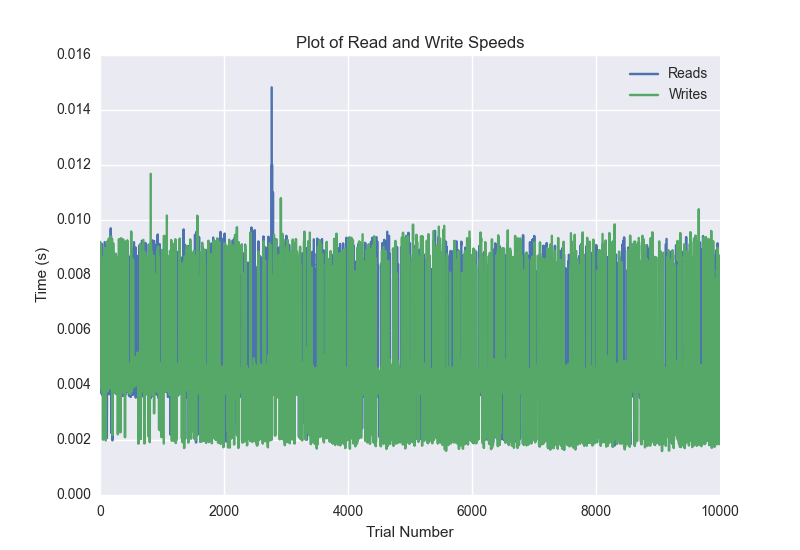
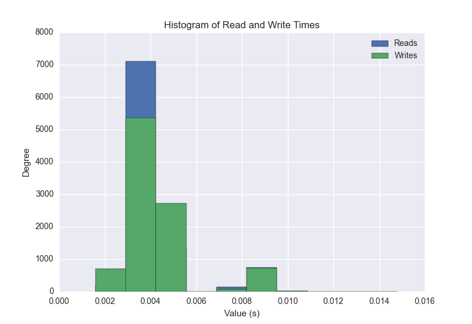
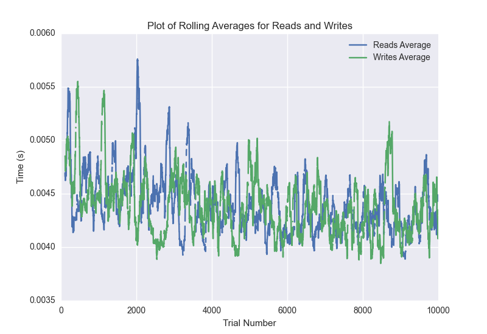

DATABASE BENCHMARKING REPORT - CASSANDRA - 10000 Trials
=========================================

This report has been automatically generated from a Benchmarking application
built by [Kurtis Jungersen](http://kmjungersen.com).  The source behind the application can be found on the [project's GitHub.](https://github.com/kmjungersen/DB-Benchmarking)

TIME AND DATE
=============

Wed, 03 Jun, 2015 17:31:01

RESULTS
=======

After using these parameters:

| Parameter                        | Value     |
|:---------------------------------|:----------|
| Database Tested                  | CASSANDRA |
| Number of Trials                 | 10000     |
| Length of Each Entry Field       | 10        |
| Number of Nodes in Cluster       | 1         |
| # of StDev's Displayed in Graphs | 3         |
| Split Reads and Writes           | True      |
| Debug Mode                       | False     |
| Chaos Mode (Random Reads)        | True      |

These results were obtained:

| Operation   |   Average |   St. Dev. |   Max Time |   Min Time |   Range |
|:------------|----------:|-----------:|-----------:|-----------:|--------:|
| Writes      |   0.00488 |    0.00298 |    0.03729 |    0.00160 | 0.03570 |
| Reads       |   0.00505 |    0.00328 |    0.03949 |    0.00179 | 0.03770 |

This plot shows the normalized speeds of reads and writes over the course of the benchmark.  The data was normalized (i.e. any data points beyond 3 standard deviations of the mean were excluded).

This plot shows a histogram which describes the general distribution of the data.

This plot shows the running averages for read and write speeds over the course of the benchmark.

