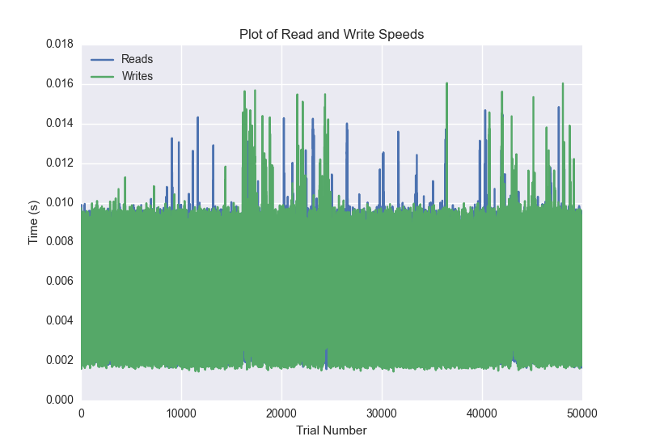
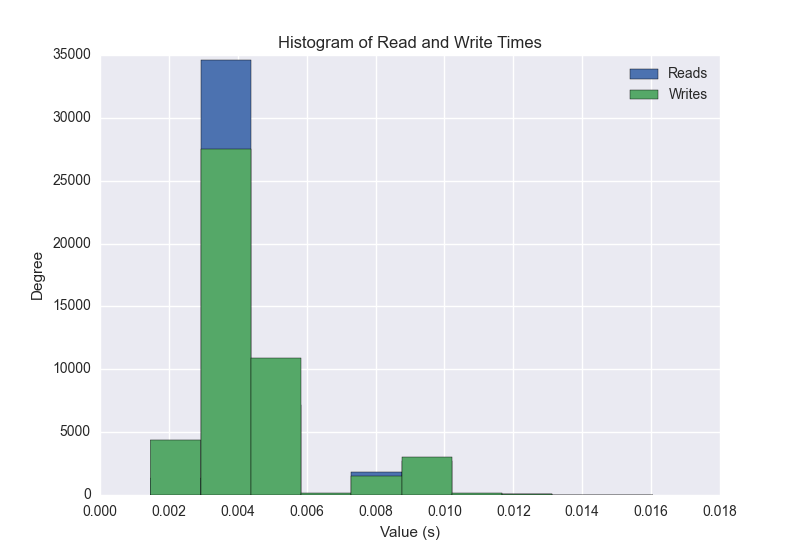
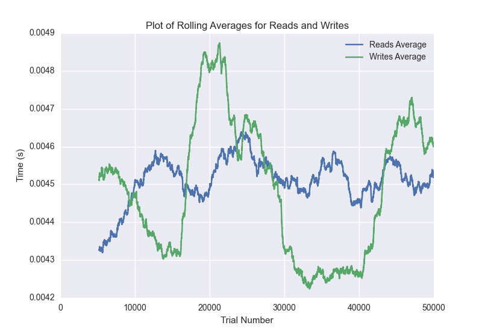

DATABASE BENCHMARKING REPORT - CASSANDRA - 50000 Trials
=========================================

This report has been automatically generated from a Benchmarking application
built by [Kurtis Jungersen](http://kmjungersen.com).  The source behind the application can be found on the [project's GitHub.](https://github.com/kmjungersen/DB-Benchmarking)

TIME AND DATE
=============

Fri, 05 Jun, 2015 12:13:39

RESULTS
=======

After using these parameters:

| Parameter                          | Value     |
|:-----------------------------------|:----------|
| Database Tested                    | CASSANDRA |
| Number of Trials                   | 50000     |
| Length of Each Entry Field         | 10        |
| Number of Nodes in Cluster         | 1         |
| # of StDev's Displayed in Graphs   | 3         |
| Range of Rolling Average in Graphs | 5000      |
| Split Reads and Writes             | True      |
| Debug Mode                         | False     |
| Chaos Mode (Random Reads)          | True      |

These results were obtained:

| Operation   |   Average |   St. Dev. |   Max Time |   Min Time |   Range |
|:------------|----------:|-----------:|-----------:|-----------:|--------:|
| Writes      |   0.00514 |    0.00365 |    0.12918 |    0.00146 | 0.12772 |
| Reads       |   0.00509 |    0.00333 |    0.08779 |    0.00159 | 0.08621 |

This plot shows the normalized speeds of reads and writes over the course of the benchmark.  The data was normalized (i.e. any data points beyond 3 standard deviations of the mean were excluded).

This plot shows a histogram which describes the general distribution of the data.

This plot shows the running averages for read and write speeds over the course of the benchmark.

