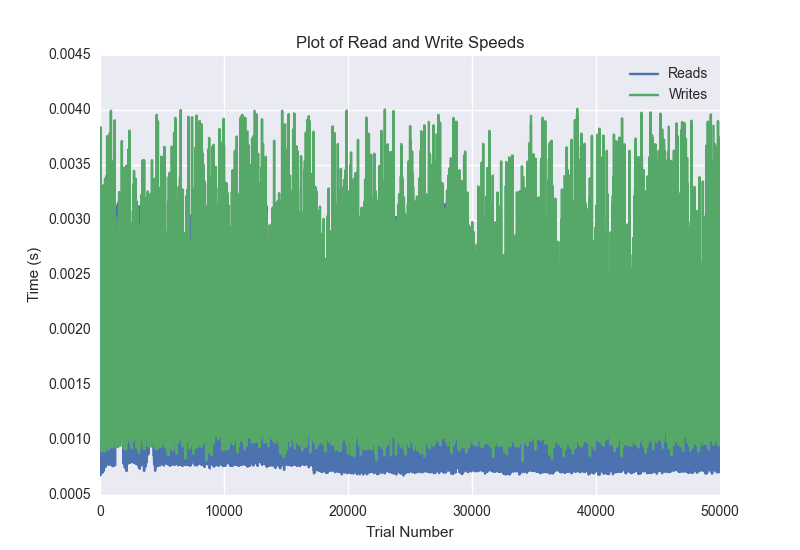
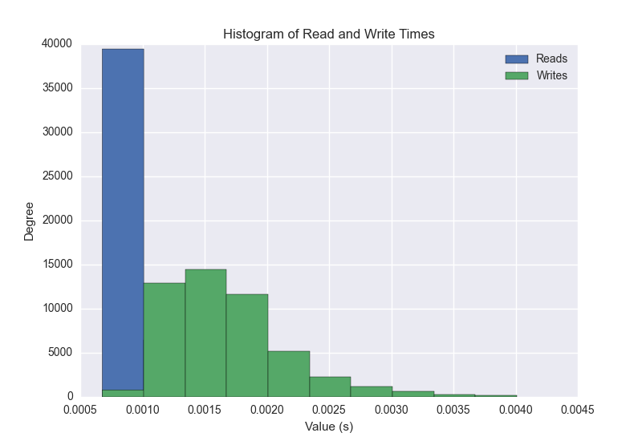
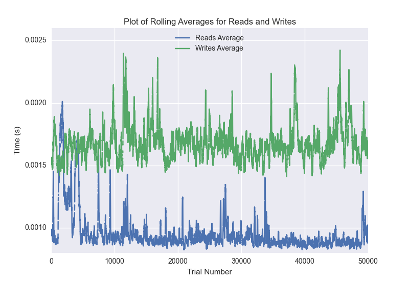

DATABASE BENCHMARKING REPORT - MONGO - 50000 Trials
=========================================

This report has been automatically generated from a Benchmarking application
built by [Kurtis Jungersen](http://kmjungersen.com).  The source behind the application can be found on the [project's GitHub.](https://github.com/kmjungersen/DB-Benchmarking)

TIME AND DATE
=============

Thu, 04 Jun, 2015 11:46:24

RESULTS
=======

After using these parameters:

| Parameter                        | Value   |
|:---------------------------------|:--------|
| Database Tested                  | MONGO   |
| Number of Trials                 | 50000   |
| Length of Each Entry Field       | 10      |
| Number of Nodes in Cluster       | 3       |
| # of StDev's Displayed in Graphs | 3       |
| Split Reads and Writes           | True    |
| Debug Mode                       | False   |
| Chaos Mode (Random Reads)        | True    |

These results were obtained:

| Operation   |   Average |   St. Dev. |   Max Time |   Min Time |   Range |
|:------------|----------:|-----------:|-----------:|-----------:|--------:|
| Writes      |   0.00172 |    0.00076 |    0.05556 |    0.00081 | 0.05475 |
| Reads       |   0.00099 |    0.00073 |    0.04656 |    0.00068 | 0.04588 |

This plot shows the normalized speeds of reads and writes over the course of the benchmark.  The data was normalized (i.e. any data points beyond 3 standard deviations of the mean were excluded).

This plot shows a histogram which describes the general distribution of the data.

This plot shows the running averages for read and write speeds over the course of the benchmark.

