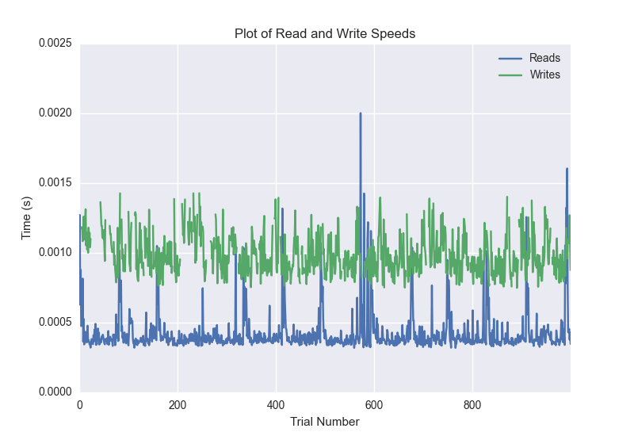
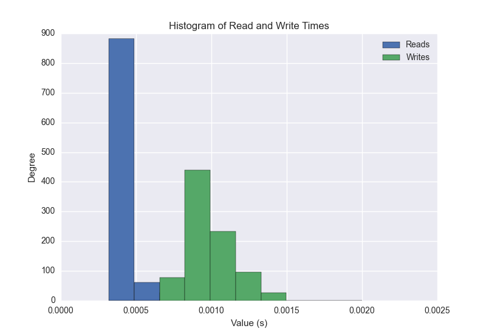
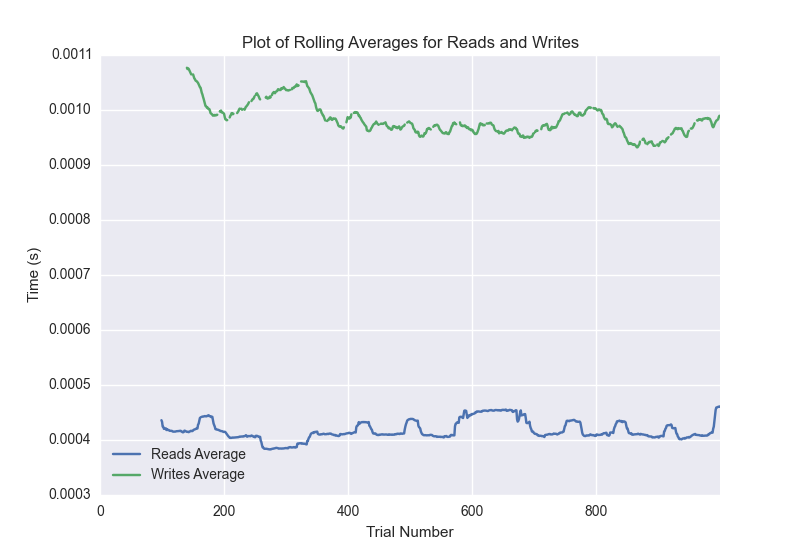

DATABASE BENCHMARKING REPORT - POSTGRESQL - 1000 Trials
=========================================

This report has been automatically generated from a Benchmarking application
built by [Kurtis Jungersen](http://kmjungersen.com).  The source behind the application can be found on the [project's GitHub.](https://github.com/kmjungersen/DB-Benchmarking)

TIME AND DATE
=============

Thu, 04 Jun, 2015 15:35:30

RESULTS
=======

After using these parameters:

| Parameter                          | Value      |
|:-----------------------------------|:-----------|
| Database Tested                    | POSTGRESQL |
| Number of Trials                   | 1000       |
| Length of Each Entry Field         | 10         |
| Number of Nodes in Cluster         | 3          |
| # of StDev's Displayed in Graphs   | 1          |
| Range of Rolling Average in Graphs | 100        |
| Split Reads and Writes             | True       |
| Debug Mode                         | False      |
| Chaos Mode (Random Reads)          | False      |

These results were obtained:

| Operation   |   Average |   St. Dev. |   Max Time |   Min Time |   Range |
|:------------|----------:|-----------:|-----------:|-----------:|--------:|
| Writes      |   0.00110 |    0.00035 |    0.00366 |    0.00072 | 0.00294 |
| Reads       |   0.00072 |    0.00955 |    0.30246 |    0.00032 | 0.30214 |

This plot shows the normalized speeds of reads and writes over the course of the benchmark.  The data was normalized (i.e. any data points beyond 3 standard deviations of the mean were excluded).

This plot shows a histogram which describes the general distribution of the data.

This plot shows the running averages for read and write speeds over the course of the benchmark.

