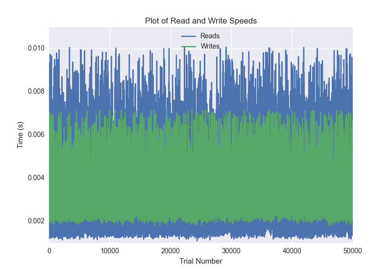
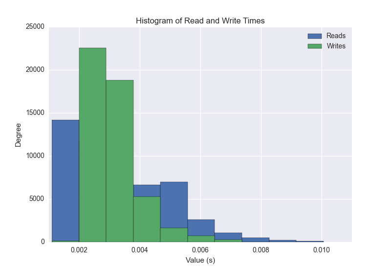
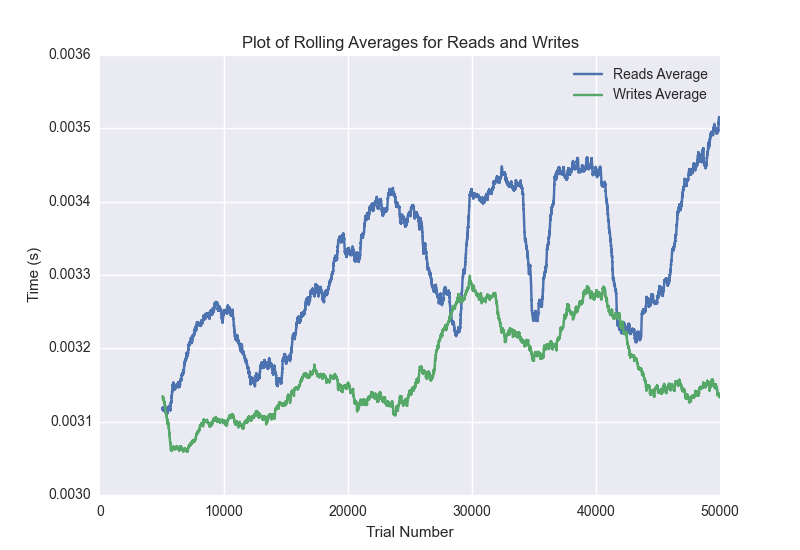

DATABASE BENCHMARKING REPORT - RIAK2 - 50000 Trials
=========================================

This report has been automatically generated from a Benchmarking application
built by [Kurtis Jungersen](http://kmjungersen.com).  The source behind the application can be found on the [project's GitHub.](https://github.com/kmjungersen/DB-Benchmarking)

TIME AND DATE
=============

Thu, 04 Jun, 2015 13:15:41

RESULTS
=======

After using these parameters:

| Parameter                          | Value   |
|:-----------------------------------|:--------|
| Database Tested                    | RIAK2   |
| Number of Trials                   | 50000   |
| Length of Each Entry Field         | 10      |
| Number of Nodes in Cluster         | 3       |
| # of StDev's Displayed in Graphs   | 3       |
| Range of Rolling Average in Graphs | 5000    |
| Split Reads and Writes             | True    |
| Debug Mode                         | False   |
| Chaos Mode (Random Reads)          | True    |

These results were obtained:

| Operation   |   Average |   St. Dev. |   Max Time |   Min Time |   Range |
|:------------|----------:|-----------:|-----------:|-----------:|--------:|
| Writes      |   0.00324 |    0.00131 |    0.09486 |    0.00179 | 0.09307 |
| Reads       |   0.00339 |    0.00222 |    0.20517 |    0.00110 | 0.20407 |

This plot shows the normalized speeds of reads and writes over the course of the benchmark.  The data was normalized (i.e. any data points beyond 3 standard deviations of the mean were excluded).

This plot shows a histogram which describes the general distribution of the data.

This plot shows the running averages for read and write speeds over the course of the benchmark.

