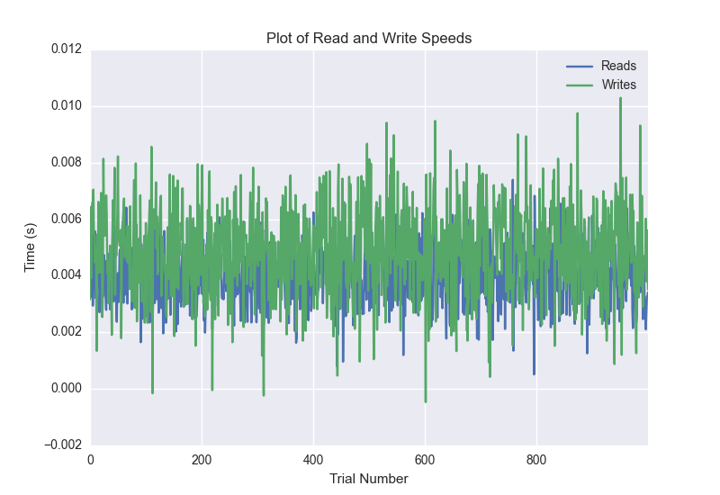
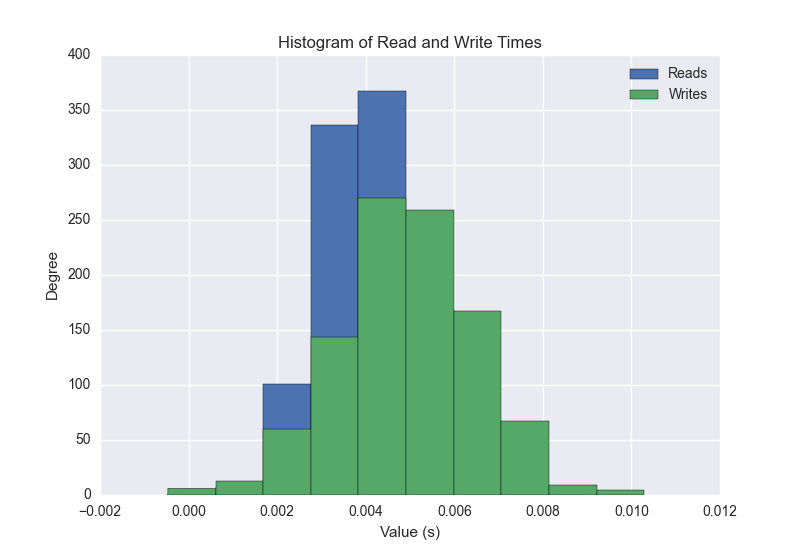
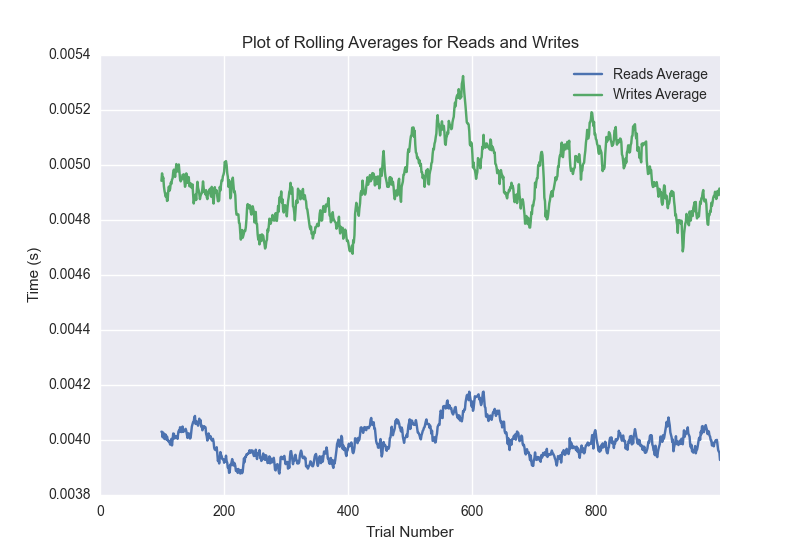

DATABASE BENCHMARKING REPORT - feaux_db - 1000 Trials
=========================================

This report has been automatically generated from a Benchmarking application
built by [Kurtis Jungersen](http://kmjungersen.com).  The source behind the application can be found on the [project's GitHub.](https://github.com/kmjungersen/DB-Benchmarking)

TIME AND DATE
=============

Mon, 21 Sep, 2015 at 23:03:31

RESULTS
=======

After using these parameters:

| Parameter                          | Value    |
|:-----------------------------------|:---------|
| Database Tested                    | feaux_db |
| Number of Trials                   | 1000     |
| Length of Each Entry Field         | 10       |
| Number of Nodes in Cluster         | n/a      |
| # of StDev's Displayed in Graphs   | 1        |
| Range of Rolling Average in Graphs | 100.0    |
| Split Reads and Writes             | True     |
| Debug Mode                         | True     |
| Random Mode (Random Reads)         | False    |

These results were obtained:

| Operation   |   Average |   St. Dev. |   Max Time |   Min Time |   Range |
|:------------|----------:|-----------:|-----------:|-----------:|--------:|
| writes      |   0.00494 |    0.00154 |    0.01029 |   -0.00047 | 0.01076 |
| reads       |   0.00399 |    0.00099 |    0.00739 |    0.00051 | 0.00688 |

This plot shows the normalized speeds of reads and writes over the course of the benchmark.  The data was normalized (i.e. any data points beyond 3 standard deviations of the mean were excluded).

This plot shows a histogram which describes the general distribution of the data.

This plot shows the running averages for read and write speeds over the course of the benchmark.

