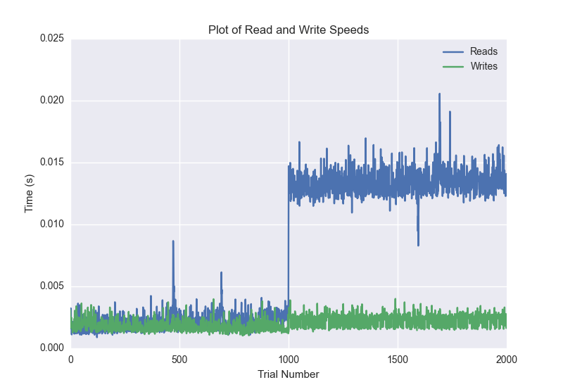
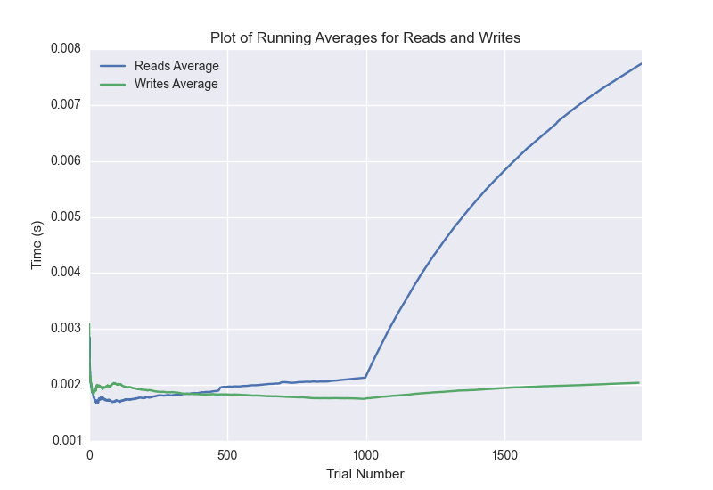

DATABASE BENCHMARKING REPORT - MONGO
=========================================

This report has been automatically generated from a Benchmarking application
built by [Kurtis Jungersen](http://kmjungersen.com).  The source behind the application can be found on the [project's GitHub.](https://github.com/kmjungersen/DB-Benchmarking)

TIME AND DATE
=============

Wed, 12 Nov, 2014 11:37:41

RESULTS
=======

After using these parameters:

| Parameter                  | Value   |
|:---------------------------|:--------|
| Database Tested            | MONGO   |
| Number of Trials           | 2000    |
| Length of Each Entry Field | 10      |
| Number of Nodes in Cluster | 3       |

These results were obtained:

| Operation   |   Average |   St. Dev. |   Max Time |   Min Time |   Range |
|:------------|----------:|-----------:|-----------:|-----------:|--------:|
| Writes      |   0.00207 |    0.00066 |    0.01208 |    0.00102 | 0.01107 |
| Reads       |   0.00777 |    0.00573 |    0.02990 |    0.00089 | 0.02901 |

This plot shows the normalized speeds of reads and writes over the course of the benchmark.  The data was normalized (i.e. any data points beyond 3 standard deviations of the mean were excluded).

This plot shows a histogram which describes the general distribution of the data.

This plot shows the running averages for read and write speeds over the course of the benchmark.

Note: If any outliers were obtained in this benchmark, they will displayed here:

| Operation   |   Trial Number |      Value |
|:------------|---------------:|-----------:|
| Write       |             23 | 0.00447488 |
| Write       |            121 | 0.00411201 |
| Write       |            135 | 0.00429201 |
| Write       |            471 | 0.00752378 |
| Write       |            472 | 0.00945997 |
| Write       |            473 | 0.00637078 |
| Write       |            476 | 0.00541592 |
| Write       |            594 | 0.00446486 |
| Write       |            814 | 0.00554991 |
| Write       |           1468 | 0.00430417 |
| Write       |           1504 | 0.00648785 |
| Write       |           1560 | 0.00440216 |
| Write       |           1589 | 0.012085   |
| Write       |           1625 | 0.00420594 |
| Read        |              0 | 0.0286212  |
| Read        |           1503 | 0.0294089  |
| Read        |           1504 | 0.029897   |