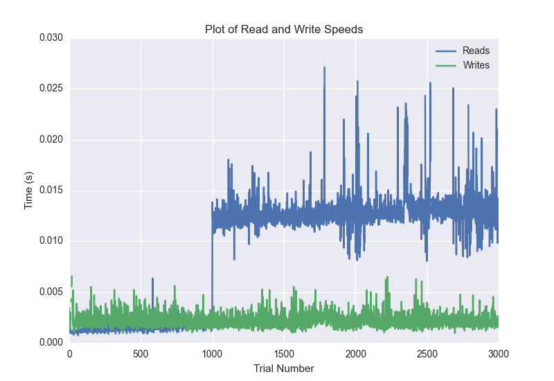
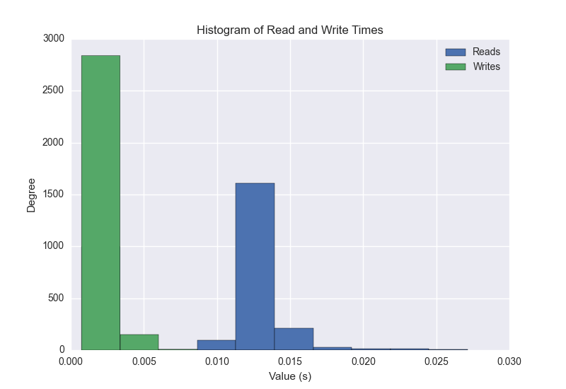
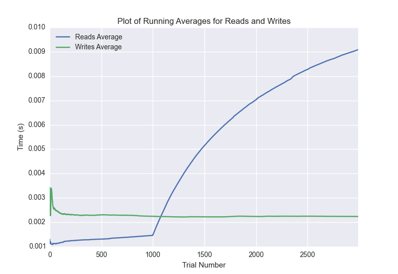

DATABASE BENCHMARKING REPORT - MONGO
=========================================

This report has been automatically generated from a Benchmarking application
built by [Kurtis Jungersen](http://kmjungersen.com).  The source behind the application can be found on the [project's GitHub.](https://github.com/kmjungersen/DB-Benchmarking)

TIME AND DATE
=============

Wed, 12 Nov, 2014 11:55:17

RESULTS
=======

After using these parameters:

| Parameter                  | Value   |
|:---------------------------|:--------|
| Database Tested            | MONGO   |
| Number of Trials           | 3000    |
| Length of Each Entry Field | 10      |
| Number of Nodes in Cluster | 3       |

These results were obtained:

| Operation   |   Average |   St. Dev. |   Max Time |   Min Time |   Range |
|:------------|----------:|-----------:|-----------:|-----------:|--------:|
| Writes      |   0.00228 |    0.00165 |    0.08326 |    0.00097 | 0.08229 |
| Reads       |   0.00924 |    0.00611 |    0.07863 |    0.00073 | 0.07790 |

This plot shows the normalized speeds of reads and writes over the course of the benchmark.  The data was normalized (i.e. any data points beyond 3 standard deviations of the mean were excluded).

This plot shows a histogram which describes the general distribution of the data.

This plot shows the running averages for read and write speeds over the course of the benchmark.

Note: If any outliers were obtained in this benchmark, they will displayed here:

| Operation   |   Trial Number |      Value |
|:------------|---------------:|-----------:|
| Write       |              9 | 0.0832601  |
| Write       |             10 | 0.00810599 |
| Write       |             11 | 0.0110781  |
| Write       |             12 | 0.0078001  |
| Write       |             13 | 0.00811601 |
| Write       |             16 | 0.00822997 |
| Write       |             19 | 0.00782204 |
| Write       |             21 | 0.0107849  |
| Write       |             22 | 0.00764298 |
| Read        |              0 | 0.040689   |
| Read        |           1782 | 0.033164   |
| Read        |           2013 | 0.033134   |
| Read        |           2020 | 0.042119   |
| Read        |           2482 | 0.0566931  |
| Read        |           2483 | 0.052994   |
| Read        |           2484 | 0.0640771  |
| Read        |           2485 | 0.07863    |
| Read        |           2524 | 0.0475178  |
| Read        |           2525 | 0.0296478  |
| Read        |           2776 | 0.0295939  |
| Read        |           2785 | 0.0330141  |
| Read        |           2787 | 0.0283601  |
| Read        |           2988 | 0.030915   |