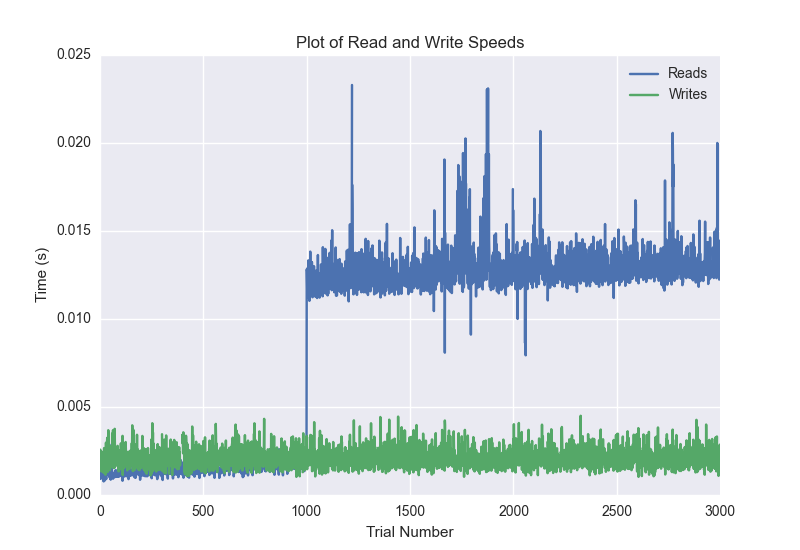
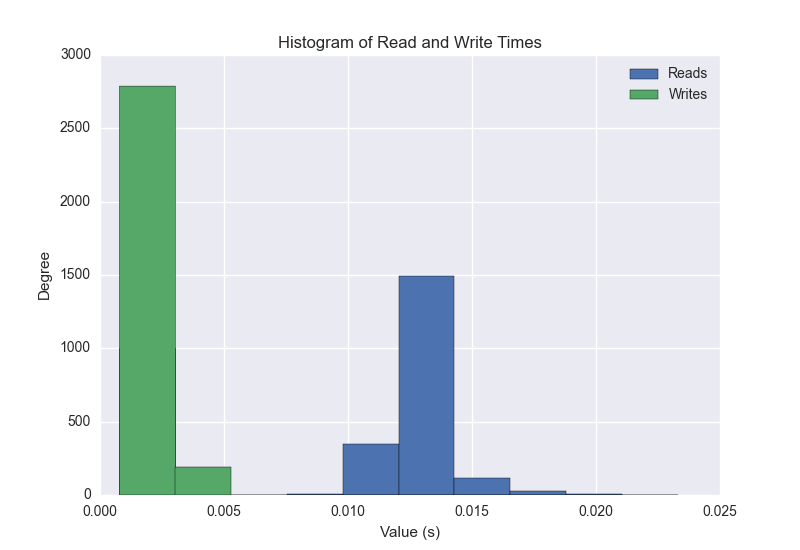
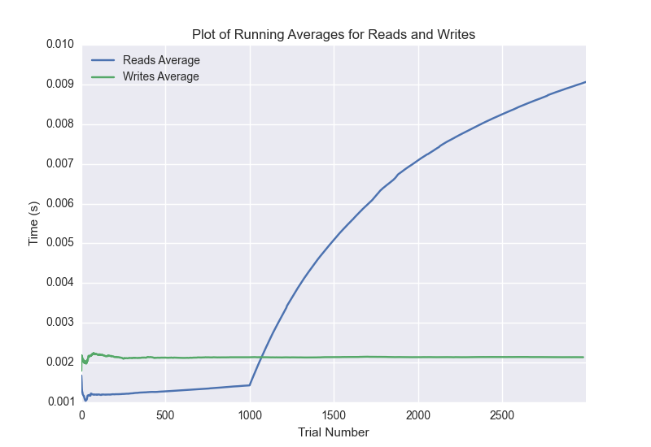

DATABASE BENCHMARKING REPORT - MONGO
=========================================

This report has been automatically generated from a Benchmarking application
built by [Kurtis Jungersen](http://kmjungersen.com).  The source behind the application can be found on the [project's GitHub.](https://github.com/kmjungersen/DB-Benchmarking)

TIME AND DATE
=============

Wed, 12 Nov, 2014 11:59:49

RESULTS
=======

After using these parameters:

| Parameter                  | Value   |
|:---------------------------|:--------|
| Database Tested            | MONGO   |
| Number of Trials           | 3000    |
| Length of Each Entry Field | 10      |
| Number of Nodes in Cluster | 3       |
| Split Reads and Writes     | True    |
| Debug Mode                 | False   |
| Chaos Mode (Random Reads)  | False   |

These results were obtained:

| Operation   |   Average |   St. Dev. |   Max Time |   Min Time |   Range |
|:------------|----------:|-----------:|-----------:|-----------:|--------:|
| Writes      |   0.00217 |    0.00080 |    0.02909 |    0.00103 | 0.02806 |
| Reads       |   0.00909 |    0.00554 |    0.03358 |    0.00078 | 0.03280 |

This plot shows the normalized speeds of reads and writes over the course of the benchmark.  The data was normalized (i.e. any data points beyond 3 standard deviations of the mean were excluded).

This plot shows a histogram which describes the general distribution of the data.

This plot shows the running averages for read and write speeds over the course of the benchmark.

Note: If any outliers were obtained in this benchmark, they will displayed here:

| Operation   |   Trial Number |      Value |
|:------------|---------------:|-----------:|
| Write       |            299 | 0.00927401 |
| Write       |            333 | 0.00468707 |
| Write       |            389 | 0.0290949  |
| Write       |            390 | 0.00486588 |
| Write       |            391 | 0.00530887 |
| Write       |            392 | 0.0104411  |
| Write       |            393 | 0.00654221 |
| Write       |            394 | 0.0063169  |
| Write       |            395 | 0.00459504 |
| Write       |            396 | 0.00492191 |
| Write       |            397 | 0.00499105 |
| Write       |            468 | 0.00468421 |
| Write       |            514 | 0.00508714 |
| Write       |            980 | 0.00539398 |
| Write       |           1367 | 0.00757194 |
| Write       |           1372 | 0.00485206 |
| Write       |           1389 | 0.00489807 |
| Write       |           1535 | 0.00536203 |
| Write       |           2458 | 0.00569606 |
| Read        |           1220 | 0.032912   |
| Read        |           1998 | 0.0319469  |
| Read        |           1999 | 0.0335801  |