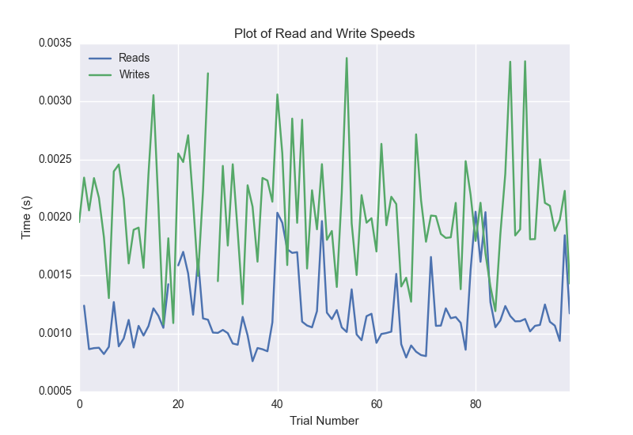
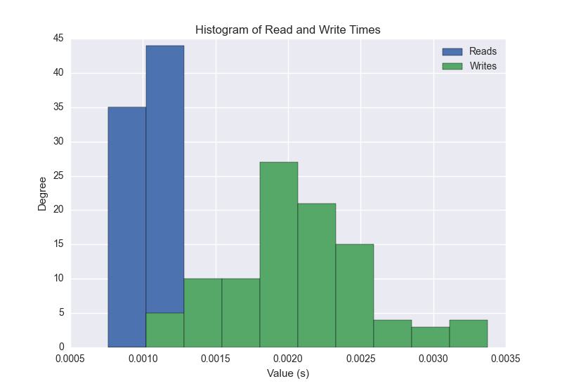
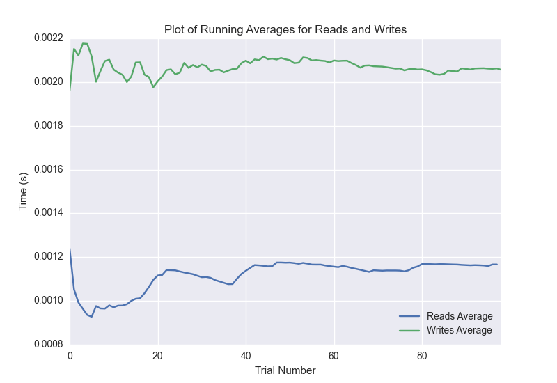

DATABASE BENCHMARKING REPORT - MONGO
=========================================

This report has been automatically generated from a Benchmarking application
built by [Kurtis Jungersen](http://kmjungersen.com).  The source behind the application can be found on the [project's GitHub.](https://github.com/kmjungersen/DB-Benchmarking)

TIME AND DATE
=============

Wed, 12 Nov, 2014 12:04:51

RESULTS
=======

After using these parameters:

| Parameter                  | Value   |
|:---------------------------|:--------|
| Database Tested            | MONGO   |
| Number of Trials           | 100     |
| Length of Each Entry Field | 10      |
| Number of Nodes in Cluster | 3       |
| Split Reads and Writes     | True    |
| Debug Mode                 | False   |
| Chaos Mode (Random Reads)  | False   |

These results were obtained:

| Operation   |   Average |   St. Dev. |   Max Time |   Min Time |   Range |
|:------------|----------:|-----------:|-----------:|-----------:|--------:|
| Writes      |   0.00208 |    0.00054 |    0.00437 |    0.00108 | 0.00329 |
| Reads       |   0.00119 |    0.00035 |    0.00232 |    0.00076 | 0.00156 |

This plot shows the normalized speeds of reads and writes over the course of the benchmark.  The data was normalized (i.e. any data points beyond 3 standard deviations of the mean were excluded).

This plot shows a histogram which describes the general distribution of the data.

This plot shows the running averages for read and write speeds over the course of the benchmark.

Note: If any outliers were obtained in this benchmark, they will displayed here:

| Operation   |   Trial Number |      Value |
|:------------|---------------:|-----------:|
| Write       |             27 | 0.00436592 |
| Read        |              0 | 0.00230098 |
| Read        |             19 | 0.00231981 |