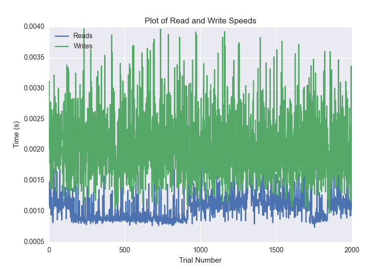
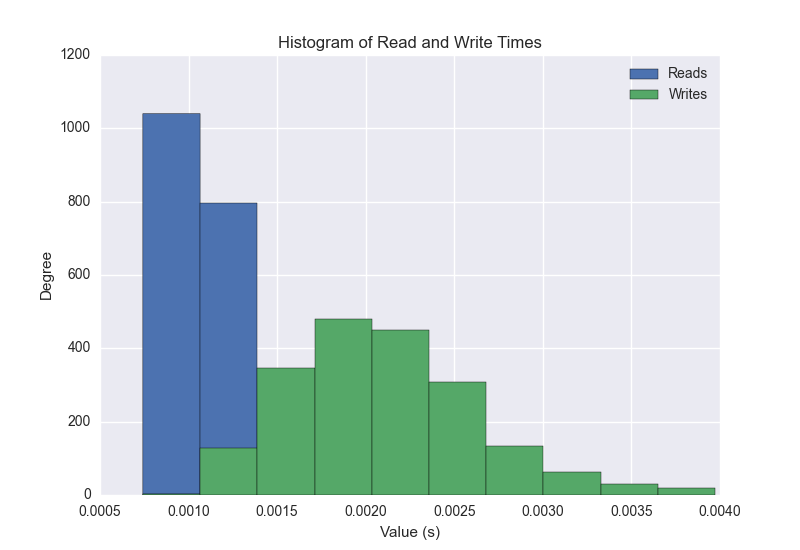
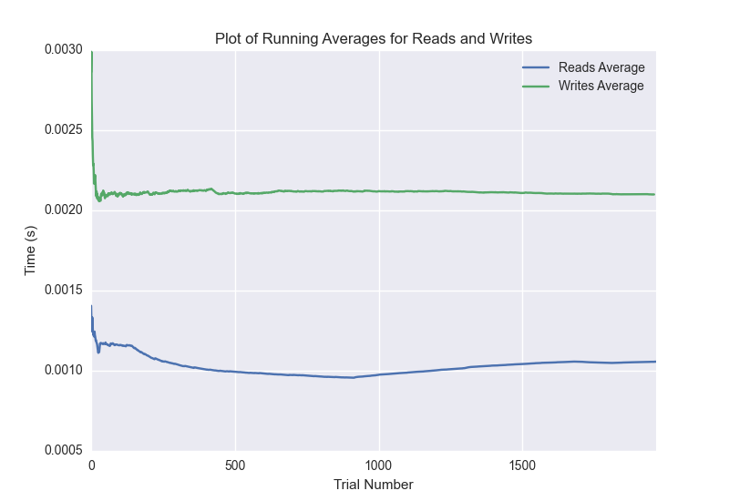

DATABASE BENCHMARKING REPORT - MONGO
=========================================

This report has been automatically generated from a Benchmarking application
built by [Kurtis Jungersen](http://kmjungersen.com).  The source behind the application can be found on the [project's GitHub.](https://github.com/kmjungersen/DB-Benchmarking)

TIME AND DATE
=============

Wed, 12 Nov, 2014 12:11:12

RESULTS
=======

After using these parameters:

| Parameter                  | Value   |
|:---------------------------|:--------|
| Database Tested            | MONGO   |
| Number of Trials           | 2000    |
| Length of Each Entry Field | 10      |
| Number of Nodes in Cluster | 3       |
| Split Reads and Writes     | True    |
| Debug Mode                 | False   |
| Chaos Mode (Random Reads)  | False   |

These results were obtained:

| Operation   |   Average |   St. Dev. |   Max Time |   Min Time |   Range |
|:------------|----------:|-----------:|-----------:|-----------:|--------:|
| Writes      |   0.00215 |    0.00061 |    0.00555 |    0.00097 | 0.00458 |
| Reads       |   0.00108 |    0.00032 |    0.00529 |    0.00074 | 0.00455 |

This plot shows the normalized speeds of reads and writes over the course of the benchmark.  The data was normalized (i.e. any data points beyond 3 standard deviations of the mean were excluded).

This plot shows a histogram which describes the general distribution of the data.

This plot shows the running averages for read and write speeds over the course of the benchmark.

Note: If any outliers were obtained in this benchmark, they will displayed here:

| Operation   |   Trial Number |      Value |
|:------------|---------------:|-----------:|
| Write       |             22 | 0.00456405 |
| Write       |             45 | 0.0040431  |
| Write       |             50 | 0.00468087 |
| Write       |             55 | 0.00410008 |
| Write       |             84 | 0.00455308 |
| Write       |             88 | 0.00441813 |
| Write       |             92 | 0.00431395 |
| Write       |            139 | 0.00423193 |
| Write       |            180 | 0.00429201 |
| Write       |            185 | 0.00449085 |
| Write       |            273 | 0.00399208 |
| Write       |            294 | 0.00399899 |
| Write       |            365 | 0.00441003 |
| Write       |            410 | 0.00450993 |
| Write       |            466 | 0.00432992 |
| Write       |            506 | 0.00436807 |
| Write       |            510 | 0.00435209 |
| Write       |            557 | 0.00502396 |
| Write       |            599 | 0.00419807 |
| Write       |            741 | 0.00475717 |
| Write       |            835 | 0.00438309 |
| Write       |            928 | 0.00493598 |
| Write       |           1069 | 0.0044229  |
| Write       |           1209 | 0.00399613 |
| Write       |           1303 | 0.00519586 |
| Write       |           1351 | 0.00423813 |
| Write       |           1364 | 0.00467706 |
| Write       |           1432 | 0.00410604 |
| Write       |           1444 | 0.00445318 |
| Write       |           1474 | 0.00437212 |
| Write       |           1489 | 0.00494599 |
| Write       |           1580 | 0.00436306 |
| Write       |           1586 | 0.00420094 |
| Write       |           1628 | 0.0041101  |
| Write       |           1633 | 0.00554609 |
| Write       |           1673 | 0.00414705 |
| Write       |           1727 | 0.00421405 |
| Write       |           1773 | 0.00449109 |
| Write       |           1875 | 0.00405598 |
| Write       |           1965 | 0.00398207 |
| Write       |           1988 | 0.00410485 |
| Read        |              0 | 0.00228691 |
| Read        |              9 | 0.00220895 |
| Read        |             22 | 0.00237203 |
| Read        |             33 | 0.00213885 |
| Read        |            100 | 0.00214815 |
| Read        |            616 | 0.00233603 |
| Read        |            952 | 0.00240707 |
| Read        |           1051 | 0.00222683 |
| Read        |           1135 | 0.00223994 |
| Read        |           1312 | 0.00527    |
| Read        |           1313 | 0.00278902 |
| Read        |           1314 | 0.00440383 |
| Read        |           1315 | 0.00360107 |
| Read        |           1316 | 0.00529003 |
| Read        |           1317 | 0.00286603 |
| Read        |           1318 | 0.00304484 |
| Read        |           1319 | 0.00246286 |
| Read        |           1320 | 0.00230503 |
| Read        |           1321 | 0.00457716 |
| Read        |           1326 | 0.00205994 |
| Read        |           1327 | 0.00205708 |
| Read        |           1328 | 0.00265718 |
| Read        |           1329 | 0.0026269  |
| Read        |           1331 | 0.00205588 |
| Read        |           1340 | 0.00226903 |
| Read        |           1394 | 0.0024569  |
| Read        |           1395 | 0.00327897 |
| Read        |           1435 | 0.00205493 |
| Read        |           1466 | 0.0021739  |
| Read        |           1604 | 0.00212598 |
| Read        |           1662 | 0.00208116 |
| Read        |           1690 | 0.00204015 |
| Read        |           1719 | 0.00213814 |
| Read        |           1937 | 0.00203896 |