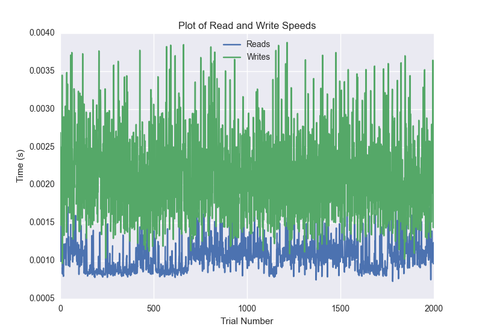
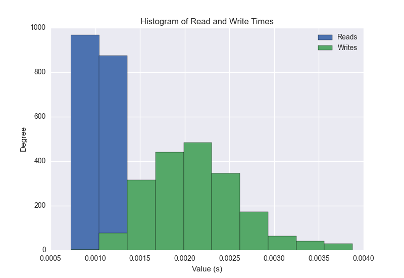
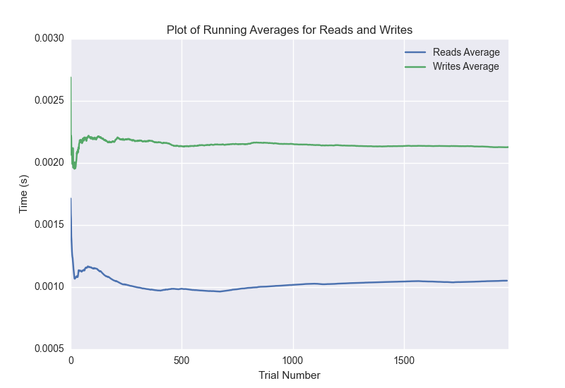

DATABASE BENCHMARKING REPORT - MONGO
=========================================

This report has been automatically generated from a Benchmarking application
built by [Kurtis Jungersen](http://kmjungersen.com).  The source behind the application can be found on the [project's GitHub.](https://github.com/kmjungersen/DB-Benchmarking)

TIME AND DATE
=============

Wed, 12 Nov, 2014 12:12:23

RESULTS
=======

After using these parameters:

| Parameter                  | Value   |
|:---------------------------|:--------|
| Database Tested            | MONGO   |
| Number of Trials           | 2000    |
| Length of Each Entry Field | 10      |
| Number of Nodes in Cluster | 3       |
| Split Reads and Writes     | True    |
| Debug Mode                 | False   |
| Chaos Mode (Random Reads)  | True    |

These results were obtained:

| Operation   |   Average |   St. Dev. |   Max Time |   Min Time |   Range |
|:------------|----------:|-----------:|-----------:|-----------:|--------:|
| Writes      |   0.00216 |    0.00058 |    0.00580 |    0.00097 | 0.00484 |
| Reads       |   0.00107 |    0.00023 |    0.00370 |    0.00073 | 0.00297 |

This plot shows the normalized speeds of reads and writes over the course of the benchmark.  The data was normalized (i.e. any data points beyond 3 standard deviations of the mean were excluded).

This plot shows a histogram which describes the general distribution of the data.

This plot shows the running averages for read and write speeds over the course of the benchmark.

Note: If any outliers were obtained in this benchmark, they will displayed here:

| Operation   |   Trial Number |      Value |
|:------------|---------------:|-----------:|
| Write       |             38 | 0.00405812 |
| Write       |             69 | 0.00417805 |
| Write       |             84 | 0.00484085 |
| Write       |            125 | 0.00450492 |
| Write       |            149 | 0.00580406 |
| Write       |            171 | 0.00409794 |
| Write       |            329 | 0.00433207 |
| Write       |            378 | 0.00438118 |
| Write       |            387 | 0.00390005 |
| Write       |            449 | 0.00394392 |
| Write       |            503 | 0.00393414 |
| Write       |            818 | 0.00440907 |
| Write       |            820 | 0.00393891 |
| Write       |            823 | 0.00460005 |
| Write       |            829 | 0.00389791 |
| Write       |            838 | 0.00416017 |
| Write       |            936 | 0.00439501 |
| Write       |            957 | 0.00441504 |
| Write       |            964 | 0.00438499 |
| Write       |           1026 | 0.00456715 |
| Write       |           1097 | 0.00414014 |
| Write       |           1120 | 0.00406384 |
| Write       |           1239 | 0.00406408 |
| Write       |           1261 | 0.00440192 |
| Write       |           1334 | 0.00413394 |
| Write       |           1425 | 0.00419998 |
| Write       |           1851 | 0.00486302 |
| Write       |           1921 | 0.00415707 |
| Write       |           1968 | 0.00391293 |
| Write       |           1980 | 0.00442505 |
| Read        |             28 | 0.00213623 |
| Read        |             35 | 0.00182199 |
| Read        |             38 | 0.00181103 |
| Read        |             39 | 0.00197506 |
| Read        |             40 | 0.00198793 |
| Read        |             57 | 0.00183105 |
| Read        |             93 | 0.00181007 |
| Read        |            202 | 0.00193596 |
| Read        |            281 | 0.002069   |
| Read        |            392 | 0.00196195 |
| Read        |            456 | 0.00238895 |
| Read        |            498 | 0.00198698 |
| Read        |            563 | 0.00178289 |
| Read        |            689 | 0.00232315 |
| Read        |            714 | 0.00187111 |
| Read        |            883 | 0.00184321 |
| Read        |            927 | 0.00207305 |
| Read        |            955 | 0.00187802 |
| Read        |           1013 | 0.0022738  |
| Read        |           1097 | 0.00209093 |
| Read        |           1161 | 0.00192714 |
| Read        |           1233 | 0.0022409  |
| Read        |           1262 | 0.00183105 |
| Read        |           1290 | 0.00177503 |
| Read        |           1329 | 0.00178504 |
| Read        |           1529 | 0.00181103 |
| Read        |           1553 | 0.00370407 |
| Read        |           1560 | 0.00210285 |
| Read        |           1587 | 0.00232601 |
| Read        |           1604 | 0.00178504 |
| Read        |           1617 | 0.00193095 |
| Read        |           1761 | 0.00176501 |
| Read        |           1769 | 0.00177097 |
| Read        |           1815 | 0.0018661  |
| Read        |           1872 | 0.00200605 |
| Read        |           1889 | 0.00213718 |
| Read        |           1928 | 0.00258708 |