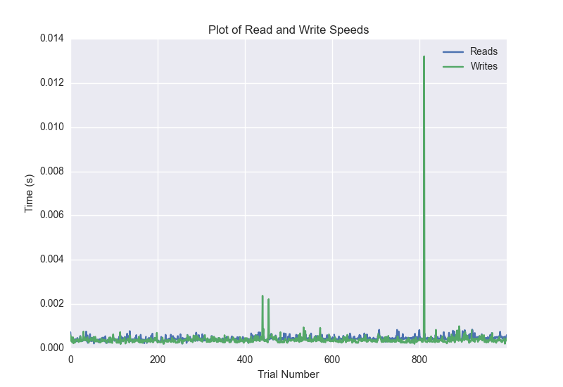
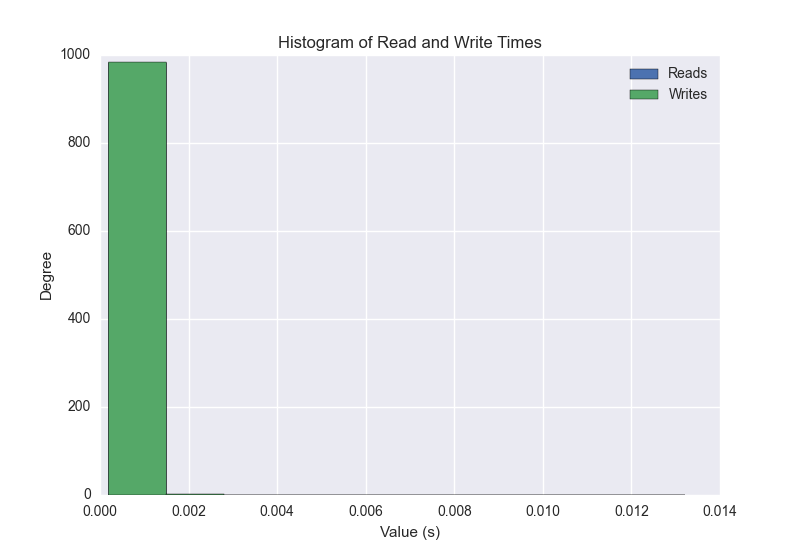
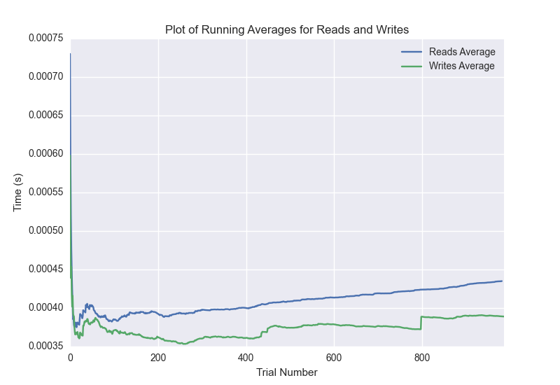

DATABASE BENCHMARKING REPORT - POSTGRESQL - 1000 Trials
=========================================

This report has been automatically generated from a Benchmarking application
built by [Kurtis Jungersen](http://kmjungersen.com).  The source behind the application can be found on the [project's GitHub.](https://github.com/kmjungersen/DB-Benchmarking)

TIME AND DATE
=============

Fri, 21 Nov, 2014 15:20:33

RESULTS
=======

After using these parameters:

| Parameter                  | Value      |
|:---------------------------|:-----------|
| Database Tested            | POSTGRESQL |
| Number of Trials           | 1000       |
| Length of Each Entry Field | 10         |
| Number of Nodes in Cluster | 1          |
| Split Reads and Writes     | False      |
| Debug Mode                 | False      |
| Chaos Mode (Random Reads)  | False      |

These results were obtained:

| Operation   |   Average |   St. Dev. |   Max Time |   Min Time |   Range |
|:------------|----------:|-----------:|-----------:|-----------:|--------:|
| Writes      |   0.00486 |    0.03925 |    0.38716 |    0.00019 | 0.38697 |
| Reads       |   0.00045 |    0.00014 |    0.00173 |    0.00021 | 0.00152 |

This plot shows the normalized speeds of reads and writes over the course of the benchmark.  The data was normalized (i.e. any data points beyond 3 standard deviations of the mean were excluded).

This plot shows a histogram which describes the general distribution of the data.

This plot shows the running averages for read and write speeds over the course of the benchmark.

Note: If any outliers were obtained in this benchmark, they will displayed here:

| Operation   |   Trial Number |       Value |
|:------------|---------------:|------------:|
| Write       |            284 | 0.358384    |
| Write       |            288 | 0.231391    |
| Write       |            305 | 0.353108    |
| Write       |            324 | 0.387164    |
| Write       |            427 | 0.312867    |
| Write       |            457 | 0.367117    |
| Write       |            502 | 0.360767    |
| Write       |            536 | 0.36667     |
| Write       |            591 | 0.350511    |
| Write       |            662 | 0.337923    |
| Write       |            706 | 0.360771    |
| Write       |            798 | 0.320713    |
| Write       |            920 | 0.372186    |
| Read        |             56 | 0.00158381  |
| Read        |            174 | 0.00107694  |
| Read        |            177 | 0.00102782  |
| Read        |            223 | 0.00123596  |
| Read        |            340 | 0.00095892  |
| Read        |            399 | 0.000879049 |
| Read        |            411 | 0.00117302  |
| Read        |            450 | 0.00101209  |
| Read        |            454 | 0.000957966 |
| Read        |            515 | 0.00173497  |
| Read        |            528 | 0.00089097  |
| Read        |            533 | 0.00163293  |
| Read        |            603 | 0.00125885  |
| Read        |            634 | 0.00099802  |
| Read        |            660 | 0.00101399  |
| Read        |            702 | 0.00106597  |
| Read        |            861 | 0.00145197  |
| Read        |            882 | 0.00103283  |