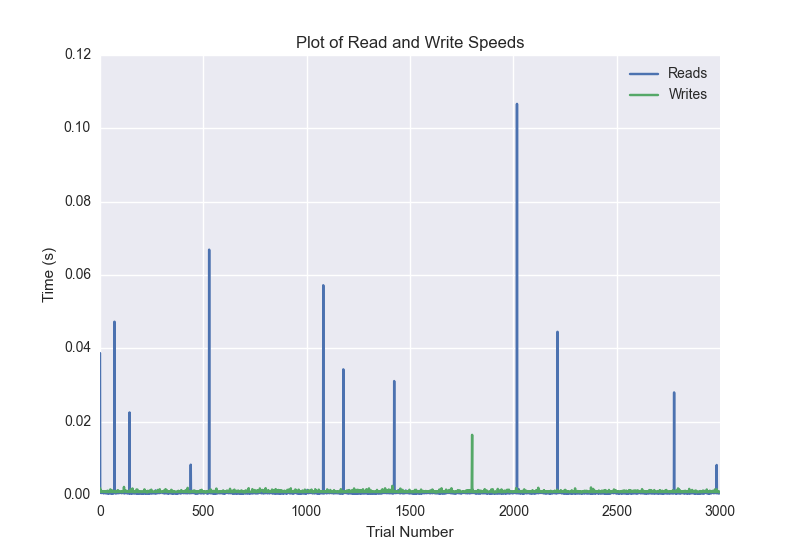
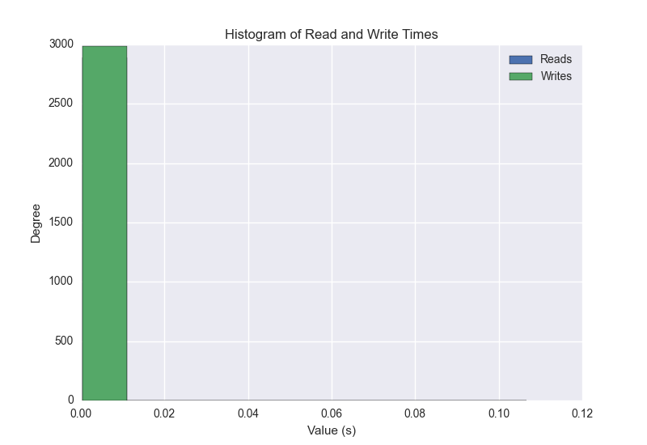
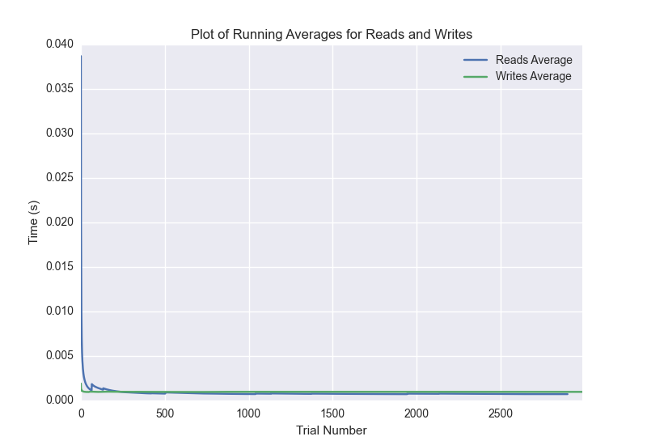

DATABASE BENCHMARKING REPORT - POSTGRESQL - 3000 Trials
=========================================

This report has been automatically generated from a Benchmarking application
built by [Kurtis Jungersen](http://kmjungersen.com).  The source behind the application can be found on the [project's GitHub.](https://github.com/kmjungersen/DB-Benchmarking)

TIME AND DATE
=============

Mon, 01 Dec, 2014 17:42:19

RESULTS
=======

After using these parameters:

| Parameter                  | Value      |
|:---------------------------|:-----------|
| Database Tested            | POSTGRESQL |
| Number of Trials           | 3000       |
| Length of Each Entry Field | 10         |
| Number of Nodes in Cluster | 1          |
| Split Reads and Writes     | True       |
| Debug Mode                 | False      |
| Chaos Mode (Random Reads)  | True       |

These results were obtained:

| Operation   |   Average |   St. Dev. |   Max Time |   Min Time |   Range |
|:------------|----------:|-----------:|-----------:|-----------:|--------:|
| Writes      |   0.00233 |    0.02134 |    0.40140 |    0.00074 | 0.40065 |
| Reads       |   0.01341 |    0.06830 |    0.40229 |    0.00039 | 0.40190 |

This plot shows the normalized speeds of reads and writes over the course of the benchmark.  The data was normalized (i.e. any data points beyond 3 standard deviations of the mean were excluded).

This plot shows a histogram which describes the general distribution of the data.

This plot shows the running averages for read and write speeds over the course of the benchmark.

Note: If any outliers were obtained in this benchmark, they will displayed here:

| Operation   |   Trial Number |    Value |
|:------------|---------------:|---------:|
| Write       |             49 | 0.33708  |
| Write       |            175 | 0.366924 |
| Write       |            648 | 0.320995 |
| Write       |            772 | 0.373263 |
| Write       |            944 | 0.309508 |
| Write       |           1040 | 0.302303 |
| Write       |           1057 | 0.067853 |
| Write       |           1922 | 0.397081 |
| Write       |           1967 | 0.355736 |
| Write       |           2015 | 0.22985  |
| Write       |           2109 | 0.330381 |
| Write       |           2307 | 0.401397 |
| Write       |           2663 | 0.298242 |
| Read        |              9 | 0.356489 |
| Read        |             15 | 0.399421 |
| Read        |             20 | 0.400068 |
| Read        |             66 | 0.378382 |
| Read        |             68 | 0.302531 |
| Read        |             84 | 0.346502 |
| Read        |             92 | 0.395398 |
| Read        |             94 | 0.399673 |
| Read        |             98 | 0.397878 |
| Read        |            108 | 0.394554 |
| Read        |            276 | 0.391647 |
| Read        |            290 | 0.393893 |
| Read        |            294 | 0.401347 |
| Read        |            298 | 0.401034 |
| Read        |            300 | 0.329919 |
| Read        |            380 | 0.328152 |
| Read        |            396 | 0.394367 |
| Read        |            401 | 0.398812 |
| Read        |            407 | 0.398227 |
| Read        |            427 | 0.392049 |
| Read        |            442 | 0.384753 |
| Read        |            445 | 0.400999 |
| Read        |            478 | 0.383219 |
| Read        |            506 | 0.386675 |
| Read        |            511 | 0.324991 |
| Read        |            568 | 0.379244 |
| Read        |            606 | 0.378848 |
| Read        |            612 | 0.396949 |
| Read        |            617 | 0.396905 |
| Read        |            623 | 0.394844 |
| Read        |            630 | 0.402293 |
| Read        |            741 | 0.346743 |
| Read        |            767 | 0.387724 |
| Read        |            795 | 0.38513  |
| Read        |            801 | 0.379258 |
| Read        |            823 | 0.309132 |
| Read        |            906 | 0.356391 |
| Read        |            924 | 0.391519 |
| Read        |           1029 | 0.338291 |
| Read        |           1065 | 0.381703 |
| Read        |           1099 | 0.3256   |
| Read        |           1103 | 0.400521 |
| Read        |           1112 | 0.397705 |
| Read        |           1133 | 0.388561 |
| Read        |           1141 | 0.396217 |
| Read        |           1183 | 0.346498 |
| Read        |           1365 | 0.307795 |
| Read        |           1375 | 0.396619 |
| Read        |           1391 | 0.391818 |
| Read        |           1418 | 0.387947 |
| Read        |           1433 | 0.359633 |
| Read        |           1437 | 0.399148 |
| Read        |           1454 | 0.39055  |
| Read        |           1478 | 0.386762 |
| Read        |           1484 | 0.397442 |
| Read        |           1558 | 0.363624 |
| Read        |           1583 | 0.386581 |
| Read        |           1599 | 0.390983 |
| Read        |           1609 | 0.395717 |
| Read        |           1611 | 0.400284 |
| Read        |           1676 | 0.365126 |
| Read        |           1681 | 0.401361 |
| Read        |           1686 | 0.39969  |
| Read        |           1691 | 0.399538 |
| Read        |           1724 | 0.37728  |
| Read        |           1750 | 0.394941 |
| Read        |           1758 | 0.396836 |
| Read        |           1763 | 0.398431 |
| Read        |           1782 | 0.392893 |
| Read        |           1792 | 0.37695  |
| Read        |           1843 | 0.385015 |
| Read        |           1984 | 0.325932 |
| Read        |           2002 | 0.391354 |
| Read        |           2006 | 0.401722 |
| Read        |           2055 | 0.234608 |
| Read        |           2109 | 0.305198 |
| Read        |           2123 | 0.393624 |
| Read        |           2128 | 0.397522 |
| Read        |           2133 | 0.398834 |
| Read        |           2192 | 0.364234 |
| Read        |           2222 | 0.341154 |
| Read        |           2226 | 0.400877 |
| Read        |           2338 | 0.34121  |
| Read        |           2472 | 0.331507 |
| Read        |           2486 | 0.390503 |
| Read        |           2603 | 0.337814 |
| Read        |           2605 | 0.402026 |
| Read        |           2733 | 0.336719 |
| Read        |           2739 | 0.398723 |
| Read        |           2769 | 0.387495 |
| Read        |           2779 | 0.368913 |
| Read        |           2811 | 0.38634  |
| Read        |           2815 | 0.399402 |
| Read        |           2818 | 0.400749 |
| Read        |           2857 | 0.380882 |
| Read        |           2924 | 0.365076 |
| Read        |           2957 | 0.380993 |
| Read        |           2961 | 0.400777 |
| Read        |           2971 | 0.395423 |
| Read        |           2977 | 0.399728 |
| Read        |           2988 | 0.38915  |