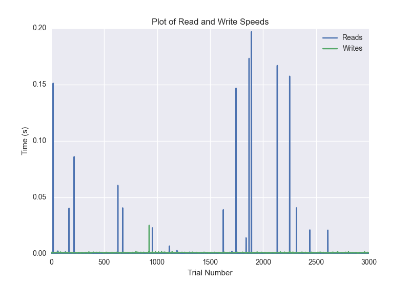
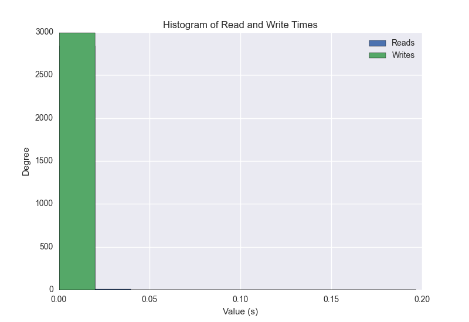
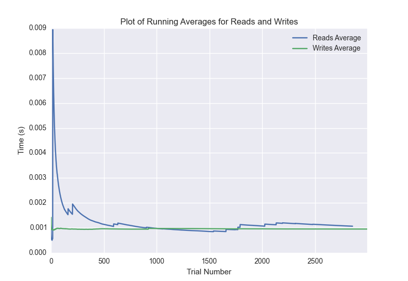

DATABASE BENCHMARKING REPORT - POSTGRESQL - 3000 Trials
=========================================

This report has been automatically generated from a Benchmarking application
built by [Kurtis Jungersen](http://kmjungersen.com).  The source behind the application can be found on the [project's GitHub.](https://github.com/kmjungersen/DB-Benchmarking)

TIME AND DATE
=============

Mon, 01 Dec, 2014 17:45:46

RESULTS
=======

After using these parameters:

| Parameter                  | Value      |
|:---------------------------|:-----------|
| Database Tested            | POSTGRESQL |
| Number of Trials           | 3000       |
| Length of Each Entry Field | 10         |
| Number of Nodes in Cluster | 1          |
| Split Reads and Writes     | True       |
| Debug Mode                 | False      |
| Chaos Mode (Random Reads)  | True       |

These results were obtained:

| Operation   |   Average |   St. Dev. |   Max Time |   Min Time |   Range |
|:------------|----------:|-----------:|-----------:|-----------:|--------:|
| Writes      |   0.00165 |    0.01562 |    0.38360 |    0.00075 | 0.38286 |
| Reads       |   0.01972 |    0.08370 |    0.63219 |    0.00039 | 0.63180 |

This plot shows the normalized speeds of reads and writes over the course of the benchmark.  The data was normalized (i.e. any data points beyond 3 standard deviations of the mean were excluded).

This plot shows a histogram which describes the general distribution of the data.

This plot shows the running averages for read and write speeds over the course of the benchmark.

Note: If any outliers were obtained in this benchmark, they will displayed here:

| Operation   |   Trial Number |    Value |
|:------------|---------------:|---------:|
| Write       |             47 | 0.34638  |
| Write       |            872 | 0.356877 |
| Write       |           1061 | 0.383604 |
| Write       |           1984 | 0.359842 |
| Write       |           2364 | 0.320882 |
| Write       |           2533 | 0.331016 |
| Read        |             11 | 0.320607 |
| Read        |             23 | 0.343086 |
| Read        |             57 | 0.382179 |
| Read        |            146 | 0.349067 |
| Read        |            159 | 0.39287  |
| Read        |            165 | 0.399585 |
| Read        |            175 | 0.34747  |
| Read        |            180 | 0.506684 |
| Read        |            189 | 0.396568 |
| Read        |            193 | 0.401191 |
| Read        |            195 | 0.330497 |
| Read        |            206 | 0.36888  |
| Read        |            267 | 0.38208  |
| Read        |            295 | 0.384844 |
| Read        |            312 | 0.392062 |
| Read        |            403 | 0.381214 |
| Read        |            410 | 0.397482 |
| Read        |            429 | 0.389514 |
| Read        |            439 | 0.397483 |
| Read        |            447 | 0.396872 |
| Read        |            454 | 0.396986 |
| Read        |            458 | 0.399869 |
| Read        |            461 | 0.40134  |
| Read        |            508 | 0.376268 |
| Read        |            512 | 0.390036 |
| Read        |            518 | 0.505732 |
| Read        |            522 | 0.401402 |
| Read        |            531 | 0.398109 |
| Read        |            533 | 0.40176  |
| Read        |            544 | 0.272885 |
| Read        |            565 | 0.311713 |
| Read        |            578 | 0.39486  |
| Read        |            580 | 0.400396 |
| Read        |            595 | 0.39377  |
| Read        |            623 | 0.388118 |
| Read        |            633 | 0.334946 |
| Read        |            645 | 0.394976 |
| Read        |            650 | 0.400041 |
| Read        |            656 | 0.40027  |
| Read        |            663 | 0.397975 |
| Read        |            690 | 0.344921 |
| Read        |            700 | 0.396896 |
| Read        |            706 | 0.397986 |
| Read        |            715 | 0.395371 |
| Read        |            765 | 0.37629  |
| Read        |            922 | 0.318185 |
| Read        |            934 | 0.393822 |
| Read        |            939 | 0.397558 |
| Read        |            947 | 0.39581  |
| Read        |            953 | 0.398523 |
| Read        |            960 | 0.375653 |
| Read        |            965 | 0.399592 |
| Read        |           1032 | 0.36527  |
| Read        |           1098 | 0.363138 |
| Read        |           1109 | 0.394272 |
| Read        |           1123 | 0.388231 |
| Read        |           1133 | 0.395626 |
| Read        |           1154 | 0.389434 |
| Read        |           1165 | 0.394339 |
| Read        |           1178 | 0.393513 |
| Read        |           1208 | 0.378449 |
| Read        |           1232 | 0.388504 |
| Read        |           1242 | 0.395149 |
| Read        |           1287 | 0.373877 |
| Read        |           1296 | 0.388111 |
| Read        |           1306 | 0.407402 |
| Read        |           1321 | 0.393092 |
| Read        |           1338 | 0.393051 |
| Read        |           1346 | 0.398224 |
| Read        |           1372 | 0.362926 |
| Read        |           1377 | 0.518946 |
| Read        |           1385 | 0.395322 |
| Read        |           1411 | 0.384882 |
| Read        |           1420 | 0.394134 |
| Read        |           1434 | 0.426672 |
| Read        |           1438 | 0.40031  |
| Read        |           1473 | 0.380224 |
| Read        |           1491 | 0.392033 |
| Read        |           1575 | 0.318652 |
| Read        |           1586 | 0.335846 |
| Read        |           1599 | 0.394383 |
| Read        |           1602 | 0.402215 |
| Read        |           1611 | 0.398316 |
| Read        |           1619 | 0.398801 |
| Read        |           1716 | 0.304586 |
| Read        |           1758 | 0.330931 |
| Read        |           1765 | 0.398639 |
| Read        |           1791 | 0.386115 |
| Read        |           1795 | 0.329574 |
| Read        |           1805 | 0.364095 |
| Read        |           1813 | 0.398414 |
| Read        |           1818 | 0.39856  |
| Read        |           1828 | 0.395293 |
| Read        |           1832 | 0.400094 |
| Read        |           1846 | 0.380533 |
| Read        |           1858 | 0.396516 |
| Read        |           1869 | 0.422247 |
| Read        |           1871 | 0.401207 |
| Read        |           1979 | 0.337064 |
| Read        |           1985 | 0.396151 |
| Read        |           1995 | 0.397077 |
| Read        |           2000 | 0.39922  |
| Read        |           2005 | 0.396844 |
| Read        |           2007 | 0.604685 |
| Read        |           2042 | 0.384298 |
| Read        |           2050 | 0.396451 |
| Read        |           2100 | 0.374216 |
| Read        |           2135 | 0.417085 |
| Read        |           2165 | 0.384703 |
| Read        |           2183 | 0.391279 |
| Read        |           2190 | 0.398357 |
| Read        |           2206 | 0.362526 |
| Read        |           2208 | 0.632192 |
| Read        |           2224 | 0.393466 |
| Read        |           2231 | 0.395416 |
| Read        |           2243 | 0.392152 |
| Read        |           2255 | 0.337396 |
| Read        |           2267 | 0.396301 |
| Read        |           2271 | 0.399786 |
| Read        |           2303 | 0.383934 |
| Read        |           2308 | 0.399061 |
| Read        |           2320 | 0.353929 |
| Read        |           2361 | 0.379618 |
| Read        |           2383 | 0.386009 |
| Read        |           2403 | 0.387512 |
| Read        |           2412 | 0.395023 |
| Read        |           2535 | 0.311392 |
| Read        |           2545 | 0.396313 |
| Read        |           2547 | 0.402133 |
| Read        |           2583 | 0.383221 |
| Read        |           2607 | 0.388779 |
| Read        |           2623 | 0.372184 |
| Read        |           2685 | 0.369145 |
| Read        |           2703 | 0.390657 |
| Read        |           2720 | 0.392048 |
| Read        |           2746 | 0.387695 |
| Read        |           2815 | 0.364469 |
| Read        |           2830 | 0.391059 |
| Read        |           2835 | 0.399323 |
| Read        |           2848 | 0.395374 |
| Read        |           2922 | 0.358268 |
| Read        |           2952 | 0.391195 |
| Read        |           2965 | 0.393702 |