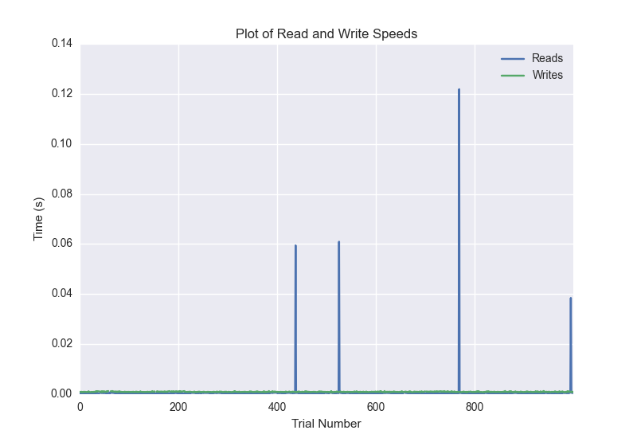
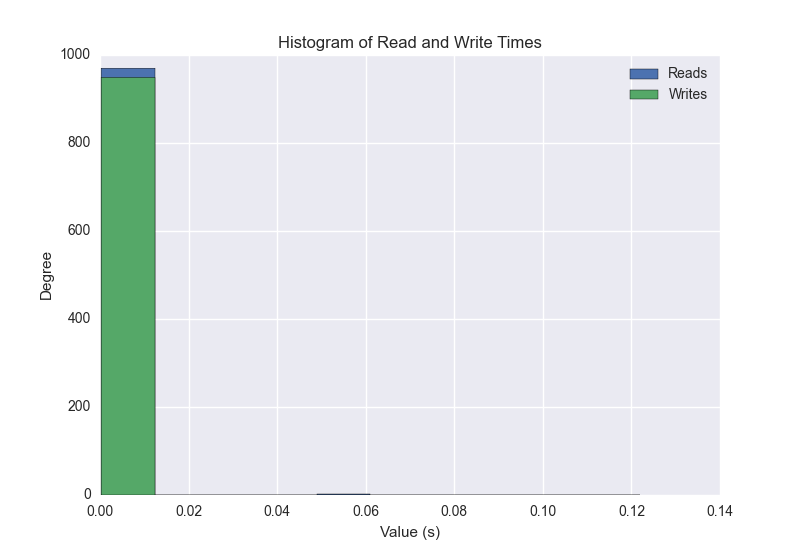
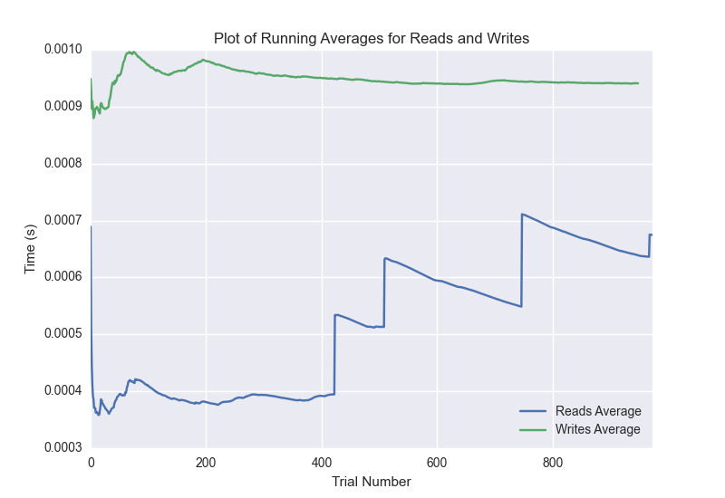

DATABASE BENCHMARKING REPORT - POSTGRESQL - 1000 Trials
=========================================

This report has been automatically generated from a Benchmarking application
built by [Kurtis Jungersen](http://kmjungersen.com).  The source behind the application can be found on the [project's GitHub.](https://github.com/kmjungersen/DB-Benchmarking)

TIME AND DATE
=============

Mon, 01 Dec, 2014 17:48:11

RESULTS
=======

After using these parameters:

| Parameter                  | Value      |
|:---------------------------|:-----------|
| Database Tested            | POSTGRESQL |
| Number of Trials           | 1000       |
| Length of Each Entry Field | 10         |
| Number of Nodes in Cluster | 1          |
| Split Reads and Writes     | True       |
| Debug Mode                 | False      |
| Chaos Mode (Random Reads)  | True       |

These results were obtained:

| Operation   |   Average |   St. Dev. |   Max Time |   Min Time |   Range |
|:------------|----------:|-----------:|-----------:|-----------:|--------:|
| Writes      |   0.00097 |    0.00015 |    0.00202 |    0.00074 | 0.00128 |
| Reads       |   0.01032 |    0.05952 |    0.40207 |    0.00026 | 0.40181 |

This plot shows the normalized speeds of reads and writes over the course of the benchmark.  The data was normalized (i.e. any data points beyond 3 standard deviations of the mean were excluded).

This plot shows a histogram which describes the general distribution of the data.

This plot shows the running averages for read and write speeds over the course of the benchmark.

Note: If any outliers were obtained in this benchmark, they will displayed here:

| Operation   |   Trial Number |      Value |
|:------------|---------------:|-----------:|
| Write       |              0 | 0.00147295 |
| Write       |             39 | 0.00150323 |
| Write       |             81 | 0.00156093 |
| Write       |             88 | 0.00164795 |
| Write       |            128 | 0.00154018 |
| Write       |            155 | 0.00178695 |
| Write       |            264 | 0.00201893 |
| Write       |            304 | 0.00142503 |
| Write       |            499 | 0.00151515 |
| Write       |            559 | 0.00181603 |
| Write       |            598 | 0.00143409 |
| Write       |            686 | 0.001441   |
| Write       |            699 | 0.00143695 |
| Write       |            700 | 0.00149608 |
| Write       |            712 | 0.00184989 |
| Write       |            729 | 0.00150204 |
| Write       |            766 | 0.00169802 |
| Write       |            790 | 0.00159407 |
| Write       |            972 | 0.00156784 |
| Write       |            991 | 0.00161815 |
| Read        |             41 | 0.33245    |
| Read        |             63 | 0.392915   |
| Read        |             70 | 0.399565   |
| Read        |            225 | 0.342545   |
| Read        |            247 | 0.392249   |
| Read        |            252 | 0.395106   |
| Read        |            271 | 0.396281   |
| Read        |            280 | 0.398813   |
| Read        |            386 | 0.359931   |
| Read        |            392 | 0.399032   |
| Read        |            398 | 0.384056   |
| Read        |            417 | 0.307513   |
| Read        |            420 | 0.402071   |
| Read        |            423 | 0.401174   |
| Read        |            496 | 0.313869   |
| Read        |            506 | 0.398795   |
| Read        |            539 | 0.323398   |
| Read        |            614 | 0.371693   |
| Read        |            621 | 0.39815    |
| Read        |            656 | 0.386664   |
| Read        |            658 | 0.301472   |
| Read        |            819 | 0.32133    |
| Read        |            866 | 0.383746   |
| Read        |            878 | 0.399494   |
| Read        |            942 | 0.377301   |
| Read        |            978 | 0.386285   |