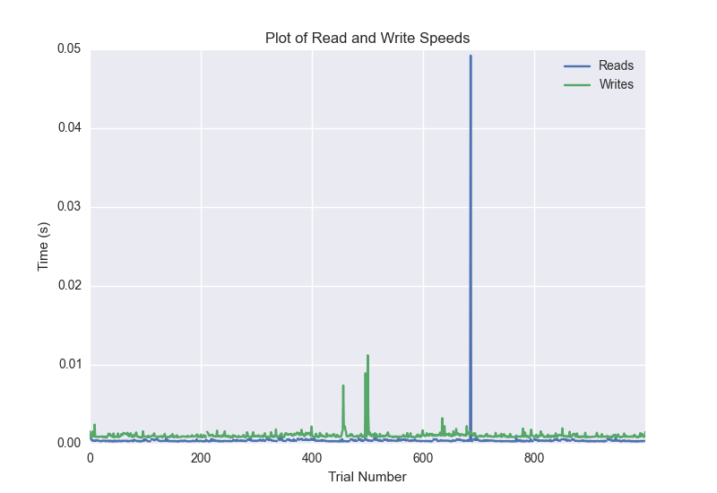
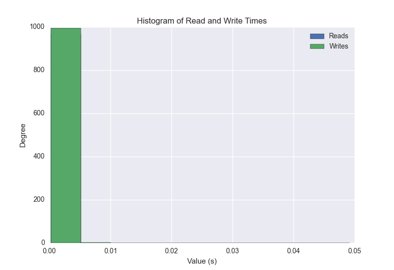
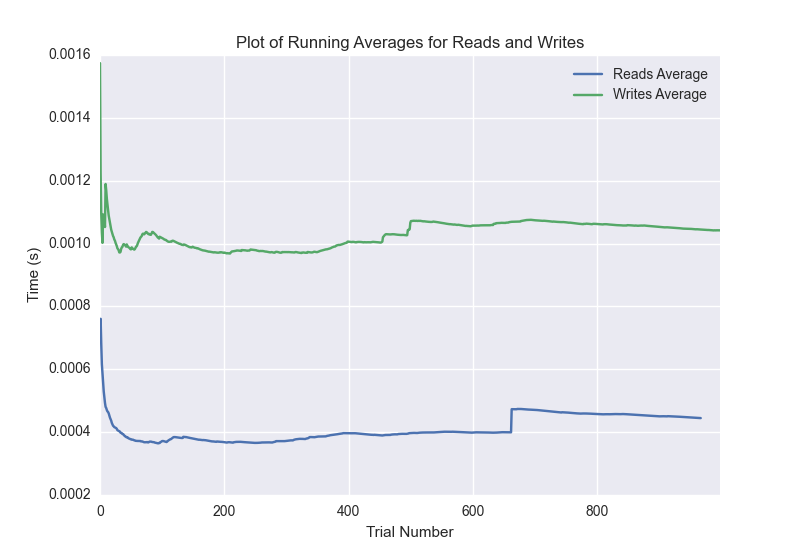

DATABASE BENCHMARKING REPORT - POSTGRESQL - 1000 Trials
=========================================

This report has been automatically generated from a Benchmarking application
built by [Kurtis Jungersen](http://kmjungersen.com).  The source behind the application can be found on the [project's GitHub.](https://github.com/kmjungersen/DB-Benchmarking)

TIME AND DATE
=============

Mon, 01 Dec, 2014 17:49:45

RESULTS
=======

After using these parameters:

| Parameter                  | Value      |
|:---------------------------|:-----------|
| Database Tested            | POSTGRESQL |
| Number of Trials           | 1000       |
| Length of Each Entry Field | 10         |
| Number of Nodes in Cluster | 1          |
| Split Reads and Writes     | True       |
| Debug Mode                 | False      |
| Chaos Mode (Random Reads)  | True       |

These results were obtained:

| Operation   |   Average |   St. Dev. |   Max Time |   Min Time |   Range |
|:------------|----------:|-----------:|-----------:|-----------:|--------:|
| Writes      |   0.00175 |    0.01589 |    0.35944 |    0.00075 | 0.35869 |
| Reads       |   0.01251 |    0.06597 |    0.40126 |    0.00028 | 0.40098 |

This plot shows the normalized speeds of reads and writes over the course of the benchmark.  The data was normalized (i.e. any data points beyond 3 standard deviations of the mean were excluded).

This plot shows a histogram which describes the general distribution of the data.

This plot shows the running averages for read and write speeds over the course of the benchmark.

Note: If any outliers were obtained in this benchmark, they will displayed here:

| Operation   |   Trial Number |    Value |
|:------------|---------------:|---------:|
| Write       |            210 | 0.353005 |
| Write       |            844 | 0.359445 |
| Read        |              1 | 0.341822 |
| Read        |             81 | 0.371962 |
| Read        |            118 | 0.379182 |
| Read        |            257 | 0.348044 |
| Read        |            283 | 0.393133 |
| Read        |            317 | 0.386804 |
| Read        |            338 | 0.392559 |
| Read        |            354 | 0.394359 |
| Read        |            373 | 0.39441  |
| Read        |            380 | 0.399791 |
| Read        |            388 | 0.399451 |
| Read        |            397 | 0.387322 |
| Read        |            468 | 0.384605 |
| Read        |            482 | 0.395687 |
| Read        |            494 | 0.397662 |
| Read        |            510 | 0.395566 |
| Read        |            528 | 0.368509 |
| Read        |            563 | 0.310658 |
| Read        |            617 | 0.379362 |
| Read        |            622 | 0.400827 |
| Read        |            630 | 0.39953  |
| Read        |            659 | 0.39116  |
| Read        |            689 | 0.341721 |
| Read        |            798 | 0.358595 |
| Read        |            834 | 0.225914 |
| Read        |            837 | 0.358785 |
| Read        |            847 | 0.398649 |
| Read        |            852 | 0.247319 |
| Read        |            866 | 0.347929 |
| Read        |            930 | 0.377775 |
| Read        |            934 | 0.399639 |
| Read        |            937 | 0.401257 |