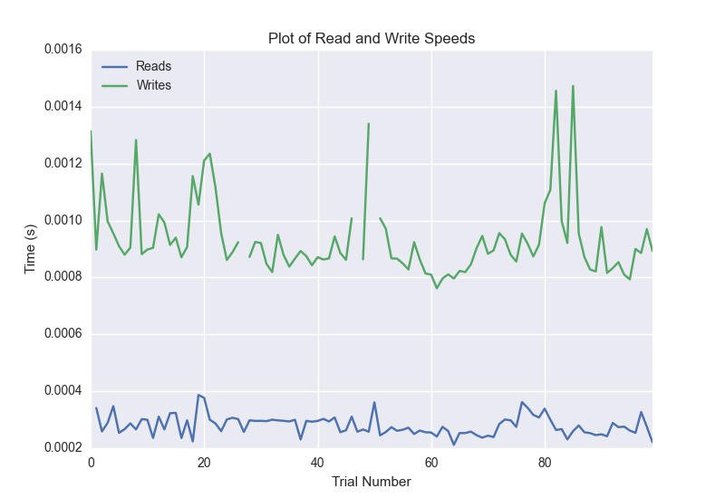
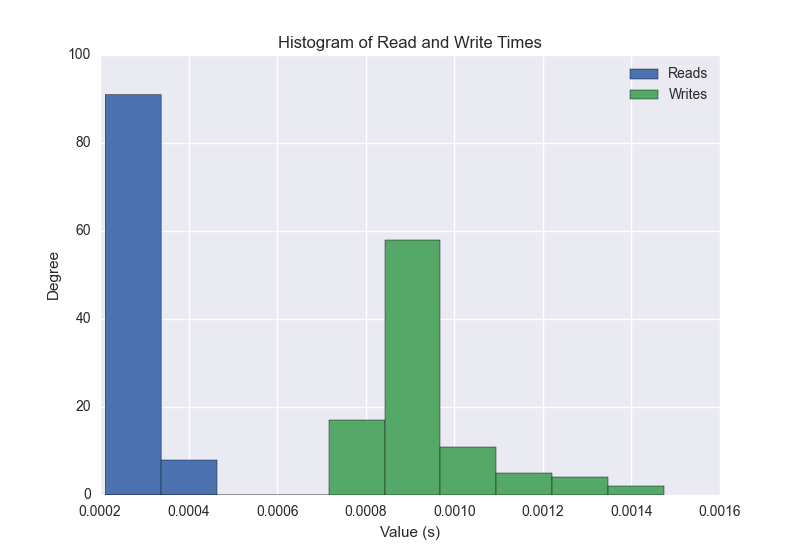
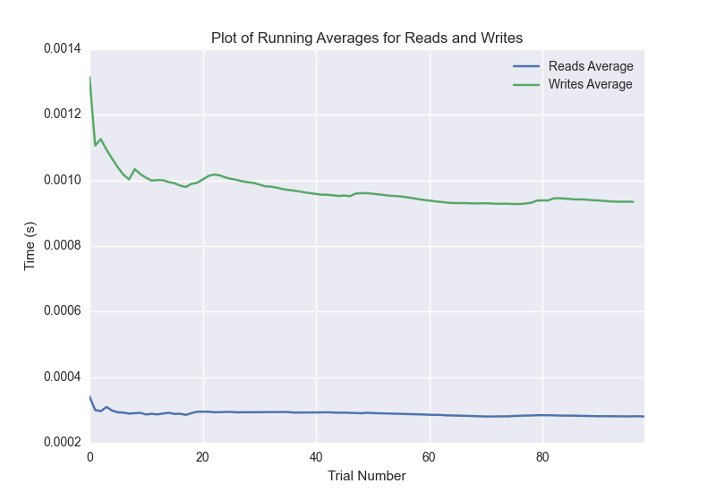

DATABASE BENCHMARKING REPORT - POSTGRESQL - 100 Trials
=========================================

This report has been automatically generated from a Benchmarking application
built by [Kurtis Jungersen](http://kmjungersen.com).  The source behind the application can be found on the [project's GitHub.](https://github.com/kmjungersen/DB-Benchmarking)

TIME AND DATE
=============

Tue, 16 Dec, 2014 11:54:20

RESULTS
=======

After using these parameters:

| Parameter                  | Value      |
|:---------------------------|:-----------|
| Database Tested            | POSTGRESQL |
| Number of Trials           | 100        |
| Length of Each Entry Field | 10         |
| Number of Nodes in Cluster | 3          |
| Split Reads and Writes     | True       |
| Debug Mode                 | False      |
| Chaos Mode (Random Reads)  | False      |

These results were obtained:

| Operation   |   Average |   St. Dev. |   Max Time |   Min Time |   Range |
|:------------|----------:|-----------:|-----------:|-----------:|--------:|
| Writes      |   0.00096 |    0.00018 |    0.00181 |    0.00076 | 0.00104 |
| Reads       |   0.00028 |    0.00005 |    0.00070 |    0.00021 | 0.00048 |

This plot shows the normalized speeds of reads and writes over the course of the benchmark.  The data was normalized (i.e. any data points beyond 3 standard deviations of the mean were excluded).

This plot shows a histogram which describes the general distribution of the data.

This plot shows the running averages for read and write speeds over the course of the benchmark.

Note: If any outliers were obtained in this benchmark, they will displayed here:

| Operation   |   Trial Number |       Value |
|:------------|---------------:|------------:|
| Write       |             27 | 0.00158906  |
| Write       |             47 | 0.00180507  |
| Write       |             50 | 0.00151515  |
| Read        |              0 | 0.000695944 |