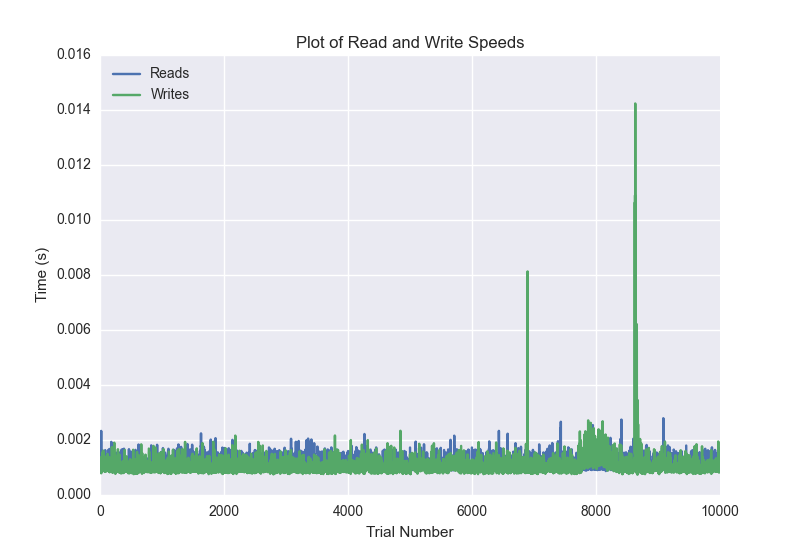
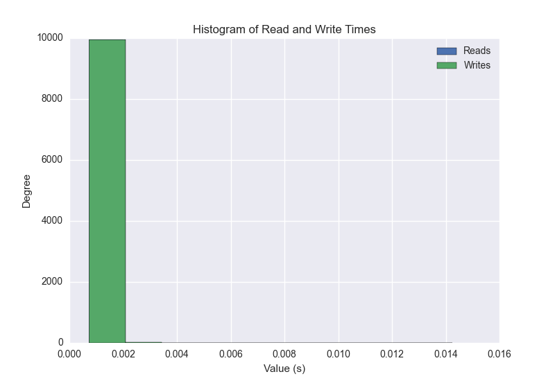
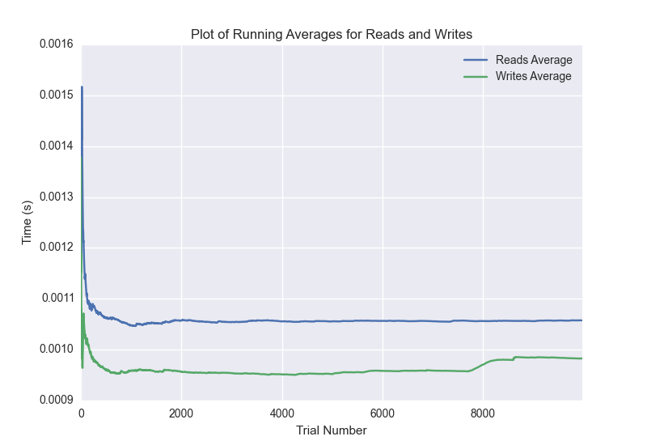

DATABASE BENCHMARKING REPORT - POSTGRESQL - 10000 Trials
=========================================

This report has been automatically generated from a Benchmarking application
built by [Kurtis Jungersen](http://kmjungersen.com).  The source behind the application can be found on the [project's GitHub.](https://github.com/kmjungersen/DB-Benchmarking)

TIME AND DATE
=============

Tue, 16 Dec, 2014 11:56:23

RESULTS
=======

After using these parameters:

| Parameter                  | Value      |
|:---------------------------|:-----------|
| Database Tested            | POSTGRESQL |
| Number of Trials           | 10000      |
| Length of Each Entry Field | 10         |
| Number of Nodes in Cluster | 3          |
| Split Reads and Writes     | True       |
| Debug Mode                 | False      |
| Chaos Mode (Random Reads)  | False      |

These results were obtained:

| Operation   |   Average |   St. Dev. |   Max Time |   Min Time |   Range |
|:------------|----------:|-----------:|-----------:|-----------:|--------:|
| Writes      |   0.00178 |    0.01655 |    0.40042 |    0.00074 | 0.39968 |
| Reads       |   0.00234 |    0.02117 |    0.42177 |    0.00086 | 0.42091 |

This plot shows the normalized speeds of reads and writes over the course of the benchmark.  The data was normalized (i.e. any data points beyond 3 standard deviations of the mean were excluded).

This plot shows a histogram which describes the general distribution of the data.

This plot shows the running averages for read and write speeds over the course of the benchmark.

Note: If any outliers were obtained in this benchmark, they will displayed here:

| Operation   |   Trial Number |    Value |
|:------------|---------------:|---------:|
| Write       |            787 | 0.347234 |
| Write       |            942 | 0.342794 |
| Write       |           1109 | 0.215426 |
| Write       |           1149 | 0.374693 |
| Write       |           1648 | 0.391348 |
| Write       |           1654 | 0.392808 |
| Write       |           2527 | 0.316818 |
| Write       |           2765 | 0.36104  |
| Write       |           2820 | 0.344891 |
| Write       |           4358 | 0.33815  |
| Write       |           5144 | 0.387138 |
| Write       |           5464 | 0.366636 |
| Write       |           5480 | 0.240202 |
| Write       |           5823 | 0.376756 |
| Write       |           6002 | 0.320356 |
| Write       |           6343 | 0.357573 |
| Write       |           6347 | 0.043283 |
| Write       |           6398 | 0.400423 |
| Write       |           6524 | 0.371313 |
| Write       |           6697 | 0.325683 |
| Write       |           6770 | 0.326041 |
| Write       |           7391 | 0.045186 |
| Write       |           8580 | 0.018832 |
| Write       |           8756 | 0.338238 |
| Write       |           9196 | 0.342354 |
| Write       |           9489 | 0.323146 |
| Read        |            224 | 0.305706 |
| Read        |           1240 | 0.320073 |
| Read        |           1378 | 0.350645 |
| Read        |           1623 | 0.338131 |
| Read        |           1627 | 0.398479 |
| Read        |           1772 | 0.343283 |
| Read        |           1826 | 0.340451 |
| Read        |           2007 | 0.307894 |
| Read        |           2619 | 0.349252 |
| Read        |           2626 | 0.39474  |
| Read        |           2724 | 0.398375 |
| Read        |           2741 | 0.379567 |
| Read        |           3502 | 0.370426 |
| Read        |           4362 | 0.161228 |
| Read        |           4660 | 0.399098 |
| Read        |           4670 | 0.391957 |
| Read        |           4999 | 0.350624 |
| Read        |           5178 | 0.30901  |
| Read        |           5204 | 0.372969 |
| Read        |           5332 | 0.365042 |
| Read        |           5432 | 0.394056 |
| Read        |           5450 | 0.234703 |
| Read        |           5548 | 0.34356  |
| Read        |           5851 | 0.375367 |
| Read        |           5997 | 0.347934 |
| Read        |           6134 | 0.195179 |
| Read        |           7374 | 0.330883 |
| Read        |           7389 | 0.315175 |
| Read        |           8165 | 0.329307 |
| Read        |           8314 | 0.34011  |
| Read        |           9063 | 0.395736 |
| Read        |           9105 | 0.351394 |
| Read        |           9122 | 0.383141 |
| Read        |           9251 | 0.171987 |
| Read        |           9453 | 0.375703 |
| Read        |           9526 | 0.421772 |
| Read        |           9539 | 0.386478 |
| Read        |           9761 | 0.264256 |