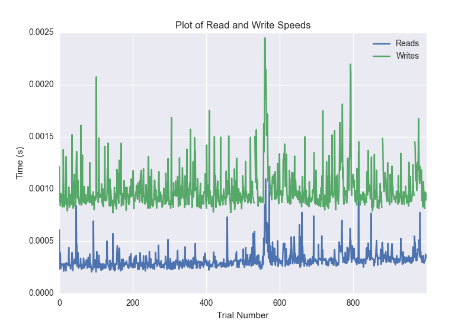
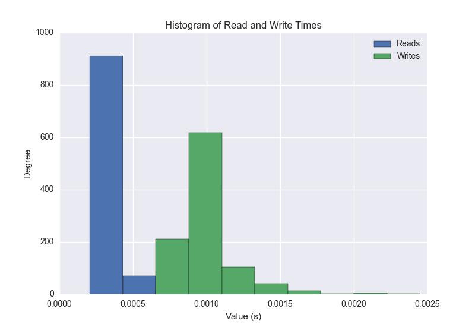
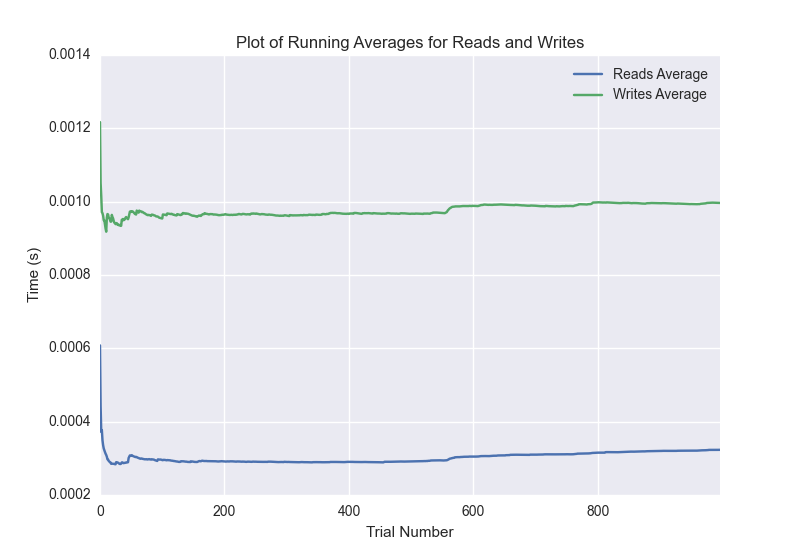

DATABASE BENCHMARKING REPORT - POSTGRESQL - 1000 Trials
=========================================

This report has been automatically generated from a Benchmarking application
built by [Kurtis Jungersen](http://kmjungersen.com).  The source behind the application can be found on the [project's GitHub.](https://github.com/kmjungersen/DB-Benchmarking)

TIME AND DATE
=============

Tue, 16 Dec, 2014 11:58:00

RESULTS
=======

After using these parameters:

| Parameter                  | Value      |
|:---------------------------|:-----------|
| Database Tested            | POSTGRESQL |
| Number of Trials           | 1000       |
| Length of Each Entry Field | 10         |
| Number of Nodes in Cluster | 3          |
| Split Reads and Writes     | False      |
| Debug Mode                 | False      |
| Chaos Mode (Random Reads)  | False      |

These results were obtained:

| Operation   |   Average |   St. Dev. |   Max Time |   Min Time |   Range |
|:------------|----------:|-----------:|-----------:|-----------:|--------:|
| Writes      |   0.00208 |    0.01982 |    0.38153 |    0.00077 | 0.38075 |
| Reads       |   0.00104 |    0.01586 |    0.42697 |    0.00021 | 0.42676 |

This plot shows the normalized speeds of reads and writes over the course of the benchmark.  The data was normalized (i.e. any data points beyond 3 standard deviations of the mean were excluded).

This plot shows a histogram which describes the general distribution of the data.

This plot shows the running averages for read and write speeds over the course of the benchmark.

Note: If any outliers were obtained in this benchmark, they will displayed here:

| Operation   |   Trial Number |     Value |
|:------------|---------------:|----------:|
| Write       |            531 | 0.367236  |
| Write       |            878 | 0.339571  |
| Write       |            966 | 0.381528  |
| Read        |            566 | 0.0280402 |
| Read        |            766 | 0.426966  |
| Read        |            976 | 0.262702  |