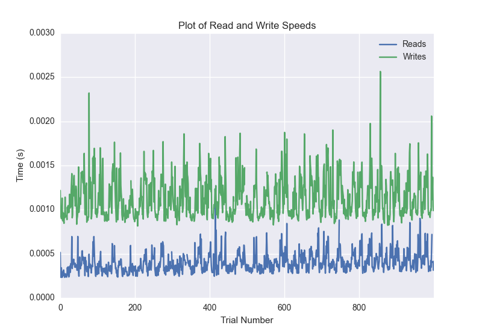
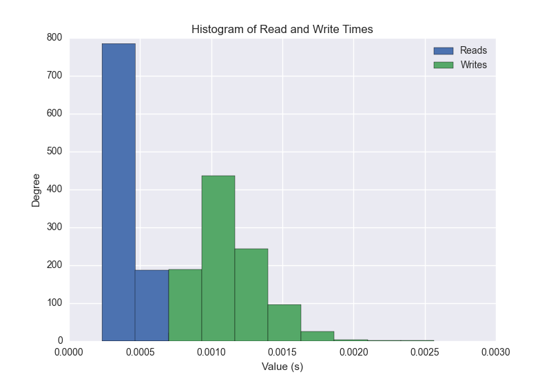
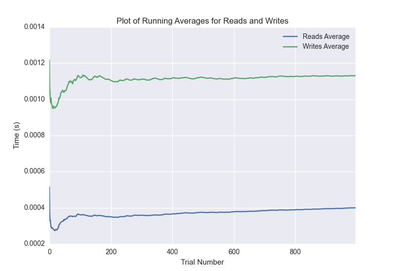

DATABASE BENCHMARKING REPORT - POSTGRESQL - 1000 Trials
=========================================

This report has been automatically generated from a Benchmarking application
built by [Kurtis Jungersen](http://kmjungersen.com).  The source behind the application can be found on the [project's GitHub.](https://github.com/kmjungersen/DB-Benchmarking)

TIME AND DATE
=============

Tue, 16 Dec, 2014 11:59:27

RESULTS
=======

After using these parameters:

| Parameter                  | Value      |
|:---------------------------|:-----------|
| Database Tested            | POSTGRESQL |
| Number of Trials           | 1000       |
| Length of Each Entry Field | 10         |
| Number of Nodes in Cluster | 3          |
| Split Reads and Writes     | False      |
| Debug Mode                 | False      |
| Chaos Mode (Random Reads)  | False      |

These results were obtained:

| Operation   |   Average |   St. Dev. |   Max Time |   Min Time |   Range |
|:------------|----------:|-----------:|-----------:|-----------:|--------:|
| Writes      |   0.00227 |    0.01844 |    0.34603 |    0.00081 | 0.34521 |
| Reads       |   0.00144 |    0.01818 |    0.34514 |    0.00023 | 0.34491 |

This plot shows the normalized speeds of reads and writes over the course of the benchmark.  The data was normalized (i.e. any data points beyond 3 standard deviations of the mean were excluded).

This plot shows a histogram which describes the general distribution of the data.

This plot shows the running averages for read and write speeds over the course of the benchmark.

Note: If any outliers were obtained in this benchmark, they will displayed here:

| Operation   |   Trial Number |     Value |
|:------------|---------------:|----------:|
| Write       |            188 | 0.315683  |
| Write       |            465 | 0.176052  |
| Write       |            494 | 0.346028  |
| Write       |            551 | 0.305107  |
| Read        |            297 | 0.315255  |
| Read        |            338 | 0.333099  |
| Read        |            747 | 0.345141  |
| Read        |            995 | 0.0501568 |