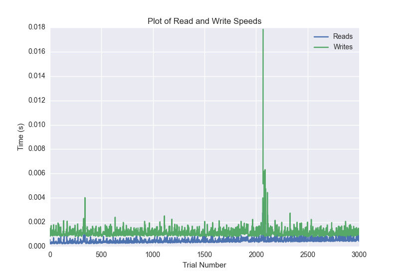
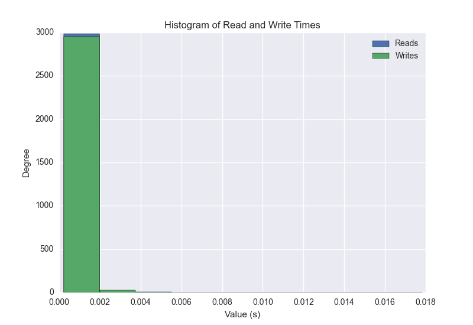
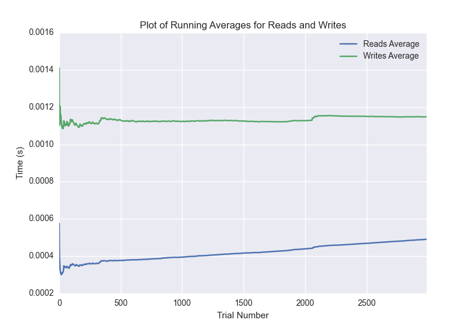

DATABASE BENCHMARKING REPORT - POSTGRESQL - 3000 Trials
=========================================

This report has been automatically generated from a Benchmarking application
built by [Kurtis Jungersen](http://kmjungersen.com).  The source behind the application can be found on the [project's GitHub.](https://github.com/kmjungersen/DB-Benchmarking)

TIME AND DATE
=============

Tue, 16 Dec, 2014 12:00:53

RESULTS
=======

After using these parameters:

| Parameter                  | Value      |
|:---------------------------|:-----------|
| Database Tested            | POSTGRESQL |
| Number of Trials           | 3000       |
| Length of Each Entry Field | 10         |
| Number of Nodes in Cluster | 3          |
| Split Reads and Writes     | False      |
| Debug Mode                 | False      |
| Chaos Mode (Random Reads)  | False      |

These results were obtained:

| Operation   |   Average |   St. Dev. |   Max Time |   Min Time |   Range |
|:------------|----------:|-----------:|-----------:|-----------:|--------:|
| Writes      |   0.00221 |    0.01823 |    0.37189 |    0.00080 | 0.37109 |
| Reads       |   0.00163 |    0.01983 |    0.38137 |    0.00023 | 0.38114 |

This plot shows the normalized speeds of reads and writes over the course of the benchmark.  The data was normalized (i.e. any data points beyond 3 standard deviations of the mean were excluded).

This plot shows a histogram which describes the general distribution of the data.

This plot shows the running averages for read and write speeds over the course of the benchmark.

Note: If any outliers were obtained in this benchmark, they will displayed here:

| Operation   |   Trial Number |     Value |
|:------------|---------------:|----------:|
| Write       |            105 | 0.371888  |
| Write       |            359 | 0.354684  |
| Write       |            516 | 0.101716  |
| Write       |            853 | 0.340839  |
| Write       |            929 | 0.369841  |
| Write       |           1129 | 0.35083   |
| Write       |           1526 | 0.124698  |
| Write       |           1652 | 0.316376  |
| Write       |           2066 | 0.0215199 |
| Write       |           2069 | 0.027427  |
| Write       |           2341 | 0.313759  |
| Write       |           2734 | 0.320945  |
| Write       |           2749 | 0.195311  |
| Read        |           1079 | 0.305105  |
| Read        |           1252 | 0.381368  |
| Read        |           1345 | 0.334079  |
| Read        |           1526 | 0.350194  |
| Read        |           1603 | 0.360973  |
| Read        |           2155 | 0.320295  |
| Read        |           2221 | 0.377379  |
| Read        |           2222 | 0.301963  |
| Read        |           2498 | 0.36356   |
| Read        |           2689 | 0.338533  |