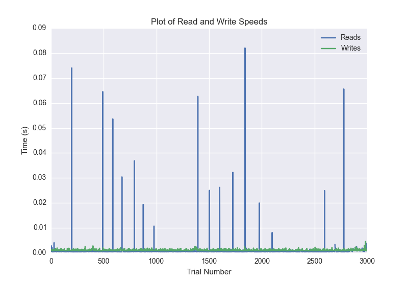
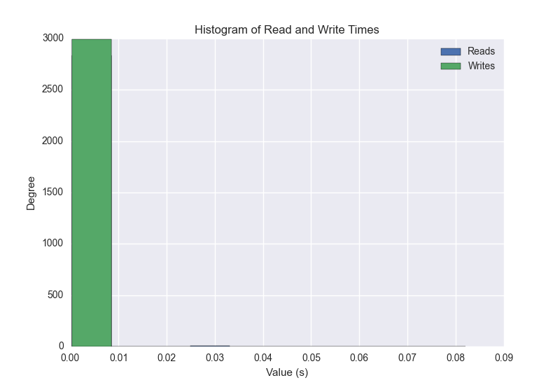
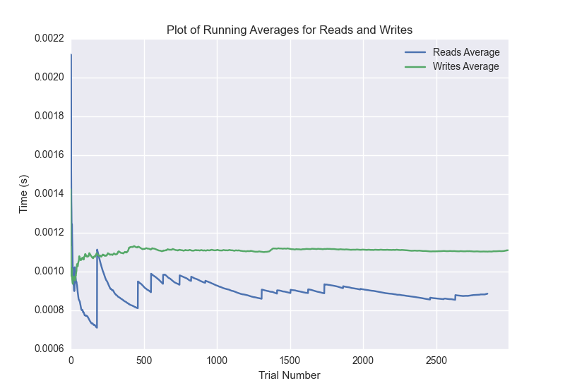

DATABASE BENCHMARKING REPORT - POSTGRESQL - 3000 Trials
=========================================

This report has been automatically generated from a Benchmarking application
built by [Kurtis Jungersen](http://kmjungersen.com).  The source behind the application can be found on the [project's GitHub.](https://github.com/kmjungersen/DB-Benchmarking)

TIME AND DATE
=============

Tue, 16 Dec, 2014 16:52:22

RESULTS
=======

After using these parameters:

| Parameter                  | Value      |
|:---------------------------|:-----------|
| Database Tested            | POSTGRESQL |
| Number of Trials           | 3000       |
| Length of Each Entry Field | 10         |
| Number of Nodes in Cluster | 3          |
| Split Reads and Writes     | True       |
| Debug Mode                 | False      |
| Chaos Mode (Random Reads)  | True       |

These results were obtained:

| Operation   |   Average |   St. Dev. |   Max Time |   Min Time |   Range |
|:------------|----------:|-----------:|-----------:|-----------:|--------:|
| Writes      |   0.00178 |    0.01563 |    0.40023 |    0.00077 | 0.39947 |
| Reads       |   0.01981 |    0.08275 |    0.51033 |    0.00042 | 0.50991 |

This plot shows the normalized speeds of reads and writes over the course of the benchmark.  The data was normalized (i.e. any data points beyond 3 standard deviations of the mean were excluded).

This plot shows a histogram which describes the general distribution of the data.

This plot shows the running averages for read and write speeds over the course of the benchmark.

Note: If any outliers were obtained in this benchmark, they will displayed here:

| Operation   |   Trial Number |     Value |
|:------------|---------------:|----------:|
| Write       |            569 | 0.347444  |
| Write       |           1787 | 0.394543  |
| Write       |           2097 | 0.0331581 |
| Write       |           2262 | 0.400232  |
| Write       |           2298 | 0.0784099 |
| Write       |           2617 | 0.397363  |
| Write       |           2727 | 0.369322  |
| Read        |              9 | 0.347612  |
| Read        |             32 | 0.380686  |
| Read        |             41 | 0.39569   |
| Read        |             59 | 0.388858  |
| Read        |             63 | 0.398889  |
| Read        |             80 | 0.391533  |
| Read        |             93 | 0.392733  |
| Read        |            104 | 0.393182  |
| Read        |            112 | 0.394718  |
| Read        |            120 | 0.394521  |
| Read        |            129 | 0.390104  |
| Read        |            143 | 0.396347  |
| Read        |            146 | 0.399188  |
| Read        |            159 | 0.393695  |
| Read        |            173 | 0.393932  |
| Read        |            175 | 0.301878  |
| Read        |            327 | 0.324879  |
| Read        |            331 | 0.399611  |
| Read        |            343 | 0.39623   |
| Read        |            349 | 0.39759   |
| Read        |            360 | 0.371254  |
| Read        |            368 | 0.41868   |
| Read        |            373 | 0.396987  |
| Read        |            390 | 0.389396  |
| Read        |            399 | 0.394107  |
| Read        |            413 | 0.365716  |
| Read        |            433 | 0.312218  |
| Read        |            443 | 0.393478  |
| Read        |            455 | 0.392093  |
| Read        |            468 | 0.391647  |
| Read        |            481 | 0.391891  |
| Read        |            495 | 0.326487  |
| Read        |            507 | 0.393793  |
| Read        |            543 | 0.380015  |
| Read        |            558 | 0.392418  |
| Read        |            570 | 0.393918  |
| Read        |            590 | 0.337154  |
| Read        |            602 | 0.394486  |
| Read        |            611 | 0.396049  |
| Read        |            622 | 0.395183  |
| Read        |            637 | 0.393596  |
| Read        |            711 | 0.322624  |
| Read        |            753 | 0.375029  |
| Read        |            765 | 0.393803  |
| Read        |            771 | 0.398027  |
| Read        |            786 | 0.393358  |
| Read        |            815 | 0.343139  |
| Read        |            824 | 0.396628  |
| Read        |            829 | 0.398534  |
| Read        |            837 | 0.396301  |
| Read        |            863 | 0.386765  |
| Read        |            921 | 0.336669  |
| Read        |            930 | 0.396111  |
| Read        |            943 | 0.395125  |
| Read        |            962 | 0.389917  |
| Read        |            972 | 0.395733  |
| Read        |            982 | 0.386288  |
| Read        |            991 | 0.394963  |
| Read        |           1006 | 0.389823  |
| Read        |           1027 | 0.386522  |
| Read        |           1041 | 0.391281  |
| Read        |           1058 | 0.390105  |
| Read        |           1080 | 0.386693  |
| Read        |           1104 | 0.384631  |
| Read        |           1117 | 0.391455  |
| Read        |           1130 | 0.391133  |
| Read        |           1141 | 0.392787  |
| Read        |           1146 | 0.39671   |
| Read        |           1167 | 0.388251  |
| Read        |           1176 | 0.147266  |
| Read        |           1198 | 0.332362  |
| Read        |           1206 | 0.299749  |
| Read        |           1216 | 0.393025  |
| Read        |           1235 | 0.39045   |
| Read        |           1245 | 0.397687  |
| Read        |           1251 | 0.397983  |
| Read        |           1259 | 0.386441  |
| Read        |           1265 | 0.51033   |
| Read        |           1280 | 0.391953  |
| Read        |           1285 | 0.398263  |
| Read        |           1317 | 0.382048  |
| Read        |           1333 | 0.268463  |
| Read        |           1345 | 0.31596   |
| Read        |           1359 | 0.394165  |
| Read        |           1369 | 0.396897  |
| Read        |           1371 | 0.402442  |
| Read        |           1391 | 0.388172  |
| Read        |           1399 | 0.333523  |
| Read        |           1416 | 0.3888    |
| Read        |           1432 | 0.392462  |
| Read        |           1437 | 0.400321  |
| Read        |           1461 | 0.386467  |
| Read        |           1520 | 0.335479  |
| Read        |           1554 | 0.378759  |
| Read        |           1566 | 0.395194  |
| Read        |           1574 | 0.396293  |
| Read        |           1577 | 0.399958  |
| Read        |           1638 | 0.330147  |
| Read        |           1653 | 0.389988  |
| Read        |           1658 | 0.397629  |
| Read        |           1706 | 0.367573  |
| Read        |           1716 | 0.393241  |
| Read        |           1738 | 0.352314  |
| Read        |           1789 | 0.369884  |
| Read        |           1800 | 0.392322  |
| Read        |           1826 | 0.385758  |
| Read        |           1861 | 0.329357  |
| Read        |           1870 | 0.241856  |
| Read        |           1882 | 0.308361  |
| Read        |           1894 | 0.391732  |
| Read        |           1907 | 0.394637  |
| Read        |           1958 | 0.226659  |
| Read        |           1964 | 0.342218  |
| Read        |           2034 | 0.330855  |
| Read        |           2042 | 0.396345  |
| Read        |           2057 | 0.393611  |
| Read        |           2082 | 0.385532  |
| Read        |           2090 | 0.39767   |
| Read        |           2113 | 0.378697  |
| Read        |           2124 | 0.393789  |
| Read        |           2132 | 0.398211  |
| Read        |           2148 | 0.39069   |
| Read        |           2155 | 0.397627  |
| Read        |           2170 | 0.392903  |
| Read        |           2180 | 0.395586  |
| Read        |           2184 | 0.399802  |
| Read        |           2193 | 0.394732  |
| Read        |           2216 | 0.380777  |
| Read        |           2230 | 0.395686  |
| Read        |           2240 | 0.397266  |
| Read        |           2418 | 0.337728  |
| Read        |           2435 | 0.390346  |
| Read        |           2454 | 0.276744  |
| Read        |           2469 | 0.307706  |
| Read        |           2485 | 0.391107  |
| Read        |           2490 | 0.399526  |
| Read        |           2497 | 0.398164  |
| Read        |           2524 | 0.383822  |
| Read        |           2641 | 0.390664  |
| Read        |           2645 | 0.398793  |
| Read        |           2661 | 0.388902  |
| Read        |           2672 | 0.392805  |
| Read        |           2678 | 0.368721  |
| Read        |           2692 | 0.318551  |
| Read        |           2717 | 0.373578  |
| Read        |           2719 | 0.399669  |
| Read        |           2732 | 0.36545   |
| Read        |           2774 | 0.399799  |
| Read        |           2791 | 0.327576  |
| Read        |           2806 | 0.393139  |
| Read        |           2825 | 0.390143  |