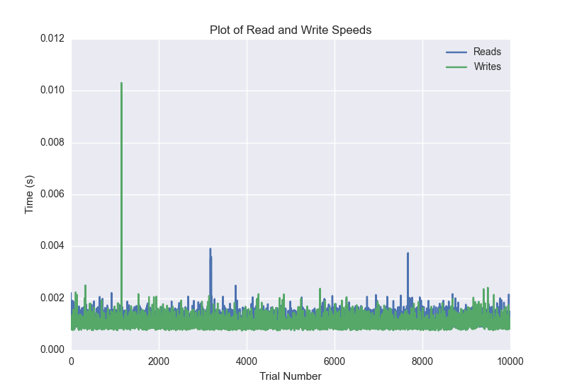
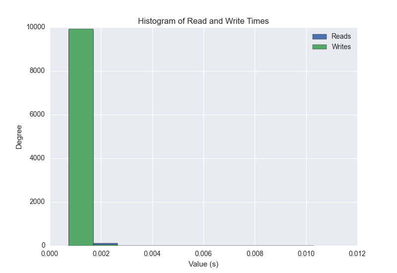
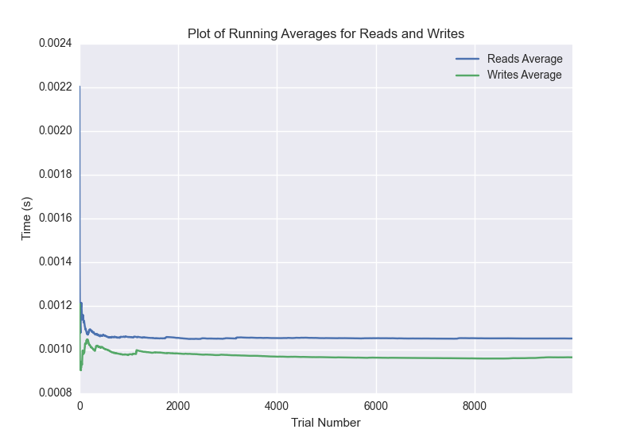

DATABASE BENCHMARKING REPORT - POSTGRESQL - 10000 Trials
=========================================

This report has been automatically generated from a Benchmarking application
built by [Kurtis Jungersen](http://kmjungersen.com).  The source behind the application can be found on the [project's GitHub.](https://github.com/kmjungersen/DB-Benchmarking)

TIME AND DATE
=============

Tue, 16 Dec, 2014 16:55:34

RESULTS
=======

After using these parameters:

| Parameter                  | Value      |
|:---------------------------|:-----------|
| Database Tested            | POSTGRESQL |
| Number of Trials           | 10000      |
| Length of Each Entry Field | 10         |
| Number of Nodes in Cluster | 3          |
| Split Reads and Writes     | True       |
| Debug Mode                 | False      |
| Chaos Mode (Random Reads)  | True       |

These results were obtained:

| Operation   |   Average |   St. Dev. |   Max Time |   Min Time |   Range |
|:------------|----------:|-----------:|-----------:|-----------:|--------:|
| Writes      |   0.00149 |    0.01335 |    0.39704 |    0.00075 | 0.39629 |
| Reads       |   0.00186 |    0.01790 |    0.79715 |    0.00087 | 0.79628 |

This plot shows the normalized speeds of reads and writes over the course of the benchmark.  The data was normalized (i.e. any data points beyond 3 standard deviations of the mean were excluded).

This plot shows a histogram which describes the general distribution of the data.

This plot shows the running averages for read and write speeds over the course of the benchmark.

Note: If any outliers were obtained in this benchmark, they will displayed here:

| Operation   |   Trial Number |     Value |
|:------------|---------------:|----------:|
| Write       |            445 | 0.320468  |
| Write       |            911 | 0.330725  |
| Write       |           1777 | 0.385242  |
| Write       |           2539 | 0.317319  |
| Write       |           3029 | 0.397043  |
| Write       |           3928 | 0.275461  |
| Write       |           4031 | 0.31182   |
| Write       |           4356 | 0.365334  |
| Write       |           4907 | 0.320456  |
| Write       |           5622 | 0.391504  |
| Write       |           6297 | 0.18863   |
| Write       |           6420 | 0.396832  |
| Write       |           6933 | 0.380948  |
| Write       |           8496 | 0.309519  |
| Write       |           8898 | 0.240346  |
| Write       |           9172 | 0.346664  |
| Read        |             27 | 0.383163  |
| Read        |            828 | 0.335837  |
| Read        |           1177 | 0.321936  |
| Read        |           1291 | 0.0261929 |
| Read        |           2460 | 0.401351  |
| Read        |           2469 | 0.330217  |
| Read        |           2917 | 0.379866  |
| Read        |           2956 | 0.355044  |
| Read        |           3174 | 0.314848  |
| Read        |           3224 | 0.118186  |
| Read        |           4221 | 0.797148  |
| Read        |           4350 | 0.365397  |
| Read        |           4383 | 0.363474  |
| Read        |           4487 | 0.38799   |
| Read        |           5888 | 0.394325  |
| Read        |           6161 | 0.309124  |
| Read        |           6473 | 0.368379  |
| Read        |           7049 | 0.385692  |
| Read        |           7638 | 0.371995  |
| Read        |           7706 | 0.309413  |
| Read        |           8262 | 0.305265  |
| Read        |           8647 | 0.384628  |
| Read        |           9499 | 0.385098  |