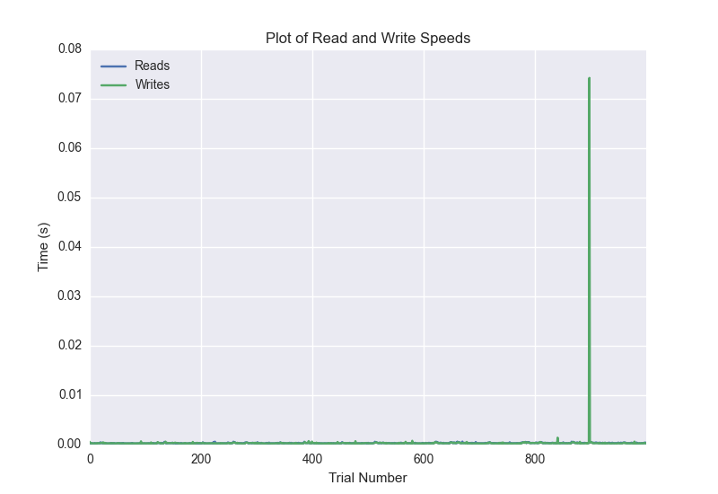
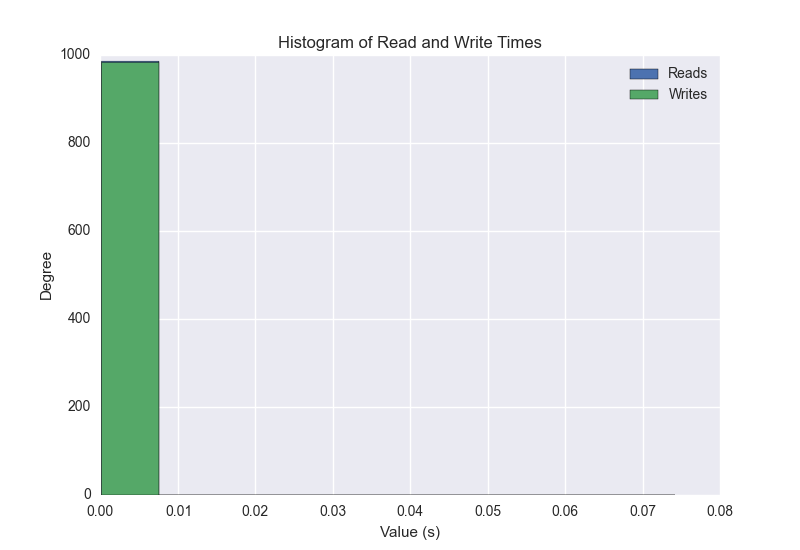
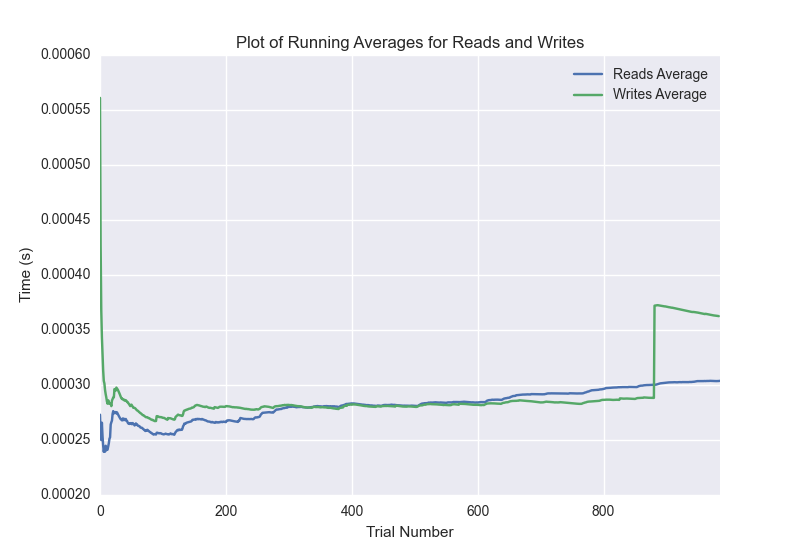

DATABASE BENCHMARKING REPORT - POSTGRESQL - 1000 Trials
=========================================

This report has been automatically generated from a Benchmarking application
built by [Kurtis Jungersen](http://kmjungersen.com).  The source behind the application can be found on the [project's GitHub.](https://github.com/kmjungersen/DB-Benchmarking)

TIME AND DATE
=============

Mon, 17 Nov, 2014 20:31:17

RESULTS
=======

After using these parameters:

| Parameter                  | Value      |
|:---------------------------|:-----------|
| Database Tested            | POSTGRESQL |
| Number of Trials           | 1000       |
| Length of Each Entry Field | 2          |
| Number of Nodes in Cluster | 1          |
| Split Reads and Writes     | False      |
| Debug Mode                 | False      |
| Chaos Mode (Random Reads)  | False      |

These results were obtained:

| Operation   |   Average |   St. Dev. |   Max Time |   Min Time |   Range |
|:------------|----------:|-----------:|-----------:|-----------:|--------:|
| Writes      |   0.00600 |    0.04448 |    0.39998 |    0.00022 | 0.39976 |
| Reads       |   0.00031 |    0.00011 |    0.00142 |    0.00020 | 0.00122 |

This plot shows the normalized speeds of reads and writes over the course of the benchmark.  The data was normalized (i.e. any data points beyond 3 standard deviations of the mean were excluded).

This plot shows a histogram which describes the general distribution of the data.

This plot shows the running averages for read and write speeds over the course of the benchmark.

Note: If any outliers were obtained in this benchmark, they will displayed here:

| Operation   |   Trial Number |       Value |
|:------------|---------------:|------------:|
| Write       |             19 | 0.281223    |
| Write       |             50 | 0.36376     |
| Write       |            134 | 0.353235    |
| Write       |            258 | 0.325742    |
| Write       |            280 | 0.386105    |
| Write       |            385 | 0.337784    |
| Write       |            453 | 0.356878    |
| Write       |            512 | 0.3644      |
| Write       |            619 | 0.331481    |
| Write       |            647 | 0.38023     |
| Write       |            660 | 0.390136    |
| Write       |            777 | 0.326377    |
| Write       |            785 | 0.396915    |
| Write       |            810 | 0.303383    |
| Write       |            865 | 0.344913    |
| Write       |            868 | 0.399977    |
| Read        |              0 | 0.000854015 |
| Read        |             12 | 0.000751972 |
| Read        |            234 | 0.00131297  |
| Read        |            440 | 0.00118899  |
| Read        |            460 | 0.000794888 |
| Read        |            531 | 0.00141811  |
| Read        |            619 | 0.000687122 |
| Read        |            622 | 0.00104117  |
| Read        |            840 | 0.000665188 |
| Read        |            846 | 0.00114584  |
| Read        |            860 | 0.000658989 |
| Read        |            867 | 0.000955105 |
| Read        |            897 | 0.000670195 |
| Read        |            994 | 0.00107002  |