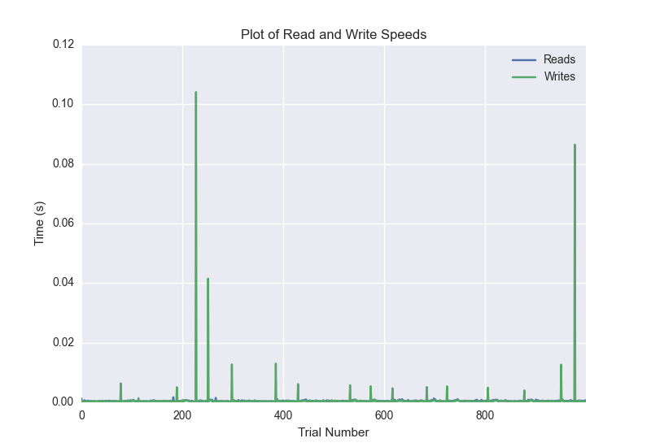
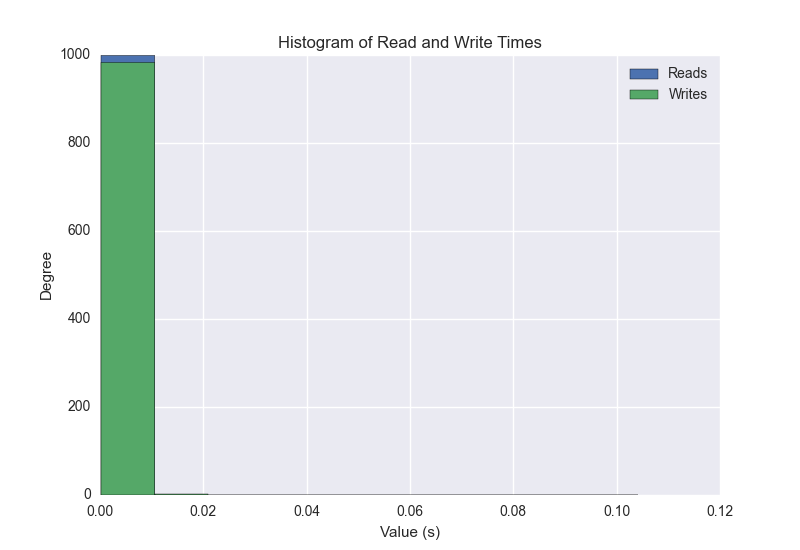
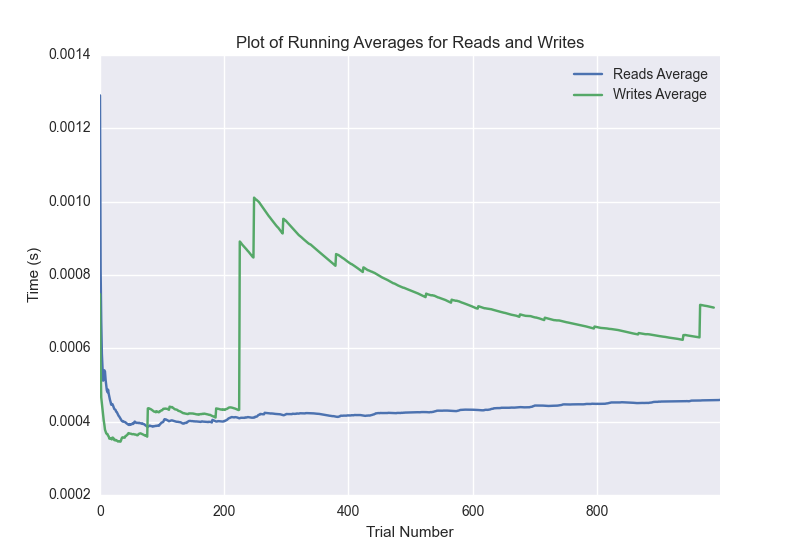

DATABASE BENCHMARKING REPORT - POSTGRESQL - 1000 Trials
=========================================

This report has been automatically generated from a Benchmarking application
built by [Kurtis Jungersen](http://kmjungersen.com).  The source behind the application can be found on the [project's GitHub.](https://github.com/kmjungersen/DB-Benchmarking)

TIME AND DATE
=============

Fri, 21 Nov, 2014 14:45:03

RESULTS
=======

After using these parameters:

| Parameter                  | Value      |
|:---------------------------|:-----------|
| Database Tested            | POSTGRESQL |
| Number of Trials           | 1000       |
| Length of Each Entry Field | 10         |
| Number of Nodes in Cluster | 1          |
| Split Reads and Writes     | False      |
| Debug Mode                 | False      |
| Chaos Mode (Random Reads)  | False      |

These results were obtained:

| Operation   |   Average |   St. Dev. |   Max Time |   Min Time |   Range |
|:------------|----------:|-----------:|-----------:|-----------:|--------:|
| Writes      |   0.00452 |    0.03664 |    0.39231 |    0.00019 | 0.39211 |
| Reads       |   0.00050 |    0.00123 |    0.03899 |    0.00023 | 0.03876 |

This plot shows the normalized speeds of reads and writes over the course of the benchmark.  The data was normalized (i.e. any data points beyond 3 standard deviations of the mean were excluded).

This plot shows a histogram which describes the general distribution of the data.

This plot shows the running averages for read and write speeds over the course of the benchmark.

Note: If any outliers were obtained in this benchmark, they will displayed here:

| Operation   |   Trial Number |     Value |
|:------------|---------------:|----------:|
| Write       |             25 | 0.364786  |
| Write       |            141 | 0.360488  |
| Write       |            235 | 0.309771  |
| Write       |            323 | 0.370363  |
| Write       |            333 | 0.392306  |
| Write       |            459 | 0.371725  |
| Write       |            486 | 0.254191  |
| Write       |            639 | 0.362009  |
| Write       |            759 | 0.373196  |
| Write       |            828 | 0.330927  |
| Write       |            904 | 0.328034  |
| Read        |            105 | 0.0389948 |