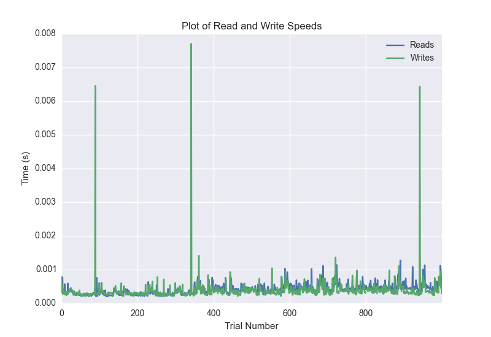
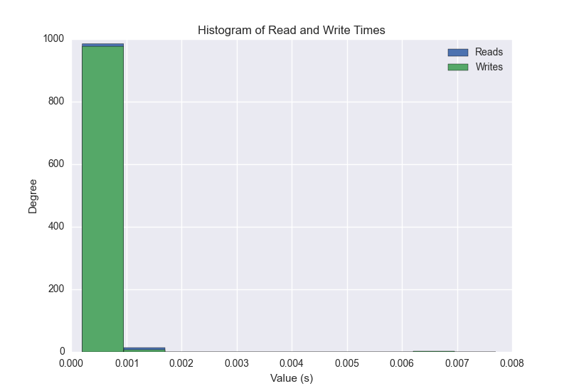
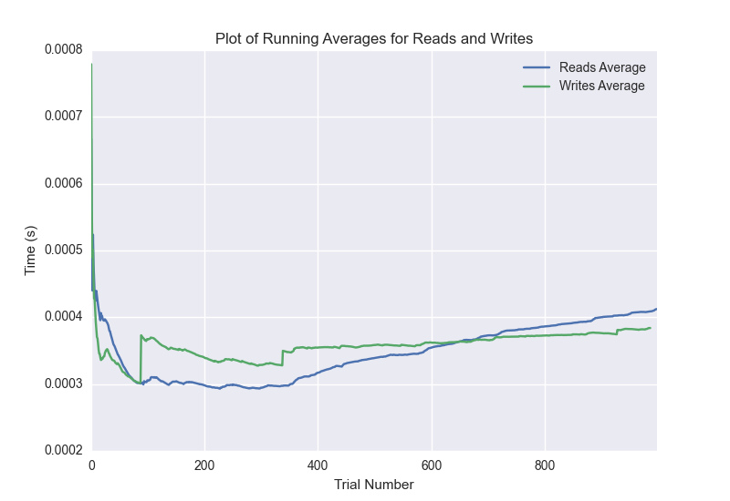

DATABASE BENCHMARKING REPORT - POSTGRESQL - 1000 Trials
=========================================

This report has been automatically generated from a Benchmarking application
built by [Kurtis Jungersen](http://kmjungersen.com).  The source behind the application can be found on the [project's GitHub.](https://github.com/kmjungersen/DB-Benchmarking)

TIME AND DATE
=============

Fri, 21 Nov, 2014 15:10:48

RESULTS
=======

After using these parameters:

| Parameter                  | Value      |
|:---------------------------|:-----------|
| Database Tested            | POSTGRESQL |
| Number of Trials           | 1000       |
| Length of Each Entry Field | 10         |
| Number of Nodes in Cluster | 1          |
| Split Reads and Writes     | False      |
| Debug Mode                 | False      |
| Chaos Mode (Random Reads)  | False      |

These results were obtained:

| Operation   |   Average |   St. Dev. |   Max Time |   Min Time |   Range |
|:------------|----------:|-----------:|-----------:|-----------:|--------:|
| Writes      |   0.00492 |    0.03964 |    0.39324 |    0.00020 | 0.39304 |
| Reads       |   0.00076 |    0.01112 |    0.35195 |    0.00020 | 0.35175 |

This plot shows the normalized speeds of reads and writes over the course of the benchmark.  The data was normalized (i.e. any data points beyond 3 standard deviations of the mean were excluded).

This plot shows a histogram which describes the general distribution of the data.

This plot shows the running averages for read and write speeds over the course of the benchmark.

Note: If any outliers were obtained in this benchmark, they will displayed here:

| Operation   |   Trial Number |    Value |
|:------------|---------------:|---------:|
| Write       |             24 | 0.365554 |
| Write       |            138 | 0.323563 |
| Write       |            164 | 0.382883 |
| Write       |            396 | 0.311346 |
| Write       |            472 | 0.324609 |
| Write       |            527 | 0.349541 |
| Write       |            599 | 0.332622 |
| Write       |            628 | 0.329042 |
| Write       |            730 | 0.333175 |
| Write       |            792 | 0.386479 |
| Write       |            800 | 0.393239 |
| Write       |            830 | 0.322604 |
| Write       |            894 | 0.382036 |
| Read        |            776 | 0.351954 |