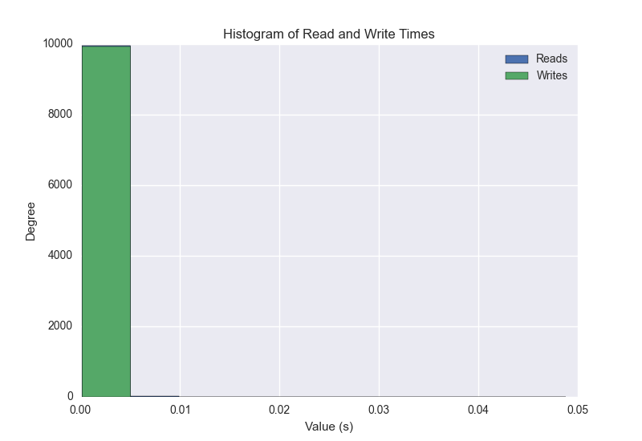
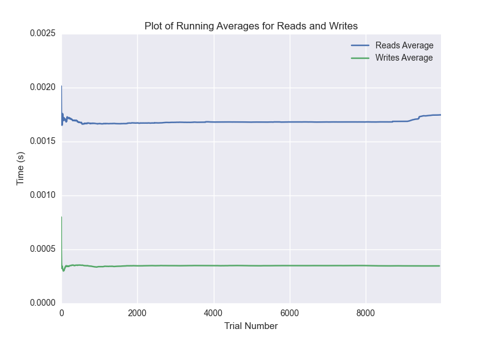

DATABASE BENCHMARKING REPORT - POSTGRESQL - 10000 Trials
=========================================

This report has been automatically generated from a Benchmarking application
built by [Kurtis Jungersen](http://kmjungersen.com).  The source behind the application can be found on the [project's GitHub.](https://github.com/kmjungersen/DB-Benchmarking)

TIME AND DATE
=============

Fri, 21 Nov, 2014 15:21:27

RESULTS
=======

After using these parameters:

| Parameter                  | Value      |
|:---------------------------|:-----------|
| Database Tested            | POSTGRESQL |
| Number of Trials           | 10000      |
| Length of Each Entry Field | 10         |
| Number of Nodes in Cluster | 1          |
| Split Reads and Writes     | True       |
| Debug Mode                 | False      |
| Chaos Mode (Random Reads)  | True       |

These results were obtained:

| Operation   |   Average |   St. Dev. |   Max Time |   Min Time |   Range |
|:------------|----------:|-----------:|-----------:|-----------:|--------:|
| Writes      |   0.00263 |    0.02814 |    0.40026 |    0.00018 | 0.40008 |
| Reads       |   0.00248 |    0.01588 |    0.54417 |    0.00094 | 0.54323 |

This plot shows the normalized speeds of reads and writes over the course of the benchmark.  The data was normalized (i.e. any data points beyond 3 standard deviations of the mean were excluded).

This plot shows a histogram which describes the general distribution of the data.

This plot shows the running averages for read and write speeds over the course of the benchmark.

Note: If any outliers were obtained in this benchmark, they will displayed here:

| Operation   |   Trial Number |     Value |
|:------------|---------------:|----------:|
| Write       |             83 | 0.35365   |
| Write       |            101 | 0.393569  |
| Write       |            205 | 0.359015  |
| Write       |            258 | 0.377937  |
| Write       |            433 | 0.329724  |
| Write       |            463 | 0.387231  |
| Write       |            935 | 0.320005  |
| Write       |           1091 | 0.334336  |
| Write       |           1129 | 0.382648  |
| Write       |           1149 | 0.286516  |
| Write       |           1409 | 0.304249  |
| Write       |           1630 | 0.304919  |
| Write       |           1702 | 0.372284  |
| Write       |           1894 | 0.320077  |
| Write       |           2167 | 0.274751  |
| Write       |           2206 | 0.301656  |
| Write       |           2227 | 0.393693  |
| Write       |           2516 | 0.384239  |
| Write       |           2707 | 0.321028  |
| Write       |           2814 | 0.330529  |
| Write       |           2898 | 0.398441  |
| Write       |           3072 | 0.332247  |
| Write       |           3120 | 0.383626  |
| Write       |           3158 | 0.387131  |
| Write       |           3370 | 0.268788  |
| Write       |           3502 | 0.384257  |
| Write       |           3604 | 0.359261  |
| Write       |           3641 | 0.385377  |
| Write       |           3721 | 0.18663   |
| Write       |           4210 | 0.342241  |
| Write       |           4298 | 0.31026   |
| Write       |           4325 | 0.391104  |
| Write       |           4403 | 0.371012  |
| Write       |           4499 | 0.360903  |
| Write       |           4904 | 0.277154  |
| Write       |           5174 | 0.354778  |
| Write       |           5329 | 0.337222  |
| Write       |           5337 | 0.400257  |
| Write       |           5642 | 0.374113  |
| Write       |           5675 | 0.211545  |
| Write       |           5782 | 0.334947  |
| Write       |           5808 | 0.391665  |
| Write       |           5880 | 0.37101   |
| Write       |           6280 | 0.340162  |
| Write       |           6356 | 0.285651  |
| Write       |           6562 | 0.397309  |
| Write       |           6723 | 0.332736  |
| Write       |           6864 | 0.343236  |
| Write       |           6868 | 0.398745  |
| Write       |           7089 | 0.220808  |
| Write       |           7163 | 0.359486  |
| Write       |           7311 | 0.339199  |
| Write       |           7445 | 0.348851  |
| Write       |           7608 | 0.332464  |
| Write       |           7666 | 0.377782  |
| Write       |           7748 | 0.367632  |
| Write       |           7896 | 0.341291  |
| Write       |           8355 | 0.328213  |
| Write       |           8696 | 0.364953  |
| Write       |           8710 | 0.190874  |
| Write       |           8764 | 0.379627  |
| Write       |           9079 | 0.372441  |
| Write       |           9168 | 0.366456  |
| Write       |           9248 | 0.366586  |
| Write       |           9263 | 0.289777  |
| Write       |           9907 | 0.341702  |
| Write       |           9990 | 0.36672   |
| Read        |            166 | 0.309173  |
| Read        |            505 | 0.333674  |
| Read        |            960 | 0.336617  |
| Read        |           1069 | 0.197729  |
| Read        |           1819 | 0.340801  |
| Read        |           1851 | 0.316134  |
| Read        |           1965 | 0.336026  |
| Read        |           2337 | 0.368609  |
| Read        |           2656 | 0.353581  |
| Read        |           2722 | 0.383795  |
| Read        |           2855 | 0.375669  |
| Read        |           3687 | 0.376734  |
| Read        |           4079 | 0.321863  |
| Read        |           4998 | 0.0760279 |
| Read        |           5020 | 0.322855  |
| Read        |           5568 | 0.22206   |
| Read        |           5731 | 0.190997  |
| Read        |           5818 | 0.327087  |
| Read        |           7018 | 0.544171  |
| Read        |           7086 | 0.383307  |
| Read        |           8339 | 0.269178  |
| Read        |           8672 | 0.318853  |
| Read        |           9509 | 0.376131  |