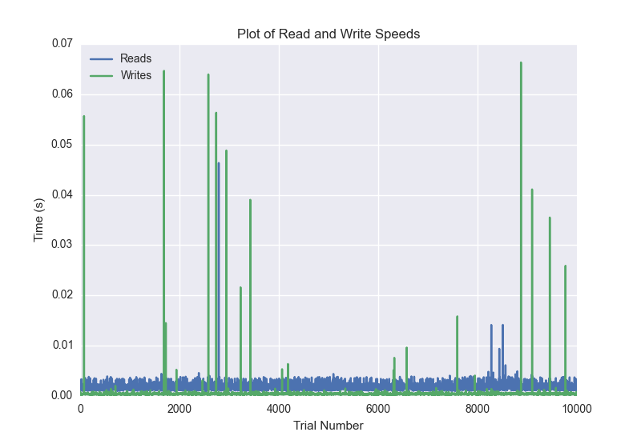
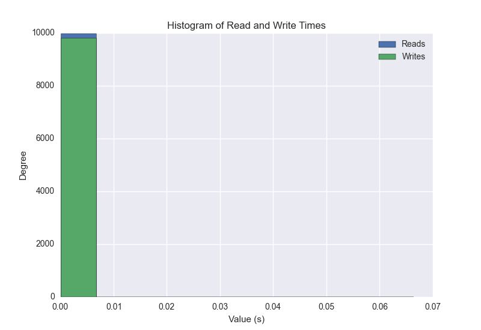
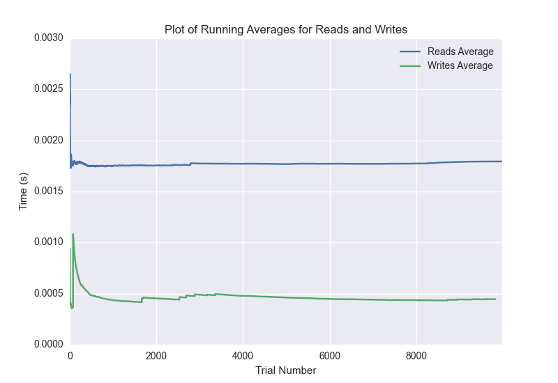

DATABASE BENCHMARKING REPORT - POSTGRESQL - 10000 Trials
=========================================

This report has been automatically generated from a Benchmarking application
built by [Kurtis Jungersen](http://kmjungersen.com).  The source behind the application can be found on the [project's GitHub.](https://github.com/kmjungersen/DB-Benchmarking)

TIME AND DATE
=============

Fri, 21 Nov, 2014 15:22:59

RESULTS
=======

After using these parameters:

| Parameter                  | Value      |
|:---------------------------|:-----------|
| Database Tested            | POSTGRESQL |
| Number of Trials           | 10000      |
| Length of Each Entry Field | 10         |
| Number of Nodes in Cluster | 1          |
| Split Reads and Writes     | True       |
| Debug Mode                 | False      |
| Chaos Mode (Random Reads)  | True       |

These results were obtained:

| Operation   |   Average |   St. Dev. |   Max Time |   Min Time |   Range |
|:------------|----------:|-----------:|-----------:|-----------:|--------:|
| Writes      |   0.00688 |    0.04851 |    0.45619 |    0.00018 | 0.45601 |
| Reads       |   0.00243 |    0.01517 |    0.41352 |    0.00091 | 0.41261 |

This plot shows the normalized speeds of reads and writes over the course of the benchmark.  The data was normalized (i.e. any data points beyond 3 standard deviations of the mean were excluded).

This plot shows a histogram which describes the general distribution of the data.

This plot shows the running averages for read and write speeds over the course of the benchmark.

Note: If any outliers were obtained in this benchmark, they will displayed here:

| Operation   |   Trial Number |    Value |
|:------------|---------------:|---------:|
| Write       |             18 | 0.383455 |
| Write       |             76 | 0.378676 |
| Write       |            101 | 0.335799 |
| Write       |            147 | 0.38296  |
| Write       |            286 | 0.329427 |
| Write       |            294 | 0.399575 |
| Write       |            305 | 0.396084 |
| Write       |            664 | 0.303    |
| Write       |            724 | 0.373232 |
| Write       |            758 | 0.385623 |
| Write       |            794 | 0.383066 |
| Write       |            855 | 0.317975 |
| Write       |           1027 | 0.367035 |
| Write       |           1075 | 0.375511 |
| Write       |           1095 | 0.391321 |
| Write       |           1133 | 0.383836 |
| Write       |           1250 | 0.27863  |
| Write       |           1255 | 0.456192 |
| Write       |           1259 | 0.398536 |
| Write       |           1393 | 0.325792 |
| Write       |           1406 | 0.397724 |
| Write       |           1479 | 0.304694 |
| Write       |           1531 | 0.343741 |
| Write       |           1558 | 0.390576 |
| Write       |           1620 | 0.375057 |
| Write       |           1646 | 0.390118 |
| Write       |           1707 | 0.309649 |
| Write       |           1808 | 0.331206 |
| Write       |           1829 | 0.394203 |
| Write       |           1839 | 0.398681 |
| Write       |           1914 | 0.370323 |
| Write       |           1930 | 0.396307 |
| Write       |           1986 | 0.371883 |
| Write       |           2011 | 0.39148  |
| Write       |           2036 | 0.388172 |
| Write       |           2059 | 0.390029 |
| Write       |           2066 | 0.39745  |
| Write       |           2083 | 0.392132 |
| Write       |           2105 | 0.389904 |
| Write       |           2352 | 0.363075 |
| Write       |           2359 | 0.399845 |
| Write       |           2362 | 0.292692 |
| Write       |           2377 | 0.303291 |
| Write       |           2387 | 0.399018 |
| Write       |           2509 | 0.330596 |
| Write       |           2529 | 0.393863 |
| Write       |           2544 | 0.396366 |
| Write       |           2592 | 0.319188 |
| Write       |           2620 | 0.390722 |
| Write       |           2637 | 0.394803 |
| Write       |           2679 | 0.382723 |
| Write       |           2717 | 0.382962 |
| Write       |           2808 | 0.306396 |
| Write       |           2833 | 0.391654 |
| Write       |           2895 | 0.372108 |
| Write       |           2910 | 0.392818 |
| Write       |           2913 | 0.399305 |
| Write       |           2970 | 0.327329 |
| Write       |           2978 | 0.399511 |
| Write       |           3116 | 0.329538 |
| Write       |           3152 | 0.386206 |
| Write       |           3168 | 0.394601 |
| Write       |           3320 | 0.303401 |
| Write       |           3323 | 0.400586 |
| Write       |           3367 | 0.381254 |
| Write       |           3385 | 0.392205 |
| Write       |           3420 | 0.384326 |
| Write       |           3750 | 0.377999 |
| Write       |           3782 | 0.386755 |
| Write       |           3830 | 0.381333 |
| Write       |           3856 | 0.391738 |
| Write       |           3953 | 0.17302  |
| Write       |           3960 | 0.368219 |
| Write       |           4004 | 0.382813 |
| Write       |           4024 | 0.393852 |
| Write       |           4032 | 0.399544 |
| Write       |           4035 | 0.399472 |
| Write       |           4083 | 0.373415 |
| Write       |           4134 | 0.37868  |
| Write       |           4149 | 0.396072 |
| Write       |           4162 | 0.396439 |
| Write       |           4181 | 0.394136 |
| Write       |           4277 | 0.347557 |
| Write       |           4426 | 0.325489 |
| Write       |           4468 | 0.383639 |
| Write       |           4681 | 0.38386  |
| Write       |           4694 | 0.293319 |
| Write       |           4779 | 0.363103 |
| Write       |           4824 | 0.380104 |
| Write       |           4967 | 0.327271 |
| Write       |           4989 | 0.391408 |
| Write       |           5063 | 0.363811 |
| Write       |           5104 | 0.38892  |
| Write       |           5145 | 0.385296 |
| Write       |           5170 | 0.391957 |
| Write       |           5191 | 0.392513 |
| Write       |           5264 | 0.34966  |
| Write       |           5325 | 0.39126  |
| Write       |           5443 | 0.338091 |
| Write       |           5473 | 0.38598  |
| Write       |           5691 | 0.371965 |
| Write       |           5788 | 0.250475 |
| Write       |           5811 | 0.313617 |
| Write       |           5817 | 0.39795  |
| Write       |           5840 | 0.389665 |
| Write       |           6027 | 0.30086  |
| Write       |           6190 | 0.307424 |
| Write       |           6397 | 0.385912 |
| Write       |           6409 | 0.397396 |
| Write       |           6412 | 0.300932 |
| Write       |           6437 | 0.391642 |
| Write       |           6470 | 0.386793 |
| Write       |           6654 | 0.388704 |
| Write       |           6674 | 0.392573 |
| Write       |           6748 | 0.367343 |
| Write       |           6766 | 0.394727 |
| Write       |           6778 | 0.348254 |
| Write       |           6807 | 0.338178 |
| Write       |           6871 | 0.373909 |
| Write       |           6885 | 0.396345 |
| Write       |           6908 | 0.393149 |
| Write       |           6937 | 0.389863 |
| Write       |           7018 | 0.363528 |
| Write       |           7021 | 0.399367 |
| Write       |           7045 | 0.389642 |
| Write       |           7279 | 0.377138 |
| Write       |           7370 | 0.287667 |
| Write       |           7435 | 0.337549 |
| Write       |           7478 | 0.385177 |
| Write       |           7493 | 0.396951 |
| Write       |           7505 | 0.395811 |
| Write       |           7570 | 0.372746 |
| Write       |           7674 | 0.330466 |
| Write       |           7740 | 0.373121 |
| Write       |           7859 | 0.340175 |
| Write       |           7911 | 0.380163 |
| Write       |           7931 | 0.391051 |
| Write       |           8064 | 0.323456 |
| Write       |           8073 | 0.395848 |
| Write       |           8083 | 0.39616  |
| Write       |           8101 | 0.394685 |
| Write       |           8116 | 0.396716 |
| Write       |           8394 | 0.348531 |
| Write       |           8401 | 0.397911 |
| Write       |           8422 | 0.392658 |
| Write       |           8439 | 0.394877 |
| Write       |           8519 | 0.255874 |
| Write       |           8566 | 0.388996 |
| Write       |           8597 | 0.385707 |
| Write       |           8613 | 0.394148 |
| Write       |           8630 | 0.393766 |
| Write       |           8652 | 0.374966 |
| Write       |           8681 | 0.308015 |
| Write       |           8736 | 0.375341 |
| Write       |           8739 | 0.402394 |
| Write       |           8767 | 0.390176 |
| Write       |           8867 | 0.339559 |
| Write       |           8880 | 0.332248 |
| Write       |           8893 | 0.397343 |
| Write       |           8967 | 0.368836 |
| Write       |           9020 | 0.380216 |
| Write       |           9073 | 0.378404 |
| Write       |           9136 | 0.330006 |
| Write       |           9257 | 0.336288 |
| Write       |           9370 | 0.341635 |
| Write       |           9394 | 0.391431 |
| Write       |           9447 | 0.379032 |
| Write       |           9471 | 0.353531 |
| Write       |           9525 | 0.376066 |
| Write       |           9634 | 0.346788 |
| Write       |           9666 | 0.385437 |
| Write       |           9765 | 0.34916  |
| Write       |           9881 | 0.305341 |
| Write       |           9893 | 0.394373 |
| Write       |           9901 | 0.396753 |
| Read        |            922 | 0.339458 |
| Read        |           1042 | 0.38134  |
| Read        |           1576 | 0.413517 |
| Read        |           2284 | 0.390689 |
| Read        |           3076 | 0.344229 |
| Read        |           3806 | 0.350242 |
| Read        |           3875 | 0.370003 |
| Read        |           4108 | 0.369371 |
| Read        |           4674 | 0.352013 |
| Read        |           5270 | 0.378591 |
| Read        |           6530 | 0.351182 |
| Read        |           6540 | 0.386371 |
| Read        |           6631 | 0.334709 |
| Read        |           6640 | 0.389841 |
| Read        |           7167 | 0.188915 |
| Read        |           7500 | 0.309732 |
| Read        |           8143 | 0.372372 |
| Read        |           8571 | 0.388233 |