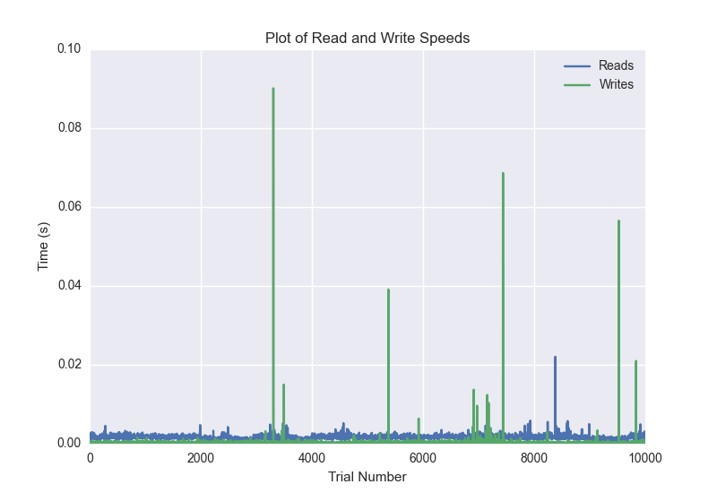
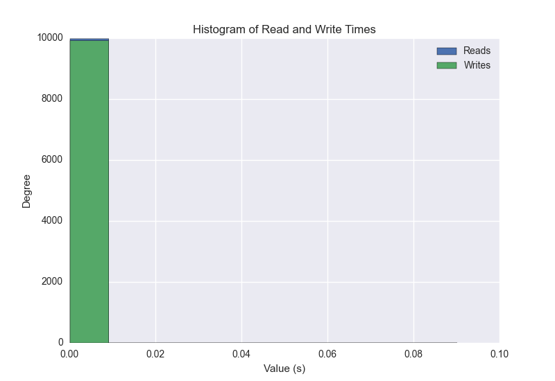
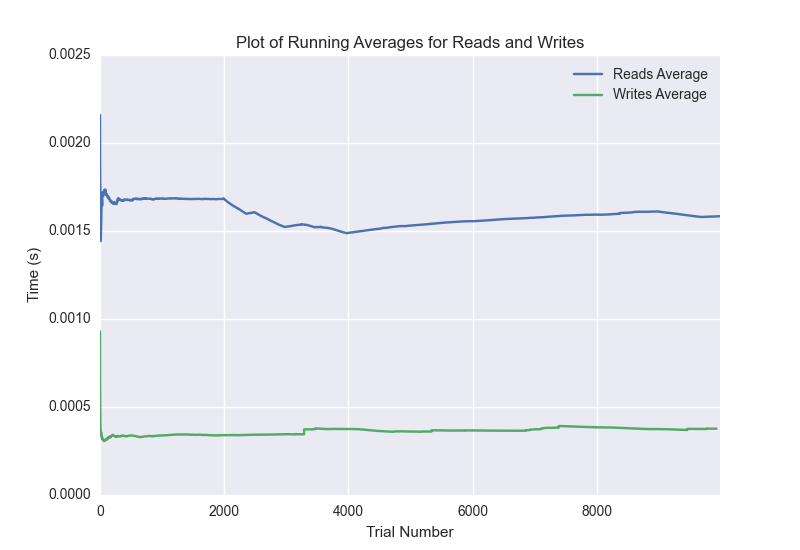

DATABASE BENCHMARKING REPORT - POSTGRESQL - 10000 Trials
=========================================

This report has been automatically generated from a Benchmarking application
built by [Kurtis Jungersen](http://kmjungersen.com).  The source behind the application can be found on the [project's GitHub.](https://github.com/kmjungersen/DB-Benchmarking)

TIME AND DATE
=============

Fri, 21 Nov, 2014 15:25:23

RESULTS
=======

After using these parameters:

| Parameter                  | Value      |
|:---------------------------|:-----------|
| Database Tested            | POSTGRESQL |
| Number of Trials           | 10000      |
| Length of Each Entry Field | 10         |
| Number of Nodes in Cluster | 1          |
| Split Reads and Writes     | True       |
| Debug Mode                 | False      |
| Chaos Mode (Random Reads)  | False      |

These results were obtained:

| Operation   |   Average |   St. Dev. |   Max Time |   Min Time |   Range |
|:------------|----------:|-----------:|-----------:|-----------:|--------:|
| Writes      |   0.00304 |    0.03072 |    0.40038 |    0.00016 | 0.40021 |
| Reads       |   0.00224 |    0.01598 |    0.74273 |    0.00089 | 0.74184 |

This plot shows the normalized speeds of reads and writes over the course of the benchmark.  The data was normalized (i.e. any data points beyond 3 standard deviations of the mean were excluded).

This plot shows a histogram which describes the general distribution of the data.

This plot shows the running averages for read and write speeds over the course of the benchmark.

Note: If any outliers were obtained in this benchmark, they will displayed here:

| Operation   |   Trial Number |     Value |
|:------------|---------------:|----------:|
| Write       |             80 | 0.264398  |
| Write       |            286 | 0.316516  |
| Write       |            427 | 0.347887  |
| Write       |            459 | 0.38615   |
| Write       |            697 | 0.307835  |
| Write       |            783 | 0.358316  |
| Write       |            874 | 0.369123  |
| Write       |           1071 | 0.316476  |
| Write       |           1148 | 0.36761   |
| Write       |           1152 | 0.398585  |
| Write       |           1204 | 0.370647  |
| Write       |           1290 | 0.374577  |
| Write       |           1674 | 0.351764  |
| Write       |           2114 | 0.328217  |
| Write       |           2295 | 0.32846   |
| Write       |           2360 | 0.150052  |
| Write       |           2693 | 0.385905  |
| Write       |           2817 | 0.348353  |
| Write       |           2820 | 0.399129  |
| Write       |           2884 | 0.375283  |
| Write       |           3319 | 0.328952  |
| Write       |           3395 | 0.36765   |
| Write       |           3406 | 0.398088  |
| Write       |           3411 | 0.400375  |
| Write       |           3419 | 0.399181  |
| Write       |           3657 | 0.38869   |
| Write       |           3662 | 0.301225  |
| Write       |           3672 | 0.398225  |
| Write       |           3788 | 0.34718   |
| Write       |           4085 | 0.320022  |
| Write       |           4102 | 0.348416  |
| Write       |           4197 | 0.364754  |
| Write       |           4518 | 0.312044  |
| Write       |           4656 | 0.35851   |
| Write       |           4667 | 0.398366  |
| Write       |           5026 | 0.346798  |
| Write       |           5202 | 0.332569  |
| Write       |           5208 | 0.397875  |
| Write       |           5302 | 0.350435  |
| Write       |           5322 | 0.260046  |
| Write       |           5446 | 0.344166  |
| Write       |           5545 | 0.357781  |
| Write       |           5708 | 0.337468  |
| Write       |           5821 | 0.349888  |
| Write       |           5867 | 0.382831  |
| Write       |           6003 | 0.342592  |
| Write       |           6103 | 0.360222  |
| Write       |           6478 | 0.347129  |
| Write       |           6643 | 0.333275  |
| Write       |           6847 | 0.224065  |
| Write       |           6887 | 0.372953  |
| Write       |           7032 | 0.380384  |
| Write       |           7039 | 0.399228  |
| Write       |           7364 | 0.374155  |
| Write       |           7581 | 0.351523  |
| Write       |           7926 | 0.377021  |
| Write       |           7975 | 0.38769   |
| Write       |           7998 | 0.393948  |
| Write       |           8111 | 0.245512  |
| Write       |           8278 | 0.341927  |
| Write       |           8345 | 0.383637  |
| Write       |           8595 | 0.333622  |
| Write       |           8870 | 0.31719   |
| Write       |           8979 | 0.332768  |
| Write       |           9028 | 0.301775  |
| Write       |           9184 | 0.338873  |
| Write       |           9413 | 0.338429  |
| Write       |           9442 | 0.392025  |
| Write       |           9512 | 0.3826    |
| Write       |           9526 | 0.340173  |
| Write       |           9578 | 0.38178   |
| Write       |           9592 | 0.397048  |
| Write       |           9633 | 0.385524  |
| Write       |           9772 | 0.348074  |
| Write       |           9846 | 0.346126  |
| Write       |           9868 | 0.390563  |
| Read        |           1053 | 0.742729  |
| Read        |           1462 | 0.308672  |
| Read        |           1502 | 0.335174  |
| Read        |           1965 | 0.319121  |
| Read        |           2138 | 0.385008  |
| Read        |           2225 | 0.397728  |
| Read        |           2360 | 0.346082  |
| Read        |           2443 | 0.355219  |
| Read        |           2607 | 0.382527  |
| Read        |           2921 | 0.354884  |
| Read        |           3186 | 0.295569  |
| Read        |           3607 | 0.377269  |
| Read        |           3697 | 0.379041  |
| Read        |           3984 | 0.175515  |
| Read        |           4380 | 0.319389  |
| Read        |           4911 | 0.0815971 |
| Read        |           6779 | 0.306932  |
| Read        |           9160 | 0.363854  |
| Read        |           9693 | 0.389337  |