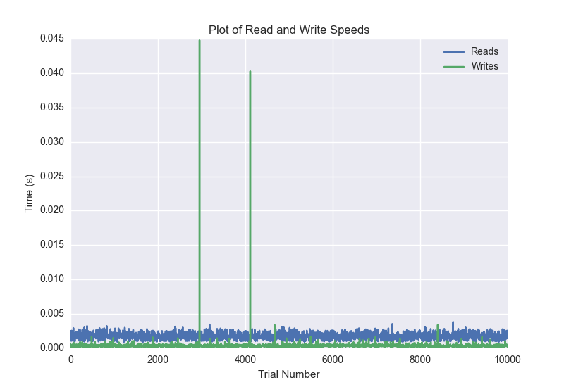
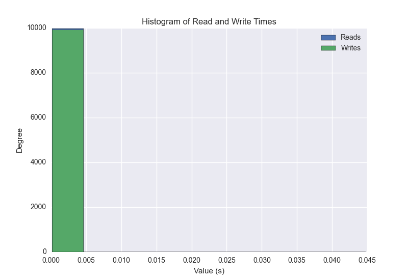
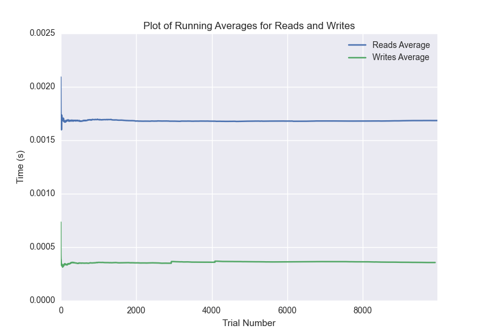

DATABASE BENCHMARKING REPORT - POSTGRESQL - 10000 Trials
=========================================

This report has been automatically generated from a Benchmarking application
built by [Kurtis Jungersen](http://kmjungersen.com).  The source behind the application can be found on the [project's GitHub.](https://github.com/kmjungersen/DB-Benchmarking)

TIME AND DATE
=============

Fri, 21 Nov, 2014 15:27:00

RESULTS
=======

After using these parameters:

| Parameter                  | Value      |
|:---------------------------|:-----------|
| Database Tested            | POSTGRESQL |
| Number of Trials           | 10000      |
| Length of Each Entry Field | 10         |
| Number of Nodes in Cluster | 1          |
| Split Reads and Writes     | True       |
| Debug Mode                 | False      |
| Chaos Mode (Random Reads)  | False      |

These results were obtained:

| Operation   |   Average |   St. Dev. |   Max Time |   Min Time |   Range |
|:------------|----------:|-----------:|-----------:|-----------:|--------:|
| Writes      |   0.00329 |    0.03233 |    0.41415 |    0.00017 | 0.41398 |
| Reads       |   0.00245 |    0.01620 |    0.40032 |    0.00091 | 0.39941 |

This plot shows the normalized speeds of reads and writes over the course of the benchmark.  The data was normalized (i.e. any data points beyond 3 standard deviations of the mean were excluded).

This plot shows a histogram which describes the general distribution of the data.

This plot shows the running averages for read and write speeds over the course of the benchmark.

Note: If any outliers were obtained in this benchmark, they will displayed here:

| Operation   |   Trial Number |    Value |
|:------------|---------------:|---------:|
| Write       |             76 | 0.389923 |
| Write       |            230 | 0.339404 |
| Write       |            269 | 0.385808 |
| Write       |            358 | 0.26354  |
| Write       |            647 | 0.383083 |
| Write       |            757 | 0.357776 |
| Write       |            895 | 0.342765 |
| Write       |            931 | 0.384868 |
| Write       |            990 | 0.265467 |
| Write       |           1009 | 0.399418 |
| Write       |           1167 | 0.336066 |
| Write       |           1363 | 0.320886 |
| Write       |           1586 | 0.307318 |
| Write       |           1684 | 0.349658 |
| Write       |           1737 | 0.390832 |
| Write       |           1831 | 0.365334 |
| Write       |           2014 | 0.330406 |
| Write       |           2126 | 0.358102 |
| Write       |           2199 | 0.346389 |
| Write       |           2356 | 0.362779 |
| Write       |           2411 | 0.376907 |
| Write       |           2704 | 0.390176 |
| Write       |           2755 | 0.380265 |
| Write       |           2760 | 0.261082 |
| Write       |           2960 | 0.315215 |
| Write       |           3082 | 0.355307 |
| Write       |           3537 | 0.322298 |
| Write       |           3850 | 0.369768 |
| Write       |           4314 | 0.374233 |
| Write       |           4375 | 0.377822 |
| Write       |           4402 | 0.388257 |
| Write       |           4454 | 0.379197 |
| Write       |           4566 | 0.297833 |
| Write       |           4869 | 0.3304   |
| Write       |           4880 | 0.395137 |
| Write       |           4931 | 0.378021 |
| Write       |           5257 | 0.367067 |
| Write       |           5315 | 0.21989  |
| Write       |           5472 | 0.397586 |
| Write       |           5499 | 0.389236 |
| Write       |           5507 | 0.401088 |
| Write       |           5552 | 0.386754 |
| Write       |           5714 | 0.265793 |
| Write       |           5806 | 0.329792 |
| Write       |           5836 | 0.390282 |
| Write       |           5969 | 0.342195 |
| Write       |           6085 | 0.349711 |
| Write       |           6112 | 0.388232 |
| Write       |           6171 | 0.375565 |
| Write       |           6177 | 0.400675 |
| Write       |           6251 | 0.371521 |
| Write       |           6309 | 0.378512 |
| Write       |           6362 | 0.379947 |
| Write       |           6407 | 0.38226  |
| Write       |           6500 | 0.36058  |
| Write       |           6648 | 0.33504  |
| Write       |           6766 | 0.349675 |
| Write       |           6777 | 0.396924 |
| Write       |           6820 | 0.384748 |
| Write       |           6890 | 0.371486 |
| Write       |           7063 | 0.329723 |
| Write       |           7117 | 0.377719 |
| Write       |           7198 | 0.35064  |
| Write       |           7207 | 0.414149 |
| Write       |           7263 | 0.37796  |
| Write       |           7376 | 0.354913 |
| Write       |           7422 | 0.381457 |
| Write       |           7725 | 0.25441  |
| Write       |           7739 | 0.324915 |
| Write       |           8120 | 0.346292 |
| Write       |           8127 | 0.399551 |
| Write       |           8684 | 0.387172 |
| Write       |           8748 | 0.135705 |
| Write       |           8794 | 0.318967 |
| Write       |           8844 | 0.378099 |
| Write       |           9067 | 0.316979 |
| Write       |           9091 | 0.389041 |
| Write       |           9123 | 0.387925 |
| Write       |           9429 | 0.383316 |
| Write       |           9760 | 0.374132 |
| Write       |           9827 | 0.376614 |
| Write       |           9942 | 0.356258 |
| Write       |           9968 | 0.234021 |
| Read        |            559 | 0.39161  |
| Read        |            685 | 0.386525 |
| Read        |           2506 | 0.309689 |
| Read        |           3283 | 0.382733 |
| Read        |           3454 | 0.313252 |
| Read        |           3601 | 0.056566 |
| Read        |           3671 | 0.380716 |
| Read        |           4125 | 0.337997 |
| Read        |           4419 | 0.306445 |
| Read        |           4650 | 0.314424 |
| Read        |           5379 | 0.352897 |
| Read        |           5419 | 0.332854 |
| Read        |           5679 | 0.357179 |
| Read        |           6078 | 0.325787 |
| Read        |           6167 | 0.360519 |
| Read        |           6552 | 0.34533  |
| Read        |           6689 | 0.364737 |
| Read        |           7921 | 0.400322 |
| Read        |           8615 | 0.316581 |
| Read        |           9015 | 0.241715 |
| Read        |           9299 | 0.368154 |
| Read        |           9571 | 0.337248 |
| Read        |           9999 | 0.369819 |