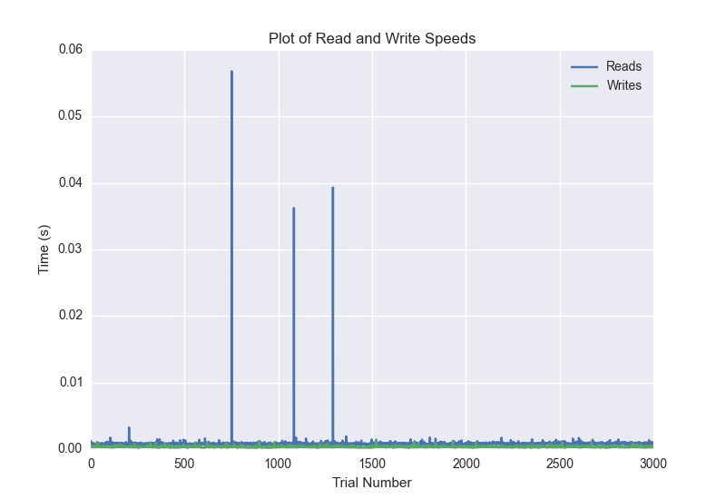
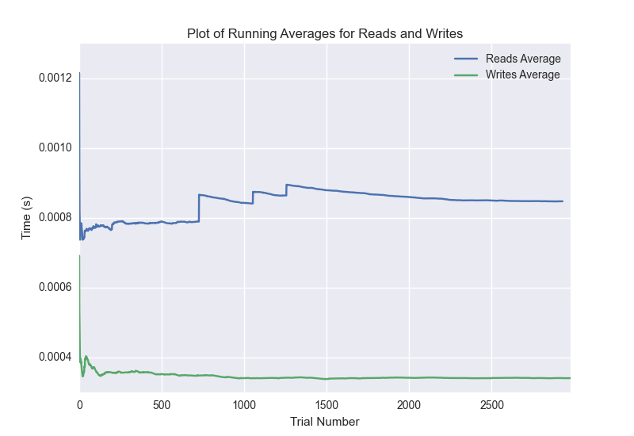

DATABASE BENCHMARKING REPORT - POSTGRESQL - 3000 Trials
=========================================

This report has been automatically generated from a Benchmarking application
built by [Kurtis Jungersen](http://kmjungersen.com).  The source behind the application can be found on the [project's GitHub.](https://github.com/kmjungersen/DB-Benchmarking)

TIME AND DATE
=============

Fri, 21 Nov, 2014 15:28:13

RESULTS
=======

After using these parameters:

| Parameter                  | Value      |
|:---------------------------|:-----------|
| Database Tested            | POSTGRESQL |
| Number of Trials           | 3000       |
| Length of Each Entry Field | 10         |
| Number of Nodes in Cluster | 1          |
| Split Reads and Writes     | True       |
| Debug Mode                 | False      |
| Chaos Mode (Random Reads)  | False      |

These results were obtained:

| Operation   |   Average |   St. Dev. |   Max Time |   Min Time |   Range |
|:------------|----------:|-----------:|-----------:|-----------:|--------:|
| Writes      |   0.00283 |    0.02979 |    0.40234 |    0.00020 | 0.40215 |
| Reads       |   0.00929 |    0.05494 |    0.45348 |    0.00045 | 0.45303 |

This plot shows the normalized speeds of reads and writes over the course of the benchmark.  The data was normalized (i.e. any data points beyond 3 standard deviations of the mean were excluded).

This plot shows a histogram which describes the general distribution of the data.

This plot shows the running averages for read and write speeds over the course of the benchmark.

Note: If any outliers were obtained in this benchmark, they will displayed here:

| Operation   |   Trial Number |    Value |
|:------------|---------------:|---------:|
| Write       |             26 | 0.373727 |
| Write       |             41 | 0.256866 |
| Write       |            136 | 0.402341 |
| Write       |            258 | 0.350956 |
| Write       |           1017 | 0.401992 |
| Write       |           1104 | 0.368144 |
| Write       |           1246 | 0.343416 |
| Write       |           1305 | 0.379221 |
| Write       |           1531 | 0.314512 |
| Write       |           1862 | 0.36343  |
| Write       |           1950 | 0.301963 |
| Write       |           2074 | 0.315754 |
| Write       |           2089 | 0.395311 |
| Write       |           2129 | 0.383638 |
| Write       |           2160 | 0.390558 |
| Write       |           2401 | 0.311214 |
| Write       |           2544 | 0.343553 |
| Write       |           2568 | 0.391485 |
| Write       |           2631 | 0.376093 |
| Write       |           2779 | 0.343824 |
| Write       |           2880 | 0.360448 |
| Read        |             28 | 0.330369 |
| Read        |             50 | 0.382829 |
| Read        |            124 | 0.341103 |
| Read        |            159 | 0.373253 |
| Read        |            197 | 0.374329 |
| Read        |            231 | 0.372454 |
| Read        |            260 | 0.379914 |
| Read        |            262 | 0.403112 |
| Read        |            297 | 0.37738  |
| Read        |            317 | 0.378146 |
| Read        |            384 | 0.354041 |
| Read        |            393 | 0.393949 |
| Read        |            452 | 0.353532 |
| Read        |            508 | 0.353263 |
| Read        |            515 | 0.384228 |
| Read        |            584 | 0.362549 |
| Read        |            604 | 0.385488 |
| Read        |            614 | 0.393897 |
| Read        |            650 | 0.374167 |
| Read        |            696 | 0.340476 |
| Read        |            710 | 0.316721 |
| Read        |            726 | 0.390179 |
| Read        |            733 | 0.395221 |
| Read        |            735 | 0.400342 |
| Read        |            741 | 0.399267 |
| Read        |            758 | 0.331832 |
| Read        |            843 | 0.333593 |
| Read        |            964 | 0.307315 |
| Read        |            969 | 0.400341 |
| Read        |           1066 | 0.324158 |
| Read        |           1103 | 0.335269 |
| Read        |           1195 | 0.325648 |
| Read        |           1220 | 0.381868 |
| Read        |           1265 | 0.361938 |
| Read        |           1283 | 0.385307 |
| Read        |           1367 | 0.390887 |
| Read        |           1416 | 0.361633 |
| Read        |           1420 | 0.398143 |
| Read        |           1442 | 0.381953 |
| Read        |           1445 | 0.341353 |
| Read        |           1450 | 0.453483 |
| Read        |           1542 | 0.327314 |
| Read        |           1554 | 0.390522 |
| Read        |           1579 | 0.379987 |
| Read        |           1664 | 0.271823 |
| Read        |           1674 | 0.312166 |
| Read        |           1819 | 0.323327 |
| Read        |           1873 | 0.358136 |
| Read        |           2003 | 0.39811  |
| Read        |           2135 | 0.226323 |
| Read        |           2197 | 0.318423 |
| Read        |           2204 | 0.396899 |
| Read        |           2306 | 0.322645 |
| Read        |           2378 | 0.341207 |
| Read        |           2386 | 0.394169 |
| Read        |           2417 | 0.373731 |
| Read        |           2427 | 0.392305 |
| Read        |           2455 | 0.376712 |
| Read        |           2491 | 0.369659 |
| Read        |           2504 | 0.38948  |
| Read        |           2540 | 0.369598 |
| Read        |           2706 | 0.364739 |
| Read        |           2726 | 0.386129 |
| Read        |           2753 | 0.381928 |
| Read        |           2769 | 0.293912 |
| Read        |           2827 | 0.34768  |
| Read        |           2894 | 0.343606 |
| Read        |           2904 | 0.395183 |
| Read        |           2915 | 0.39452  |
| Read        |           2990 | 0.330859 |