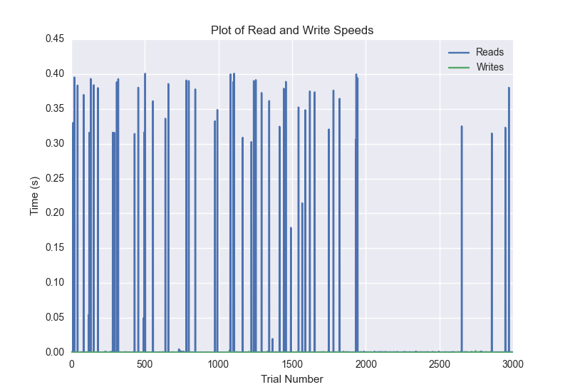
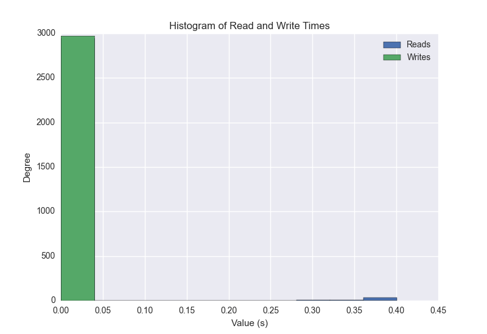
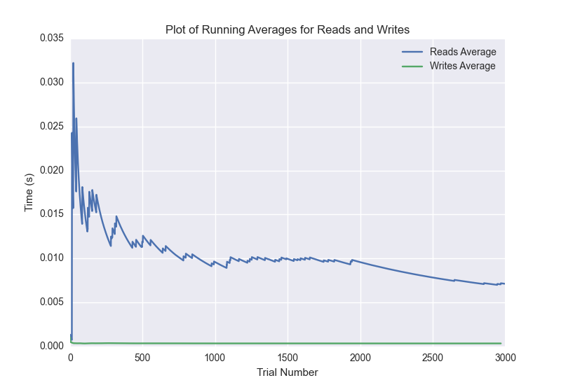

DATABASE BENCHMARKING REPORT - POSTGRESQL - 3000 Trials
=========================================

This report has been automatically generated from a Benchmarking application
built by [Kurtis Jungersen](http://kmjungersen.com).  The source behind the application can be found on the [project's GitHub.](https://github.com/kmjungersen/DB-Benchmarking)

TIME AND DATE
=============

Fri, 21 Nov, 2014 16:10:49

RESULTS
=======

After using these parameters:

| Parameter                  | Value      |
|:---------------------------|:-----------|
| Database Tested            | POSTGRESQL |
| Number of Trials           | 3000       |
| Length of Each Entry Field | 10         |
| Number of Nodes in Cluster | 1          |
| Split Reads and Writes     | True       |
| Debug Mode                 | False      |
| Chaos Mode (Random Reads)  | False      |

These results were obtained:

| Operation   |   Average |   St. Dev. |   Max Time |   Min Time |    Range |
|:------------|----------:|-----------:|-----------:|-----------:|---------:|
| Writes      |   0.00376 |    0.03484 |    0.39997 |    0.00018 |  0.39979 |
| Reads       |   0.01046 |    0.18849 |   10.00306 |    0.00040 | 10.00265 |

This plot shows the normalized speeds of reads and writes over the course of the benchmark.  The data was normalized (i.e. any data points beyond 3 standard deviations of the mean were excluded).

This plot shows a histogram which describes the general distribution of the data.

This plot shows the running averages for read and write speeds over the course of the benchmark.

Note: If any outliers were obtained in this benchmark, they will displayed here:

| Operation   |   Trial Number |     Value |
|:------------|---------------:|----------:|
| Write       |            176 |  0.303003 |
| Write       |            209 |  0.385591 |
| Write       |            252 |  0.309755 |
| Write       |            441 |  0.395453 |
| Write       |            472 |  0.387284 |
| Write       |            504 |  0.387351 |
| Write       |            538 |  0.385124 |
| Write       |            611 |  0.297323 |
| Write       |            672 |  0.347166 |
| Write       |            700 |  0.388142 |
| Write       |            843 |  0.3456   |
| Write       |            943 |  0.359217 |
| Write       |           1055 |  0.357122 |
| Write       |           1232 |  0.328562 |
| Write       |           1315 |  0.367204 |
| Write       |           1373 |  0.377898 |
| Write       |           1448 |  0.372843 |
| Write       |           1502 |  0.380056 |
| Write       |           1545 |  0.384518 |
| Write       |           1552 |  0.399967 |
| Write       |           1651 |  0.364993 |
| Write       |           1710 |  0.374825 |
| Write       |           2017 |  0.278213 |
| Write       |           2238 |  0.308064 |
| Write       |           2513 |  0.397729 |
| Write       |           2766 |  0.394437 |
| Write       |           2818 |  0.379288 |
| Write       |           2833 |  0.182775 |
| Write       |           2853 |  0.303181 |
| Read        |           1964 | 10.0031   |