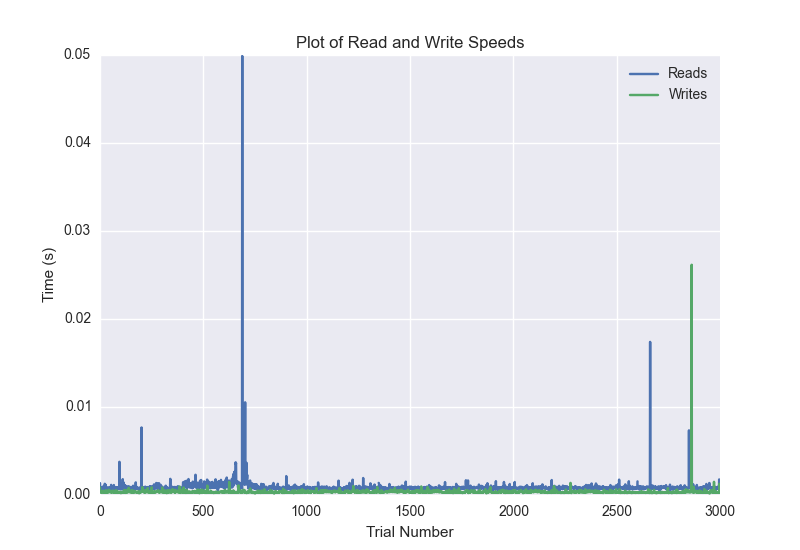
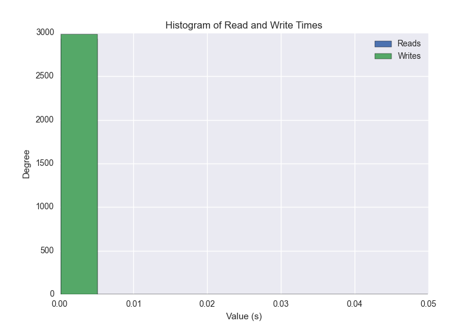
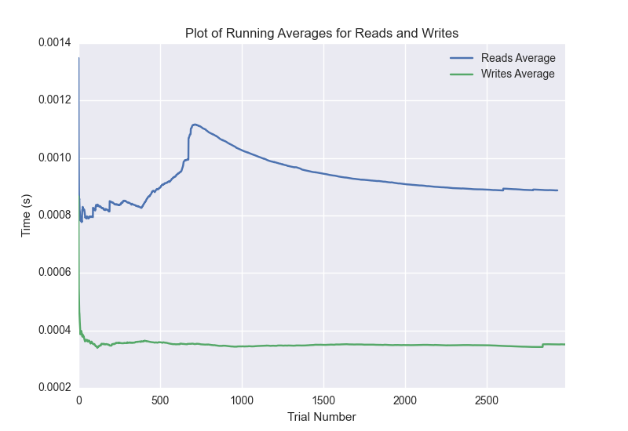

DATABASE BENCHMARKING REPORT - POSTGRESQL - 3000 Trials
=========================================

This report has been automatically generated from a Benchmarking application
built by [Kurtis Jungersen](http://kmjungersen.com).  The source behind the application can be found on the [project's GitHub.](https://github.com/kmjungersen/DB-Benchmarking)

TIME AND DATE
=============

Fri, 21 Nov, 2014 16:18:46

RESULTS
=======

After using these parameters:

| Parameter                  | Value      |
|:---------------------------|:-----------|
| Database Tested            | POSTGRESQL |
| Number of Trials           | 3000       |
| Length of Each Entry Field | 10         |
| Number of Nodes in Cluster | 1          |
| Split Reads and Writes     | True       |
| Debug Mode                 | False      |
| Chaos Mode (Random Reads)  | False      |

These results were obtained:

| Operation   |   Average |   St. Dev. |   Max Time |   Min Time |   Range |
|:------------|----------:|-----------:|-----------:|-----------:|--------:|
| Writes      |   0.00244 |    0.02721 |    0.40080 |    0.00018 | 0.40062 |
| Reads       |   0.00888 |    0.05361 |    0.43640 |    0.00044 | 0.43595 |

This plot shows the normalized speeds of reads and writes over the course of the benchmark.  The data was normalized (i.e. any data points beyond 3 standard deviations of the mean were excluded).

This plot shows a histogram which describes the general distribution of the data.

This plot shows the running averages for read and write speeds over the course of the benchmark.

Note: If any outliers were obtained in this benchmark, they will displayed here:

| Operation   |   Trial Number |    Value |
|:------------|---------------:|---------:|
| Write       |             14 | 0.302552 |
| Write       |            240 | 0.182284 |
| Write       |            396 | 0.355983 |
| Write       |            580 | 0.328853 |
| Write       |            971 | 0.35118  |
| Write       |           1025 | 0.380695 |
| Write       |           1080 | 0.380267 |
| Write       |           1128 | 0.381895 |
| Write       |           1216 | 0.312348 |
| Write       |           1271 | 0.33248  |
| Write       |           1391 | 0.352822 |
| Write       |           1451 | 0.376022 |
| Write       |           1492 | 0.384175 |
| Write       |           1513 | 0.394375 |
| Write       |           1611 | 0.361563 |
| Write       |           2089 | 0.309444 |
| Write       |           2105 | 0.393159 |
| Write       |           2348 | 0.400804 |
| Read        |             17 | 0.307099 |
| Read        |             46 | 0.377335 |
| Read        |             62 | 0.387974 |
| Read        |             66 | 0.398124 |
| Read        |             72 | 0.396047 |
| Read        |            118 | 0.358815 |
| Read        |            129 | 0.391491 |
| Read        |            156 | 0.379264 |
| Read        |            175 | 0.385455 |
| Read        |            186 | 0.392273 |
| Read        |            260 | 0.334191 |
| Read        |            271 | 0.390461 |
| Read        |            293 | 0.379102 |
| Read        |            396 | 0.319544 |
| Read        |            738 | 0.398305 |
| Read        |            794 | 0.35085  |
| Read        |            804 | 0.396573 |
| Read        |           1011 | 0.336714 |
| Read        |           1052 | 0.171445 |
| Read        |           1066 | 0.390506 |
| Read        |           1106 | 0.369249 |
| Read        |           1213 | 0.317653 |
| Read        |           1310 | 0.324651 |
| Read        |           1347 | 0.36431  |
| Read        |           1414 | 0.360708 |
| Read        |           1428 | 0.392818 |
| Read        |           1496 | 0.349023 |
| Read        |           1522 | 0.37985  |
| Read        |           1535 | 0.368685 |
| Read        |           1577 | 0.393545 |
| Read        |           1638 | 0.35557  |
| Read        |           1649 | 0.392626 |
| Read        |           1680 | 0.377305 |
| Read        |           1731 | 0.324933 |
| Read        |           1736 | 0.436398 |
| Read        |           1812 | 0.335846 |
| Read        |           1847 | 0.371254 |
| Read        |           1859 | 0.390737 |
| Read        |           1861 | 0.359525 |
| Read        |           1937 | 0.377729 |
| Read        |           2000 | 0.349935 |
| Read        |           2045 | 0.364437 |
| Read        |           2047 | 0.399379 |
| Read        |           2132 | 0.289658 |
| Read        |           2225 | 0.368757 |
| Read        |           2232 | 0.397996 |
| Read        |           2270 | 0.370664 |
| Read        |           2272 | 0.401939 |
| Read        |           2281 | 0.339927 |
| Read        |           2329 | 0.317867 |
| Read        |           2416 | 0.328802 |
| Read        |           2461 | 0.36427  |
| Read        |           2480 | 0.385799 |
| Read        |           2498 | 0.385196 |
| Read        |           2574 | 0.335213 |
| Read        |           2601 | 0.378547 |
| Read        |           2604 | 0.398696 |
| Read        |           2633 | 0.376694 |
| Read        |           2643 | 0.395823 |
| Read        |           2713 | 0.329091 |
| Read        |           2780 | 0.348072 |
| Read        |           2808 | 0.380193 |
| Read        |           2814 | 0.399364 |
| Read        |           2838 | 0.383323 |
| Read        |           2940 | 0.309706 |
| Read        |           2990 | 0.359456 |