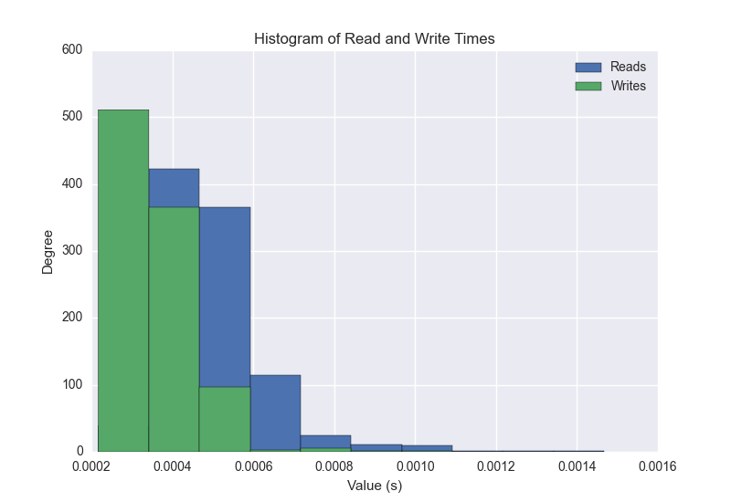
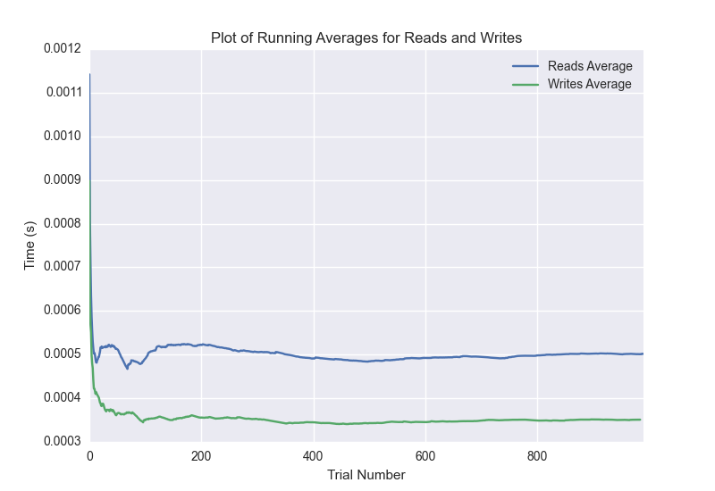

DATABASE BENCHMARKING REPORT - POSTGRESQL - 1000 Trials
=========================================

This report has been automatically generated from a Benchmarking application
built by [Kurtis Jungersen](http://kmjungersen.com).  The source behind the application can be found on the [project's GitHub.](https://github.com/kmjungersen/DB-Benchmarking)

TIME AND DATE
=============

Fri, 21 Nov, 2014 16:34:28

RESULTS
=======

After using these parameters:

| Parameter                  | Value      |
|:---------------------------|:-----------|
| Database Tested            | POSTGRESQL |
| Number of Trials           | 1000       |
| Length of Each Entry Field | 10         |
| Number of Nodes in Cluster | 1          |
| Split Reads and Writes     | True       |
| Debug Mode                 | False      |
| Chaos Mode (Random Reads)  | False      |

These results were obtained:

| Operation   |   Average |   St. Dev. |   Max Time |   Min Time |   Range |
|:------------|----------:|-----------:|-----------:|-----------:|--------:|
| Writes      |   0.00582 |    0.04451 |    0.39669 |    0.00022 | 0.39648 |
| Reads       |   0.00358 |    0.03270 |    0.39981 |    0.00029 | 0.39952 |

This plot shows the normalized speeds of reads and writes over the course of the benchmark.  The data was normalized (i.e. any data points beyond 3 standard deviations of the mean were excluded).

This plot shows a histogram which describes the general distribution of the data.

This plot shows the running averages for read and write speeds over the course of the benchmark.

Note: If any outliers were obtained in this benchmark, they will displayed here:

| Operation   |   Trial Number |    Value |
|:------------|---------------:|---------:|
| Write       |            106 | 0.34605  |
| Write       |            166 | 0.37518  |
| Write       |            230 | 0.374023 |
| Write       |            284 | 0.377784 |
| Write       |            375 | 0.253621 |
| Write       |            477 | 0.372456 |
| Write       |            516 | 0.384003 |
| Write       |            585 | 0.370998 |
| Write       |            664 | 0.367216 |
| Write       |            743 | 0.350723 |
| Write       |            863 | 0.365964 |
| Write       |            878 | 0.393973 |
| Write       |            886 | 0.396692 |
| Write       |            908 | 0.393133 |
| Write       |            984 | 0.350325 |
| Read        |            109 | 0.355896 |
| Read        |            120 | 0.396224 |
| Read        |            125 | 0.399809 |
| Read        |            189 | 0.368153 |
| Read        |            502 | 0.215718 |
| Read        |            531 | 0.319512 |
| Read        |            602 | 0.361816 |
| Read        |            772 | 0.309095 |
| Read        |            852 | 0.35546  |