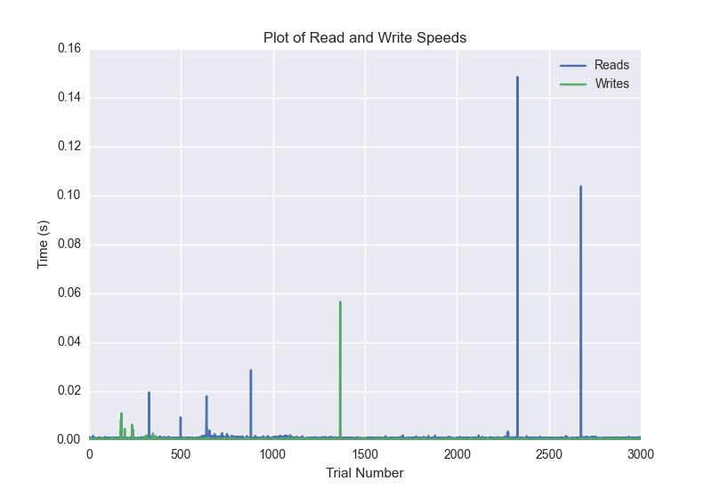
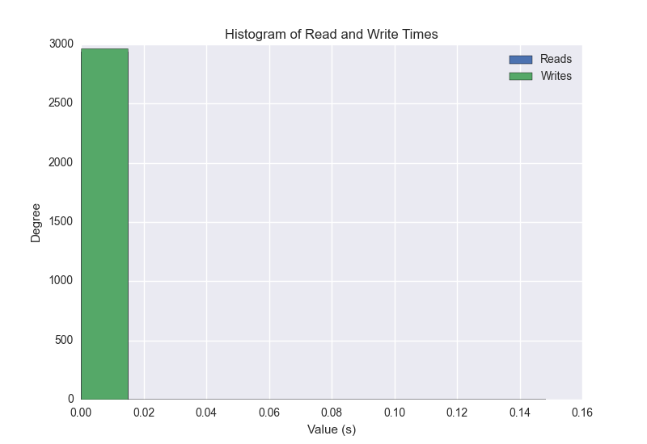
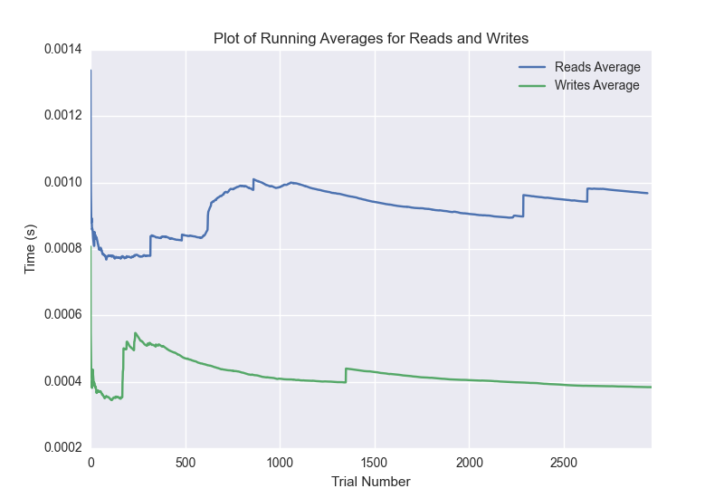

DATABASE BENCHMARKING REPORT - POSTGRESQL - 3000 Trials
=========================================

This report has been automatically generated from a Benchmarking application
built by [Kurtis Jungersen](http://kmjungersen.com).  The source behind the application can be found on the [project's GitHub.](https://github.com/kmjungersen/DB-Benchmarking)

TIME AND DATE
=============

Fri, 21 Nov, 2014 16:34:44

RESULTS
=======

After using these parameters:

| Parameter                  | Value      |
|:---------------------------|:-----------|
| Database Tested            | POSTGRESQL |
| Number of Trials           | 3000       |
| Length of Each Entry Field | 10         |
| Number of Nodes in Cluster | 1          |
| Split Reads and Writes     | True       |
| Debug Mode                 | False      |
| Chaos Mode (Random Reads)  | False      |

These results were obtained:

| Operation   |   Average |   St. Dev. |   Max Time |   Min Time |   Range |
|:------------|----------:|-----------:|-----------:|-----------:|--------:|
| Writes      |   0.00469 |    0.03968 |    0.51247 |    0.00019 | 0.51228 |
| Reads       |   0.00797 |    0.05032 |    0.51372 |    0.00045 | 0.51327 |

This plot shows the normalized speeds of reads and writes over the course of the benchmark.  The data was normalized (i.e. any data points beyond 3 standard deviations of the mean were excluded).

This plot shows a histogram which describes the general distribution of the data.

This plot shows the running averages for read and write speeds over the course of the benchmark.

Note: If any outliers were obtained in this benchmark, they will displayed here:

| Operation   |   Trial Number |    Value |
|:------------|---------------:|---------:|
| Write       |             40 | 0.272575 |
| Write       |             96 | 0.384395 |
| Write       |            171 | 0.371898 |
| Write       |            424 | 0.327718 |
| Write       |            441 | 0.393131 |
| Write       |            592 | 0.22415  |
| Write       |            594 | 0.512468 |
| Write       |            603 | 0.397299 |
| Write       |            727 | 0.352252 |
| Write       |            996 | 0.394313 |
| Write       |           1035 | 0.164214 |
| Write       |           1165 | 0.366714 |
| Write       |           1209 | 0.356289 |
| Write       |           1255 | 0.308691 |
| Write       |           1319 | 0.375922 |
| Write       |           1339 | 0.393415 |
| Write       |           1392 | 0.321855 |
| Write       |           1776 | 0.351617 |
| Write       |           1779 | 0.399699 |
| Write       |           1786 | 0.397628 |
| Write       |           1795 | 0.362683 |
| Write       |           1870 | 0.308027 |
| Write       |           1931 | 0.379998 |
| Write       |           1978 | 0.382324 |
| Write       |           1990 | 0.398052 |
| Write       |           2250 | 0.347316 |
| Write       |           2263 | 0.345208 |
| Write       |           2543 | 0.395257 |
| Write       |           2592 | 0.382606 |
| Write       |           2637 | 0.382935 |
| Write       |           2726 | 0.305786 |
| Write       |           2730 | 0.460157 |
| Write       |           2940 | 0.317055 |
| Write       |           2944 | 0.402191 |
| Write       |           2971 | 0.390789 |
| Write       |           2999 | 0.318033 |
| Read        |             17 | 0.359072 |
| Read        |             36 | 0.384927 |
| Read        |             38 | 0.399587 |
| Read        |            134 | 0.326207 |
| Read        |            140 | 0.395861 |
| Read        |            199 | 0.353242 |
| Read        |            240 | 0.367761 |
| Read        |            308 | 0.345767 |
| Read        |            310 | 0.399558 |
| Read        |            322 | 0.391577 |
| Read        |            346 | 0.361729 |
| Read        |            351 | 0.39869  |
| Read        |            438 | 0.331794 |
| Read        |            467 | 0.38099  |
| Read        |            494 | 0.38003  |
| Read        |            566 | 0.335512 |
| Read        |            580 | 0.393063 |
| Read        |            590 | 0.395202 |
| Read        |            594 | 0.398087 |
| Read        |            964 | 0.334351 |
| Read        |            966 | 0.402035 |
| Read        |           1002 | 0.370789 |
| Read        |           1108 | 0.378022 |
| Read        |           1192 | 0.226469 |
| Read        |           1229 | 0.377696 |
| Read        |           1303 | 0.340482 |
| Read        |           1323 | 0.383555 |
| Read        |           1357 | 0.374274 |
| Read        |           1382 | 0.366786 |
| Read        |           1387 | 0.513719 |
| Read        |           1488 | 0.320762 |
| Read        |           1596 | 0.314869 |
| Read        |           1639 | 0.365686 |
| Read        |           1646 | 0.277192 |
| Read        |           1747 | 0.334498 |
| Read        |           1749 | 0.399441 |
| Read        |           1761 | 0.390609 |
| Read        |           1830 | 0.340905 |
| Read        |           1844 | 0.370469 |
| Read        |           1932 | 0.350016 |
| Read        |           1950 | 0.38835  |
| Read        |           2190 | 0.308092 |
| Read        |           2200 | 0.396165 |
| Read        |           2416 | 0.364151 |
| Read        |           2449 | 0.377177 |
| Read        |           2494 | 0.364596 |
| Read        |           2524 | 0.375679 |
| Read        |           2613 | 0.284226 |
| Read        |           2652 | 0.312489 |
| Read        |           2672 | 0.386755 |
| Read        |           2756 | 0.317109 |
| Read        |           2772 | 0.391824 |
| Read        |           2813 | 0.311604 |
| Read        |           2845 | 0.334104 |
| Read        |           2859 | 0.389969 |
| Read        |           2902 | 0.365509 |
| Read        |           2938 | 0.368966 |
| Read        |           2943 | 0.39704  |