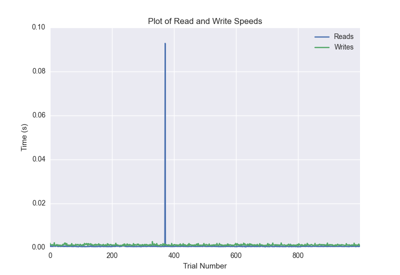
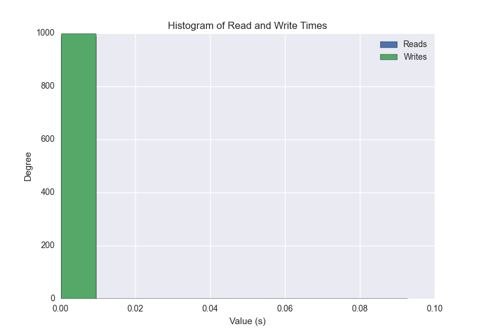
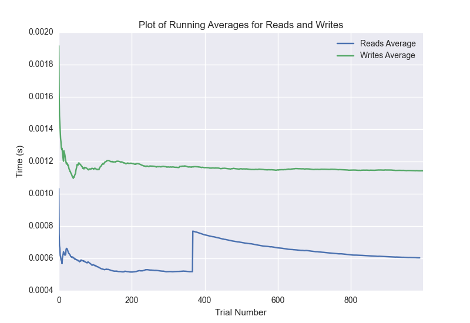

DATABASE BENCHMARKING REPORT - POSTGRESQL - 1000 Trials
=========================================

This report has been automatically generated from a Benchmarking application
built by [Kurtis Jungersen](http://kmjungersen.com).  The source behind the application can be found on the [project's GitHub.](https://github.com/kmjungersen/DB-Benchmarking)

TIME AND DATE
=============

Fri, 21 Nov, 2014 16:44:29

RESULTS
=======

After using these parameters:

| Parameter                  | Value      |
|:---------------------------|:-----------|
| Database Tested            | POSTGRESQL |
| Number of Trials           | 1000       |
| Length of Each Entry Field | 10         |
| Number of Nodes in Cluster | 1          |
| Split Reads and Writes     | True       |
| Debug Mode                 | False      |
| Chaos Mode (Random Reads)  | False      |

These results were obtained:

| Operation   |   Average |   St. Dev. |   Max Time |   Min Time |   Range |
|:------------|----------:|-----------:|-----------:|-----------:|--------:|
| Writes      |   0.00165 |    0.01200 |    0.34056 |    0.00071 | 0.33985 |
| Reads       |   0.00457 |    0.03787 |    0.39676 |    0.00029 | 0.39647 |

This plot shows the normalized speeds of reads and writes over the course of the benchmark.  The data was normalized (i.e. any data points beyond 3 standard deviations of the mean were excluded).

This plot shows a histogram which describes the general distribution of the data.

This plot shows the running averages for read and write speeds over the course of the benchmark.

Note: If any outliers were obtained in this benchmark, they will displayed here:

| Operation   |   Trial Number |    Value |
|:------------|---------------:|---------:|
| Write       |            618 | 0.34056  |
| Write       |            834 | 0.17071  |
| Read        |              6 | 0.37269  |
| Read        |             29 | 0.38536  |
| Read        |            304 | 0.353391 |
| Read        |            317 | 0.396762 |
| Read        |            460 | 0.334554 |
| Read        |            496 | 0.383006 |
| Read        |            811 | 0.340213 |
| Read        |            854 | 0.379373 |
| Read        |            876 | 0.297926 |
| Read        |            900 | 0.381139 |
| Read        |            991 | 0.350203 |