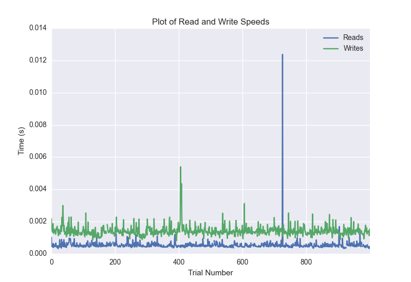
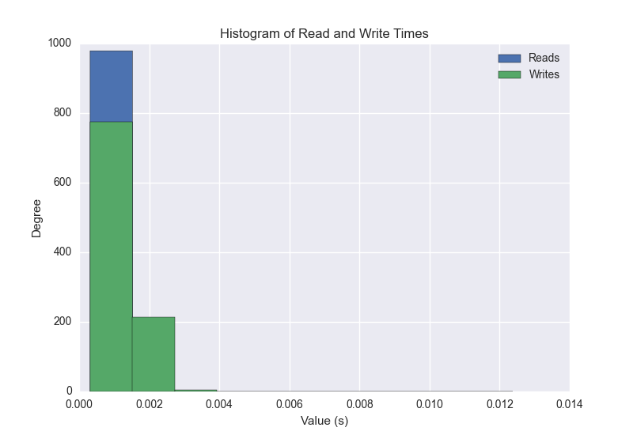
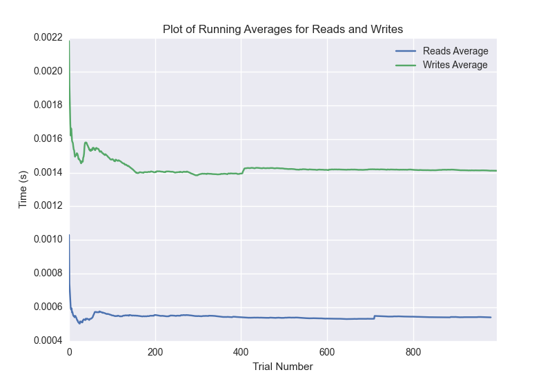

DATABASE BENCHMARKING REPORT - POSTGRESQL - 1000 Trials
=========================================

This report has been automatically generated from a Benchmarking application
built by [Kurtis Jungersen](http://kmjungersen.com).  The source behind the application can be found on the [project's GitHub.](https://github.com/kmjungersen/DB-Benchmarking)

TIME AND DATE
=============

Fri, 21 Nov, 2014 16:46:52

RESULTS
=======

After using these parameters:

| Parameter                  | Value      |
|:---------------------------|:-----------|
| Database Tested            | POSTGRESQL |
| Number of Trials           | 1000       |
| Length of Each Entry Field | 10         |
| Number of Nodes in Cluster | 1          |
| Split Reads and Writes     | True       |
| Debug Mode                 | False      |
| Chaos Mode (Random Reads)  | True       |

These results were obtained:

| Operation   |   Average |   St. Dev. |   Max Time |   Min Time |   Range |
|:------------|----------:|-----------:|-----------:|-----------:|--------:|
| Writes      |   0.00304 |    0.02307 |    0.35176 |    0.00081 | 0.35095 |
| Reads       |   0.00729 |    0.04908 |    0.40217 |    0.00031 | 0.40186 |

This plot shows the normalized speeds of reads and writes over the course of the benchmark.  The data was normalized (i.e. any data points beyond 3 standard deviations of the mean were excluded).

This plot shows a histogram which describes the general distribution of the data.

This plot shows the running averages for read and write speeds over the course of the benchmark.

Note: If any outliers were obtained in this benchmark, they will displayed here:

| Operation   |   Trial Number |    Value |
|:------------|---------------:|---------:|
| Write       |            174 | 0.326585 |
| Write       |            621 | 0.33486  |
| Write       |            658 | 0.349831 |
| Write       |            692 | 0.351759 |
| Write       |            835 | 0.271987 |
| Read        |             65 | 0.338637 |
| Read        |            122 | 0.370677 |
| Read        |            187 | 0.365825 |
| Read        |            190 | 0.401929 |
| Read        |            192 | 0.167725 |
| Read        |            270 | 0.389393 |
| Read        |            317 | 0.376133 |
| Read        |            428 | 0.341865 |
| Read        |            448 | 0.390038 |
| Read        |            509 | 0.324389 |
| Read        |            572 | 0.312275 |
| Read        |            627 | 0.3741   |
| Read        |            630 | 0.402174 |
| Read        |            660 | 0.387368 |
| Read        |            672 | 0.395519 |
| Read        |            760 | 0.342005 |
| Read        |            925 | 0.309401 |
| Read        |            960 | 0.379802 |
| Read        |            974 | 0.391906 |