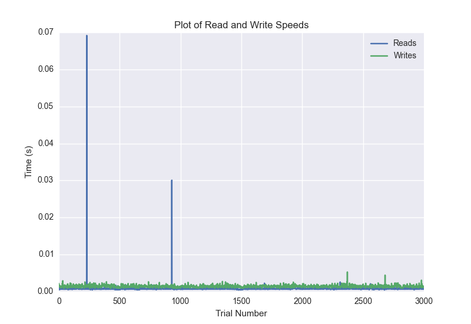
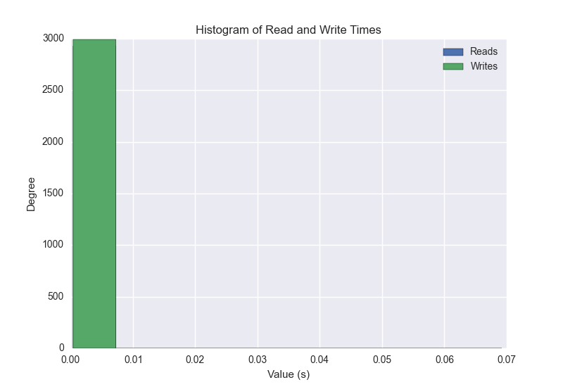
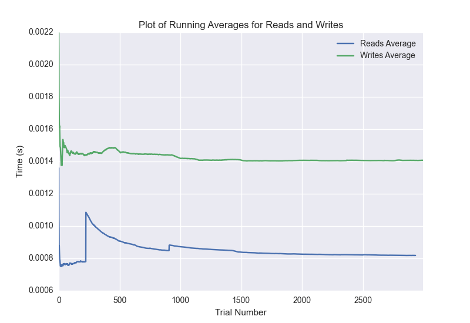

DATABASE BENCHMARKING REPORT - POSTGRESQL - 3000 Trials
=========================================

This report has been automatically generated from a Benchmarking application
built by [Kurtis Jungersen](http://kmjungersen.com).  The source behind the application can be found on the [project's GitHub.](https://github.com/kmjungersen/DB-Benchmarking)

TIME AND DATE
=============

Fri, 21 Nov, 2014 17:08:08

RESULTS
=======

After using these parameters:

| Parameter                  | Value      |
|:---------------------------|:-----------|
| Database Tested            | POSTGRESQL |
| Number of Trials           | 3000       |
| Length of Each Entry Field | 10         |
| Number of Nodes in Cluster | 1          |
| Split Reads and Writes     | True       |
| Debug Mode                 | False      |
| Chaos Mode (Random Reads)  | True       |

These results were obtained:

| Operation   |   Average |   St. Dev. |   Max Time |   Min Time |   Range |
|:------------|----------:|-----------:|-----------:|-----------:|--------:|
| Writes      |   0.00224 |    0.01727 |    0.39138 |    0.00081 | 0.39057 |
| Reads       |   0.00912 |    0.05441 |    0.40200 |    0.00044 | 0.40155 |

This plot shows the normalized speeds of reads and writes over the course of the benchmark.  The data was normalized (i.e. any data points beyond 3 standard deviations of the mean were excluded).

This plot shows a histogram which describes the general distribution of the data.

This plot shows the running averages for read and write speeds over the course of the benchmark.

Note: If any outliers were obtained in this benchmark, they will displayed here:

| Operation   |   Trial Number |    Value |
|:------------|---------------:|---------:|
| Write       |            456 | 0.370288 |
| Write       |            677 | 0.386565 |
| Write       |           1004 | 0.332046 |
| Write       |           1672 | 0.334808 |
| Write       |           1948 | 0.391383 |
| Write       |           2020 | 0.381482 |
| Write       |           2835 | 0.309863 |
| Read        |              4 | 0.228445 |
| Read        |             20 | 0.314882 |
| Read        |             33 | 0.391604 |
| Read        |            138 | 0.315117 |
| Read        |            194 | 0.354434 |
| Read        |            226 | 0.37606  |
| Read        |            313 | 0.364582 |
| Read        |            343 | 0.376814 |
| Read        |            363 | 0.385145 |
| Read        |            371 | 0.394782 |
| Read        |            383 | 0.361475 |
| Read        |            416 | 0.304228 |
| Read        |            453 | 0.370659 |
| Read        |            580 | 0.401996 |
| Read        |            664 | 0.338324 |
| Read        |            679 | 0.349632 |
| Read        |            713 | 0.317266 |
| Read        |            830 | 0.30882  |
| Read        |            867 | 0.372554 |
| Read        |            879 | 0.385505 |
| Read        |            907 | 0.384947 |
| Read        |           1021 | 0.376866 |
| Read        |           1049 | 0.377911 |
| Read        |           1075 | 0.37918  |
| Read        |           1109 | 0.375035 |
| Read        |           1135 | 0.326498 |
| Read        |           1241 | 0.365894 |
| Read        |           1279 | 0.369746 |
| Read        |           1293 | 0.389847 |
| Read        |           1304 | 0.394172 |
| Read        |           1328 | 0.323652 |
| Read        |           1353 | 0.342066 |
| Read        |           1355 | 0.401746 |
| Read        |           1378 | 0.383153 |
| Read        |           1392 | 0.392514 |
| Read        |           1399 | 0.39653  |
| Read        |           1448 | 0.361241 |
| Read        |           1451 | 0.400445 |
| Read        |           1512 | 0.365191 |
| Read        |           1632 | 0.306098 |
| Read        |           1674 | 0.369919 |
| Read        |           1738 | 0.35101  |
| Read        |           1755 | 0.387671 |
| Read        |           1769 | 0.392654 |
| Read        |           1814 | 0.36564  |
| Read        |           1816 | 0.399238 |
| Read        |           1913 | 0.3215   |
| Read        |           1924 | 0.391986 |
| Read        |           2002 | 0.335972 |
| Read        |           2036 | 0.37661  |
| Read        |           2071 | 0.368978 |
| Read        |           2134 | 0.35647  |
| Read        |           2158 | 0.384815 |
| Read        |           2177 | 0.387366 |
| Read        |           2303 | 0.397688 |
| Read        |           2369 | 0.23029  |
| Read        |           2379 | 0.305562 |
| Read        |           2391 | 0.391211 |
| Read        |           2425 | 0.372058 |
| Read        |           2440 | 0.389138 |
| Read        |           2506 | 0.34591  |
| Read        |           2698 | 0.345862 |
| Read        |           2703 | 0.399593 |
| Read        |           2743 | 0.370624 |
| Read        |           2785 | 0.36921  |
| Read        |           2834 | 0.329196 |
| Read        |           2922 | 0.364245 |
| Read        |           2925 | 0.398505 |
| Read        |           2994 | 0.341659 |