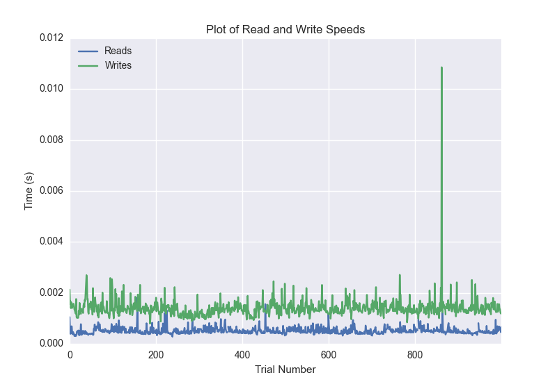
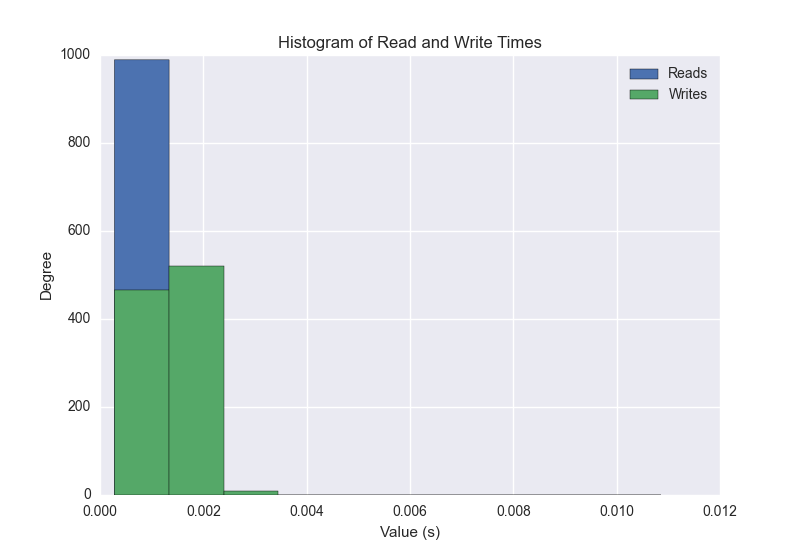
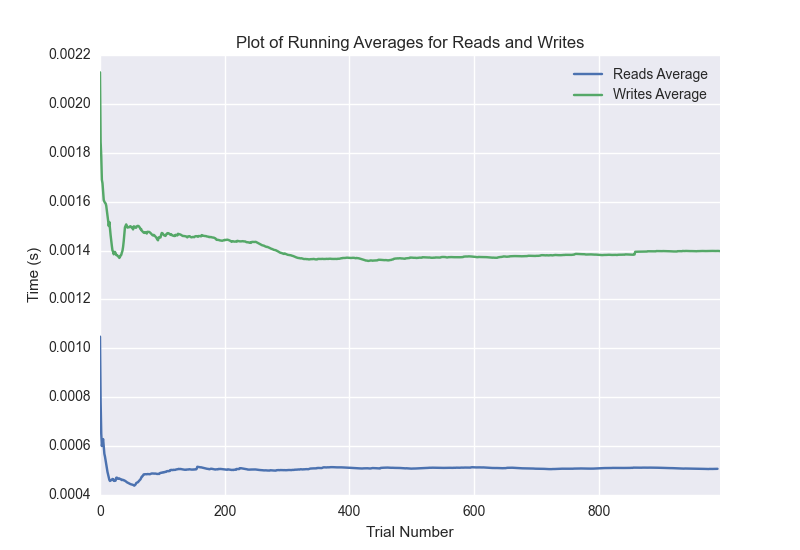

DATABASE BENCHMARKING REPORT - POSTGRESQL - 1000 Trials
=========================================

This report has been automatically generated from a Benchmarking application
built by [Kurtis Jungersen](http://kmjungersen.com).  The source behind the application can be found on the [project's GitHub.](https://github.com/kmjungersen/DB-Benchmarking)

TIME AND DATE
=============

Fri, 21 Nov, 2014 17:10:25

RESULTS
=======

After using these parameters:

| Parameter                  | Value      |
|:---------------------------|:-----------|
| Database Tested            | POSTGRESQL |
| Number of Trials           | 1000       |
| Length of Each Entry Field | 10         |
| Number of Nodes in Cluster | 1          |
| Split Reads and Writes     | True       |
| Debug Mode                 | False      |
| Chaos Mode (Random Reads)  | False      |

These results were obtained:

| Operation   |   Average |   St. Dev. |   Max Time |   Min Time |   Range |
|:------------|----------:|-----------:|-----------:|-----------:|--------:|
| Writes      |   0.00327 |    0.02648 |    0.39523 |    0.00079 | 0.39444 |
| Reads       |   0.00377 |    0.03462 |    0.47048 |    0.00028 | 0.47020 |

This plot shows the normalized speeds of reads and writes over the course of the benchmark.  The data was normalized (i.e. any data points beyond 3 standard deviations of the mean were excluded).

This plot shows a histogram which describes the general distribution of the data.

This plot shows the running averages for read and write speeds over the course of the benchmark.

Note: If any outliers were obtained in this benchmark, they will displayed here:

| Operation   |   Trial Number |    Value |
|:------------|---------------:|---------:|
| Write       |            361 | 0.374999 |
| Write       |            655 | 0.375868 |
| Write       |            734 | 0.38436  |
| Write       |            871 | 0.395232 |
| Write       |            906 | 0.350703 |
| Read        |             72 | 0.325834 |
| Read        |            301 | 0.382351 |
| Read        |            366 | 0.364842 |
| Read        |            504 | 0.330462 |
| Read        |            733 | 0.379202 |
| Read        |            738 | 0.397642 |
| Read        |            806 | 0.291485 |
| Read        |            810 | 0.470479 |
| Read        |            945 | 0.329296 |