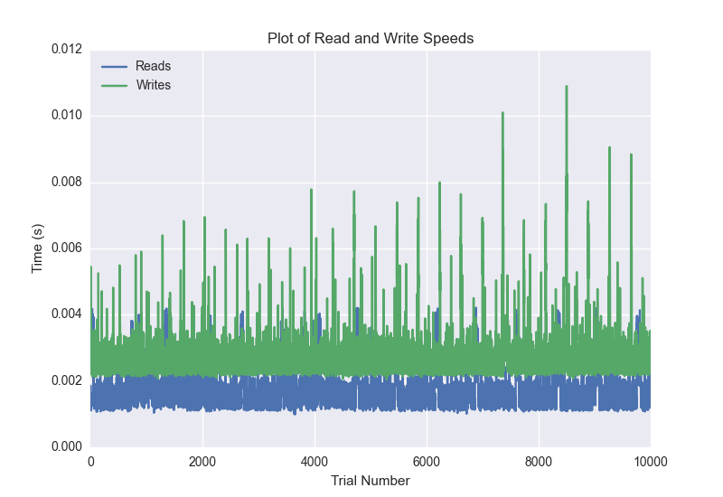
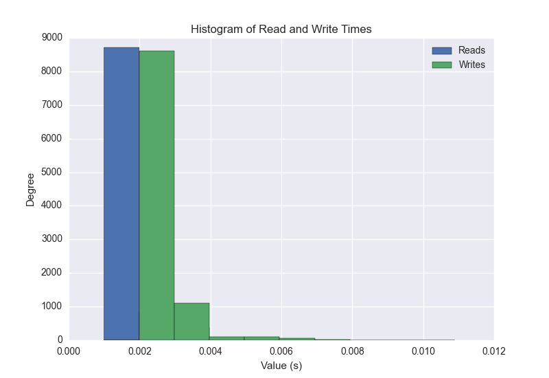
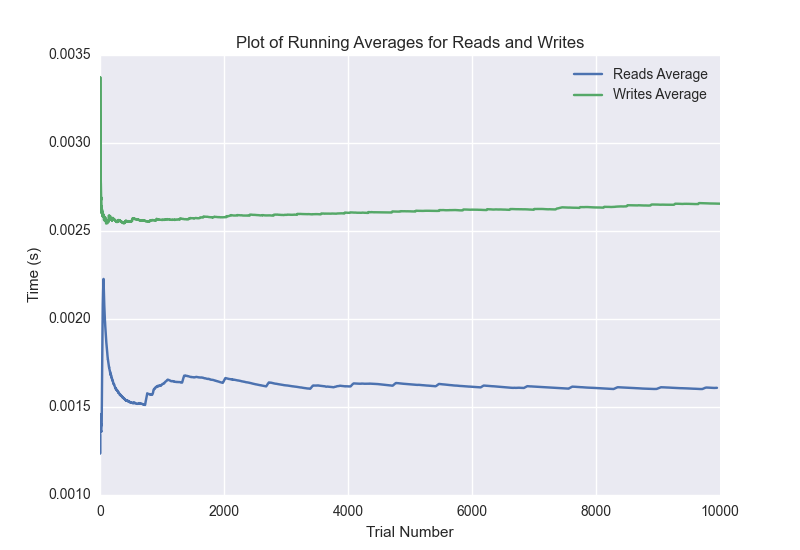

DATABASE BENCHMARKING REPORT - RIAK2 - 10000 Trials
=========================================

This report has been automatically generated from a Benchmarking application
built by [Kurtis Jungersen](http://kmjungersen.com).  The source behind the application can be found on the [project's GitHub.](https://github.com/kmjungersen/DB-Benchmarking)

TIME AND DATE
=============

Tue, 16 Dec, 2014 19:11:01

RESULTS
=======

After using these parameters:

| Parameter                  | Value   |
|:---------------------------|:--------|
| Database Tested            | RIAK2   |
| Number of Trials           | 10000   |
| Length of Each Entry Field | 10      |
| Number of Nodes in Cluster | 3       |
| Split Reads and Writes     | True    |
| Debug Mode                 | False   |
| Chaos Mode (Random Reads)  | True    |

These results were obtained:

| Operation   |   Average |   St. Dev. |   Max Time |   Min Time |   Range |
|:------------|----------:|-----------:|-----------:|-----------:|--------:|
| Writes      |   0.00269 |    0.00277 |    0.26536 |    0.00205 | 0.26331 |
| Reads       |   0.00163 |    0.00086 |    0.05472 |    0.00100 | 0.05372 |

This plot shows the normalized speeds of reads and writes over the course of the benchmark.  The data was normalized (i.e. any data points beyond 3 standard deviations of the mean were excluded).

This plot shows a histogram which describes the general distribution of the data.

This plot shows the running averages for read and write speeds over the course of the benchmark.

Note: If any outliers were obtained in this benchmark, they will displayed here:

| Operation   |   Trial Number |      Value |
|:------------|---------------:|-----------:|
| Write       |              0 | 0.265361   |
| Write       |            140 | 0.032989   |
| Write       |           1913 | 0.027895   |
| Write       |           6466 | 0.048614   |
| Write       |           9881 | 0.0146868  |
| Read        |              0 | 0.0547209  |
| Read        |             29 | 0.00446701 |
| Read        |             30 | 0.00474381 |
| Read        |             47 | 0.00437999 |
| Read        |            753 | 0.00433016 |
| Read        |            938 | 0.00537515 |
| Read        |           1331 | 0.00477099 |
| Read        |           1333 | 0.00451589 |
| Read        |           1350 | 0.00480795 |
| Read        |           1353 | 0.00464606 |
| Read        |           1391 | 0.00444698 |
| Read        |           2147 | 0.00515199 |
| Read        |           2703 | 0.00468302 |
| Read        |           3418 | 0.00440311 |
| Read        |           3786 | 0.00559711 |
| Read        |           3792 | 0.00484085 |
| Read        |           3875 | 0.00532603 |
| Read        |           4058 | 0.00438094 |
| Read        |           4081 | 0.00458097 |
| Read        |           4088 | 0.00499988 |
| Read        |           4781 | 0.00559211 |
| Read        |           4788 | 0.00455403 |
| Read        |           4790 | 0.00424218 |
| Read        |           4798 | 0.00538611 |
| Read        |           5463 | 0.00437093 |
| Read        |           5464 | 0.00439906 |
| Read        |           6162 | 0.00427985 |
| Read        |           6165 | 0.00431013 |
| Read        |           6178 | 0.00443816 |
| Read        |           6199 | 0.00518203 |
| Read        |           6696 | 0.004843   |
| Read        |           6706 | 0.00655317 |
| Read        |           6868 | 0.00428891 |
| Read        |           6895 | 0.00458717 |
| Read        |           6906 | 0.004354   |
| Read        |           6909 | 0.00435495 |
| Read        |           7612 | 0.00458789 |
| Read        |           7637 | 0.00460315 |
| Read        |           8321 | 0.00443792 |
| Read        |           8340 | 0.00519609 |
| Read        |           8378 | 0.00422907 |
| Read        |           8432 | 0.00534892 |
| Read        |           8810 | 0.041477   |
| Read        |           9031 | 0.00452781 |
| Read        |           9055 | 0.00482011 |
| Read        |           9069 | 0.00448823 |
| Read        |           9769 | 0.00434995 |
| Read        |           9788 | 0.00453591 |
| Read        |           9791 | 0.00443983 |
| Read        |           9798 | 0.00452805 |
| Read        |           9803 | 0.00458407 |
| Read        |           9806 | 0.00445008 |
| Read        |           9856 | 0.00458288 |
| Read        |           9996 | 0.00468206 |