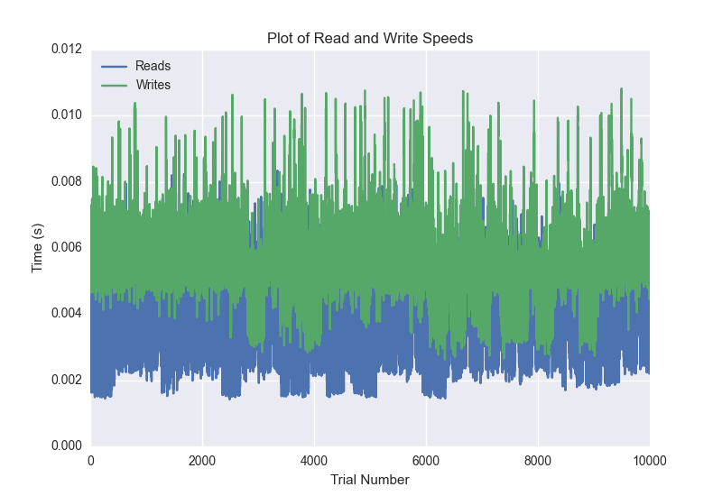
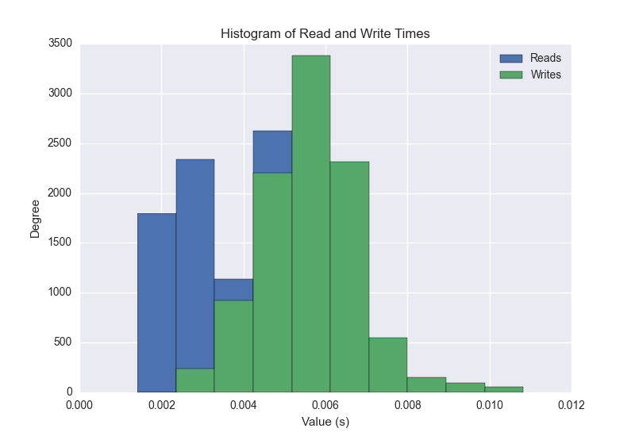
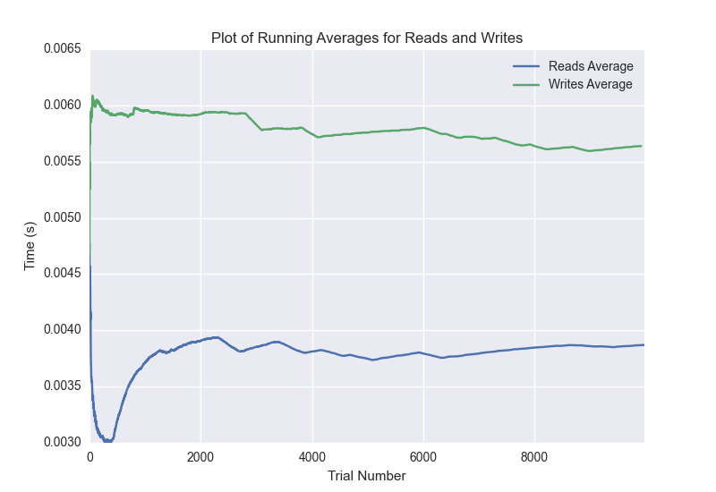

DATABASE BENCHMARKING REPORT - RIAK2 - 10000 Trials
=========================================

This report has been automatically generated from a Benchmarking application
built by [Kurtis Jungersen](http://kmjungersen.com).  The source behind the application can be found on the [project's GitHub.](https://github.com/kmjungersen/DB-Benchmarking)

TIME AND DATE
=============

Wed, 17 Dec, 2014 13:00:54

RESULTS
=======

After using these parameters:

| Parameter                  | Value   |
|:---------------------------|:--------|
| Database Tested            | RIAK2   |
| Number of Trials           | 10000   |
| Length of Each Entry Field | 10      |
| Number of Nodes in Cluster | 3       |
| Split Reads and Writes     | True    |
| Debug Mode                 | False   |
| Chaos Mode (Random Reads)  | True    |

These results were obtained:

| Operation   |   Average |   St. Dev. |   Max Time |   Min Time |   Range |
|:------------|----------:|-----------:|-----------:|-----------:|--------:|
| Writes      |   0.00572 |    0.00173 |    0.08307 |    0.00262 | 0.08044 |
| Reads       |   0.00389 |    0.00152 |    0.03720 |    0.00142 | 0.03578 |

This plot shows the normalized speeds of reads and writes over the course of the benchmark.  The data was normalized (i.e. any data points beyond 3 standard deviations of the mean were excluded).

This plot shows a histogram which describes the general distribution of the data.

This plot shows the running averages for read and write speeds over the course of the benchmark.

Note: If any outliers were obtained in this benchmark, they will displayed here:

| Operation   |   Trial Number |      Value |
|:------------|---------------:|-----------:|
| Write       |            197 | 0.011132   |
| Write       |            791 | 0.0129209  |
| Write       |            796 | 0.0190101  |
| Write       |            797 | 0.0114598  |
| Write       |            798 | 0.0117431  |
| Write       |            799 | 0.0143931  |
| Write       |            800 | 0.028492   |
| Write       |            944 | 0.046201   |
| Write       |           2032 | 0.0121241  |
| Write       |           2633 | 0.030479   |
| Write       |           2634 | 0.0117059  |
| Write       |           3454 | 0.0200119  |
| Write       |           3671 | 0.011502   |
| Write       |           3749 | 0.011153   |
| Write       |           3751 | 0.0186241  |
| Write       |           3772 | 0.0149281  |
| Write       |           3773 | 0.0208781  |
| Write       |           3787 | 0.012423   |
| Write       |           3805 | 0.011389   |
| Write       |           4384 | 0.0115161  |
| Write       |           4736 | 0.0137241  |
| Write       |           4906 | 0.0116301  |
| Write       |           4908 | 0.011482   |
| Write       |           5080 | 0.011693   |
| Write       |           5083 | 0.0109601  |
| Write       |           5257 | 0.0118191  |
| Write       |           5258 | 0.011606   |
| Write       |           5430 | 0.0118361  |
| Write       |           5433 | 0.0117421  |
| Write       |           5609 | 0.0113699  |
| Write       |           5717 | 0.0111401  |
| Write       |           5781 | 0.012073   |
| Write       |           5784 | 0.0138681  |
| Write       |           5785 | 0.011657   |
| Write       |           5873 | 0.011081   |
| Write       |           5890 | 0.083065   |
| Write       |           5892 | 0.0149291  |
| Write       |           5933 | 0.012625   |
| Write       |           5936 | 0.0109229  |
| Write       |           5937 | 0.011054   |
| Write       |           6656 | 0.0121369  |
| Write       |           6661 | 0.011924   |
| Write       |           6708 | 0.0118692  |
| Write       |           6737 | 0.0115581  |
| Write       |           6738 | 0.0155339  |
| Write       |           6739 | 0.0486522  |
| Write       |           6743 | 0.024231   |
| Write       |           6781 | 0.0118039  |
| Write       |           6911 | 0.014472   |
| Write       |           6912 | 0.0220759  |
| Write       |           6913 | 0.020169   |
| Write       |           6914 | 0.0115528  |
| Write       |           7297 | 0.011241   |
| Write       |           7298 | 0.011641   |
| Write       |           7927 | 0.012114   |
| Write       |           7932 | 0.015203   |
| Write       |           8355 | 0.0135679  |
| Write       |           8358 | 0.0110199  |
| Write       |           8359 | 0.011174   |
| Write       |           8360 | 0.0118139  |
| Write       |           8532 | 0.0109439  |
| Write       |           8534 | 0.0141079  |
| Write       |           8536 | 0.0118082  |
| Write       |           8537 | 0.0116069  |
| Write       |           8710 | 0.0127301  |
| Write       |           8714 | 0.0124559  |
| Write       |           8715 | 0.0114851  |
| Write       |           8750 | 0.014087   |
| Write       |           9132 | 0.011703   |
| Write       |           9133 | 0.0114071  |
| Write       |           9137 | 0.011553   |
| Write       |           9138 | 0.014606   |
| Write       |           9311 | 0.010922   |
| Write       |           9317 | 0.012408   |
| Write       |           9318 | 0.016089   |
| Write       |           9489 | 0.011143   |
| Write       |           9490 | 0.0114679  |
| Write       |           9667 | 0.0117311  |
| Write       |           9670 | 0.0118921  |
| Write       |           9672 | 0.011265   |
| Write       |           9674 | 0.0134978  |
| Write       |           9846 | 0.0115821  |
| Write       |           9847 | 0.012171   |
| Write       |           9851 | 0.012408   |
| Write       |           9852 | 0.0137508  |
| Write       |           9960 | 0.0159528  |
| Read        |              0 | 0.0372031  |
| Read        |             12 | 0.00876284 |
| Read        |           1275 | 0.00939393 |
| Read        |           1303 | 0.00955105 |
| Read        |           1437 | 0.010076   |
| Read        |           1467 | 0.00861406 |
| Read        |           1471 | 0.0107241  |
| Read        |           1521 | 0.0103331  |
| Read        |           1531 | 0.0117459  |
| Read        |           1662 | 0.00962186 |
| Read        |           1762 | 0.00933814 |
| Read        |           1773 | 0.00860095 |
| Read        |           1775 | 0.0087781  |
| Read        |           1777 | 0.0106831  |
| Read        |           1807 | 0.0134239  |
| Read        |           3125 | 0.00975394 |
| Read        |           3214 | 0.00874901 |
| Read        |           4187 | 0.0124519  |
| Read        |           5678 | 0.00983191 |
| Read        |           5679 | 0.0169179  |
| Read        |           5934 | 0.0135059  |
| Read        |           6462 | 0.00876093 |
| Read        |           6463 | 0.0130501  |
| Read        |           6464 | 0.0300338  |
| Read        |           6897 | 0.012099   |
| Read        |           7898 | 0.00888491 |