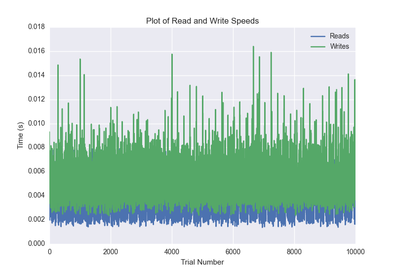
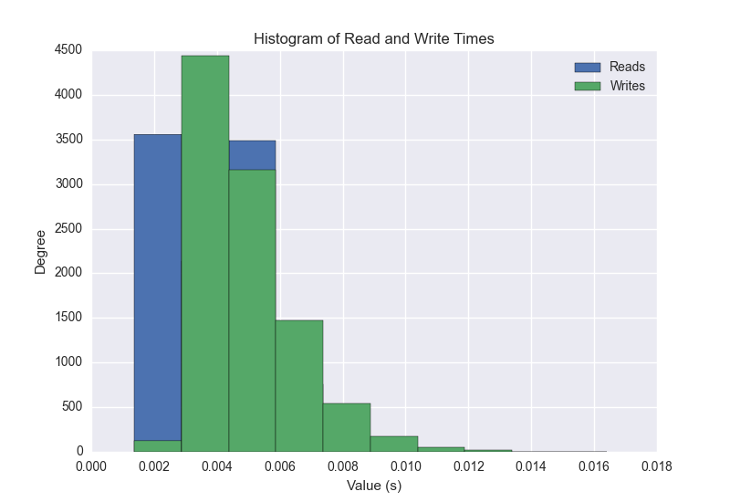
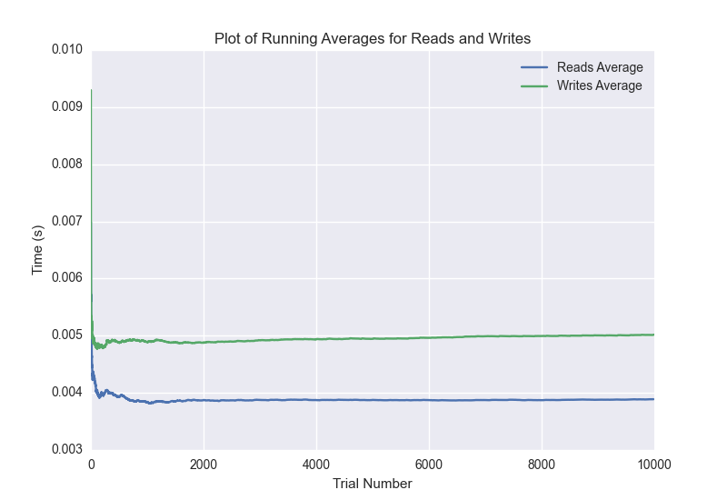

DATABASE BENCHMARKING REPORT - RIAK2 - 10000 Trials
=========================================

This report has been automatically generated from a Benchmarking application
built by [Kurtis Jungersen](http://kmjungersen.com).  The source behind the application can be found on the [project's GitHub.](https://github.com/kmjungersen/DB-Benchmarking)

TIME AND DATE
=============

Wed, 17 Dec, 2014 14:02:29

RESULTS
=======

After using these parameters:

| Parameter                  | Value   |
|:---------------------------|:--------|
| Database Tested            | RIAK2   |
| Number of Trials           | 10000   |
| Length of Each Entry Field | 10      |
| Number of Nodes in Cluster | 3       |
| Split Reads and Writes     | True    |
| Debug Mode                 | False   |
| Chaos Mode (Random Reads)  | True    |

These results were obtained:

| Operation   |   Average |   St. Dev. |   Max Time |   Min Time |   Range |
|:------------|----------:|-----------:|-----------:|-----------:|--------:|
| Writes      |   0.00507 |    0.00430 |    0.40052 |    0.00234 | 0.39818 |
| Reads       |   0.00390 |    0.00144 |    0.01713 |    0.00137 | 0.01576 |

This plot shows the normalized speeds of reads and writes over the course of the benchmark.  The data was normalized (i.e. any data points beyond 3 standard deviations of the mean were excluded).

This plot shows a histogram which describes the general distribution of the data.

This plot shows the running averages for read and write speeds over the course of the benchmark.

Note: If any outliers were obtained in this benchmark, they will displayed here:

| Operation   |   Trial Number |      Value |
|:------------|---------------:|-----------:|
| Write       |           2221 | 0.400524   |
| Write       |           5892 | 0.052881   |
| Write       |           6098 | 0.0189519  |
| Write       |           6125 | 0.0492001  |
| Write       |           9380 | 0.022289   |
| Read        |            722 | 0.00883698 |
| Read        |           2301 | 0.0108719  |
| Read        |           2302 | 0.017127   |
| Read        |           2447 | 0.00947309 |
| Read        |           2736 | 0.00874782 |
| Read        |           2913 | 0.0154221  |
| Read        |           2915 | 0.0101719  |
| Read        |           4964 | 0.00855613 |
| Read        |           5285 | 0.00844383 |
| Read        |           6036 | 0.0144529  |
| Read        |           6525 | 0.00854778 |
| Read        |           6532 | 0.00865412 |
| Read        |           6664 | 0.00870013 |
| Read        |           7744 | 0.00863385 |
| Read        |           9235 | 0.012017   |
| Read        |           9236 | 0.00954199 |
| Read        |           9270 | 0.00833201 |
| Read        |           9616 | 0.00835896 |
| Read        |           9717 | 0.0135751  |
| Read        |           9911 | 0.00893021 |