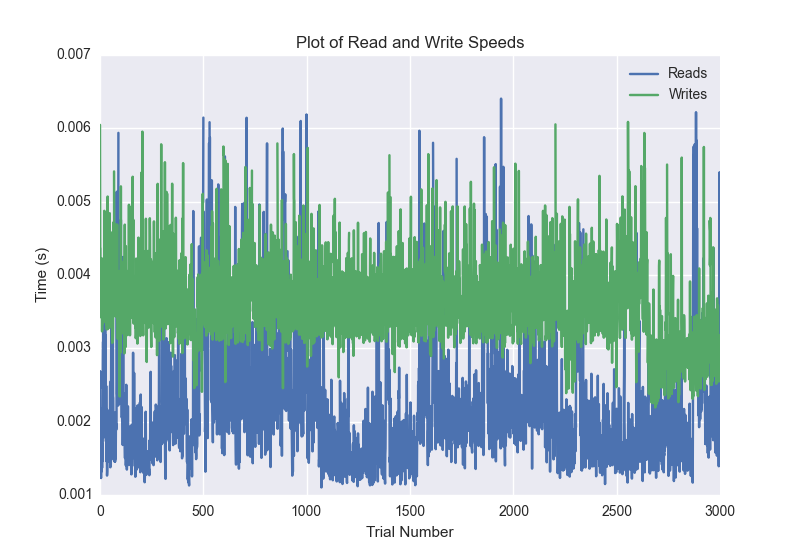
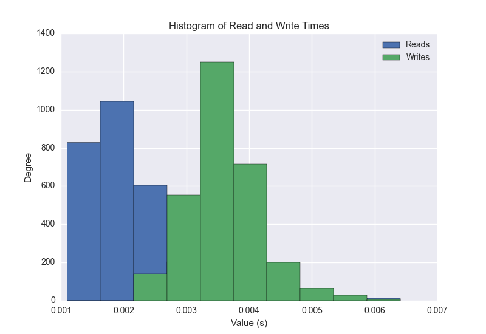
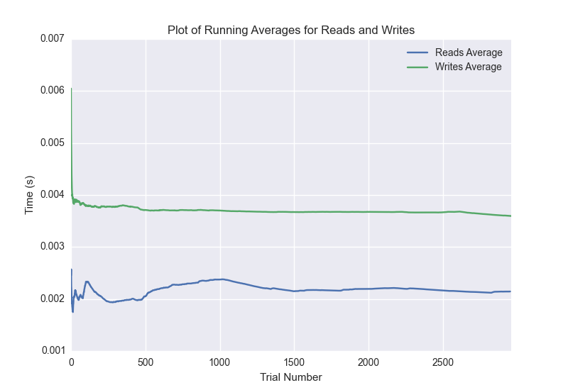

DATABASE BENCHMARKING REPORT - RIAK2
=========================================

This report has been automatically generated from a Benchmarking application
built by [Kurtis Jungersen](http://kmjungersen.com).  The source behind the application can be found on the [project's GitHub.](https://github.com/kmjungersen/DB-Benchmarking)

TIME AND DATE
=============

Fri, 14 Nov, 2014 17:51:27

RESULTS
=======

After using these parameters:

| Parameter                  | Value   |
|:---------------------------|:--------|
| Database Tested            | RIAK2   |
| Number of Trials           | 3000    |
| Length of Each Entry Field | 10      |
| Number of Nodes in Cluster | 3       |
| Split Reads and Writes     | True    |
| Debug Mode                 | False   |
| Chaos Mode (Random Reads)  | True    |

These results were obtained:

| Operation   |   Average |   St. Dev. |   Max Time |   Min Time |   Range |
|:------------|----------:|-----------:|-----------:|-----------:|--------:|
| Writes      |   0.00366 |    0.00082 |    0.01798 |    0.00219 | 0.01579 |
| Reads       |   0.00227 |    0.00138 |    0.02453 |    0.00110 | 0.02342 |

This plot shows the normalized speeds of reads and writes over the course of the benchmark.  The data was normalized (i.e. any data points beyond 3 standard deviations of the mean were excluded).

This plot shows a histogram which describes the general distribution of the data.

This plot shows the running averages for read and write speeds over the course of the benchmark.

Note: If any outliers were obtained in this benchmark, they will displayed here:

| Operation   |   Trial Number |      Value |
|:------------|---------------:|-----------:|
| Write       |             67 | 0.00661111 |
| Write       |            325 | 0.00766683 |
| Write       |            479 | 0.00635982 |
| Write       |            595 | 0.00901794 |
| Write       |            603 | 0.00630093 |
| Write       |            736 | 0.00647807 |
| Write       |            804 | 0.00650406 |
| Write       |            856 | 0.00801301 |
| Write       |            857 | 0.00868297 |
| Write       |           1127 | 0.00859714 |
| Write       |           1128 | 0.008039   |
| Write       |           1206 | 0.00651598 |
| Write       |           1397 | 0.00869393 |
| Write       |           1398 | 0.00868893 |
| Write       |           1399 | 0.00651598 |
| Write       |           1407 | 0.00648904 |
| Write       |           1664 | 0.00880885 |
| Write       |           1665 | 0.011795   |
| Write       |           1666 | 0.00879598 |
| Write       |           1931 | 0.008111   |
| Write       |           1932 | 0.00895309 |
| Write       |           1933 | 0.00779581 |
| Write       |           2199 | 0.00867009 |
| Write       |           2200 | 0.00955987 |
| Write       |           2201 | 0.00871301 |
| Write       |           2202 | 0.0077889  |
| Write       |           2211 | 0.00666189 |
| Write       |           2412 | 0.00636792 |
| Write       |           2471 | 0.00891304 |
| Write       |           2472 | 0.00953197 |
| Write       |           2473 | 0.00852585 |
| Write       |           2474 | 0.00702906 |
| Write       |           2610 | 0.017983   |
| Write       |           2612 | 0.0123532  |
| Write       |           2613 | 0.00977492 |
| Write       |           2623 | 0.0064621  |
| Write       |           2635 | 0.00628996 |
| Write       |           2740 | 0.00943613 |
| Write       |           2741 | 0.00738001 |
| Write       |           2742 | 0.00666595 |
| Write       |           2946 | 0.00929403 |
| Read        |             90 | 0.0129862  |
| Read        |            302 | 0.00695491 |
| Read        |            312 | 0.0164781  |
| Read        |            476 | 0.00743198 |
| Read        |            483 | 0.00693011 |
| Read        |            485 | 0.0197492  |
| Read        |            486 | 0.00673819 |
| Read        |            491 | 0.0147378  |
| Read        |            495 | 0.0109489  |
| Read        |            496 | 0.00895405 |
| Read        |            497 | 0.0119679  |
| Read        |            498 | 0.0128632  |
| Read        |            501 | 0.00943804 |
| Read        |            505 | 0.00868821 |
| Read        |            519 | 0.00663209 |
| Read        |            523 | 0.00789595 |
| Read        |            525 | 0.0084939  |
| Read        |            528 | 0.0245261  |
| Read        |            529 | 0.00728393 |
| Read        |            533 | 0.00745916 |
| Read        |            534 | 0.0154881  |
| Read        |            535 | 0.0150042  |
| Read        |            554 | 0.00822306 |
| Read        |            568 | 0.00669909 |
| Read        |            587 | 0.0075202  |
| Read        |            588 | 0.00826502 |
| Read        |            594 | 0.0119579  |
| Read        |            622 | 0.00899506 |
| Read        |            629 | 0.011209   |
| Read        |            888 | 0.00660801 |
| Read        |            890 | 0.00953794 |
| Read        |            892 | 0.00654292 |
| Read        |            894 | 0.00675297 |
| Read        |            906 | 0.0108821  |
| Read        |            909 | 0.00745702 |
| Read        |            912 | 0.00650215 |
| Read        |            965 | 0.010812   |
| Read        |           1019 | 0.00648499 |
| Read        |           1020 | 0.00865984 |
| Read        |           1573 | 0.0219049  |
| Read        |           1606 | 0.00778294 |
| Read        |           1610 | 0.0113049  |
| Read        |           1626 | 0.00773716 |
| Read        |           1724 | 0.00677514 |
| Read        |           2187 | 0.00707006 |
| Read        |           2339 | 0.00741315 |
| Read        |           2916 | 0.011019   |
| Read        |           2917 | 0.0108719  |