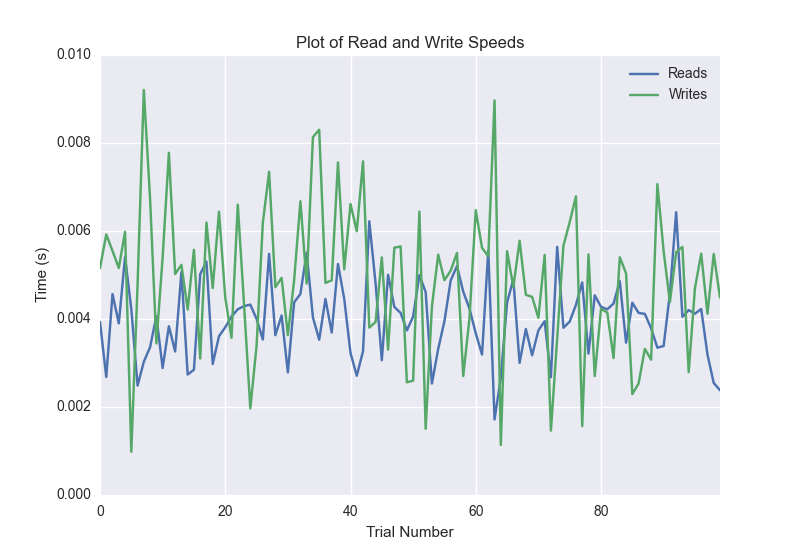
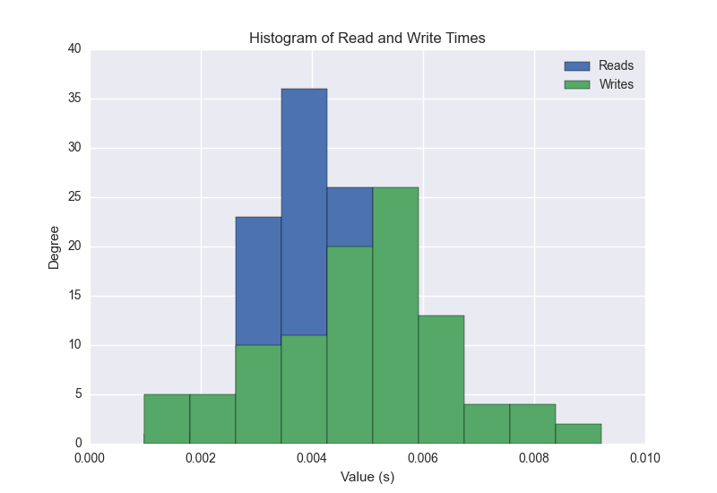

DATABASE BENCHMARKING REPORT - feaux_db - 100 Trials
=========================================

This report has been automatically generated from a Benchmarking application
built by [Kurtis Jungersen](http://kmjungersen.com).  The source behind the application can be found on the [project's GitHub.](https://github.com/kmjungersen/DB-Benchmarking)

TIME AND DATE
=============

Fri, 08 May, 2015 17:50:22

RESULTS
=======

After using these parameters:

| Parameter                        | Value    |
|:---------------------------------|:---------|
| Database Tested                  | feaux_db |
| Number of Trials                 | 100      |
| Length of Each Entry Field       | 10       |
| Number of Nodes in Cluster       | n/a      |
| # of StDev's Displayed in Graphs | 1        |
| Split Reads and Writes           | True     |
| Debug Mode                       | True     |
| Chaos Mode (Random Reads)        | False    |

These results were obtained:

| Operation   |   Average |   St. Dev. |   Max Time |   Min Time |   Range |
|:------------|----------:|-----------:|-----------:|-----------:|--------:|
| Writes      |   0.00490 |         15 |    0.00921 |    0.00098 | 0.00822 |
| Reads       |   0.00399 |         15 |    0.00643 |    0.00172 | 0.00471 |

This plot shows the normalized speeds of reads and writes over the course of the benchmark.  The data was normalized (i.e. any data points beyond 3 standard deviations of the mean were excluded).

This plot shows a histogram which describes the general distribution of the data.

This plot shows the running averages for read and write speeds over the course of the benchmark.

