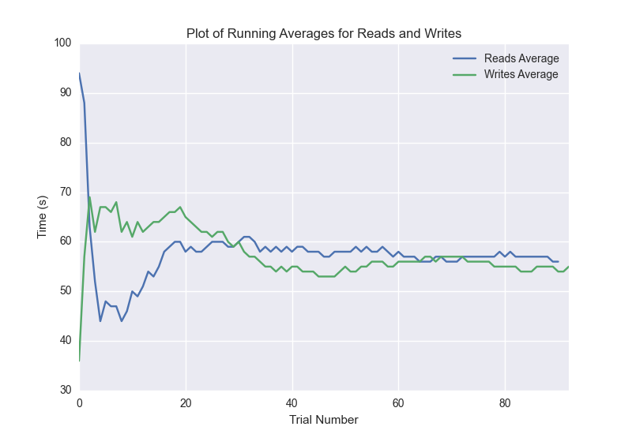

DATABASE BENCHMARKING REPORT - feaux_db
=========================================

This report has been automatically generated from a Benchmarking application
built by [Kurtis Jungersen](http://kmjungersen.com).  The source behind the application can be found on the [project's GitHub.](https://github.com/kmjungersen/DB-Benchmarking)

TIME AND DATE
=============

Wed, 12 Nov, 2014 11:35:59

RESULTS
=======

After using these parameters:

| Parameter                  | Value    |
|:---------------------------|:---------|
| Database Tested            | feaux_db |
| Number of Trials           | 100      |
| Length of Each Entry Field | 10       |
| Number of Nodes in Cluster | 3        |

These results were obtained:

| Operation   |   Average |   St. Dev. |   Max Time |   Min Time |    Range |
|:------------|----------:|-----------:|-----------:|-----------:|---------:|
| Writes      |  51.40000 |         15 |   96.00000 |    0.00000 | 96.00000 |
| Reads       |  53.03000 |         15 |   99.00000 |    1.00000 | 98.00000 |

This plot shows the normalized speeds of reads and writes over the course of the benchmark.  The data was normalized (i.e. any data points beyond 3 standard deviations of the mean were excluded).

This plot shows a histogram which describes the general distribution of the data.

This plot shows the running averages for read and write speeds over the course of the benchmark.

Note: If any outliers were obtained in this benchmark, they will displayed here:

| Operation   |   Trial Number |   Value |
|:------------|---------------:|--------:|
| Write       |              9 |       3 |
| Write       |             17 |       1 |
| Write       |             26 |       6 |
| Write       |             62 |       4 |
| Write       |             73 |       2 |
| Write       |             81 |       4 |
| Write       |             90 |       0 |
| Read        |              1 |       7 |
| Read        |              7 |       8 |
| Read        |             22 |       3 |
| Read        |             26 |       4 |
| Read        |             58 |       2 |
| Read        |             82 |      99 |
| Read        |             87 |       2 |
| Read        |             93 |       1 |
| Read        |             95 |       8 |