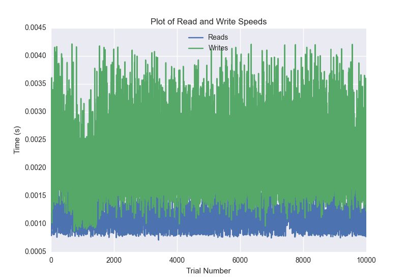
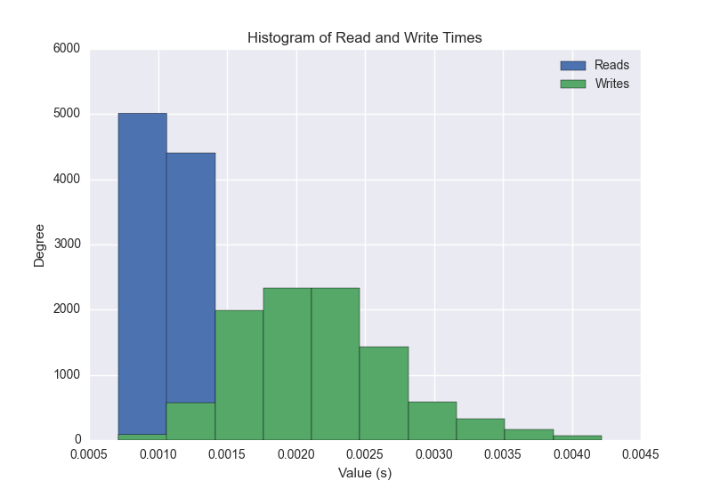
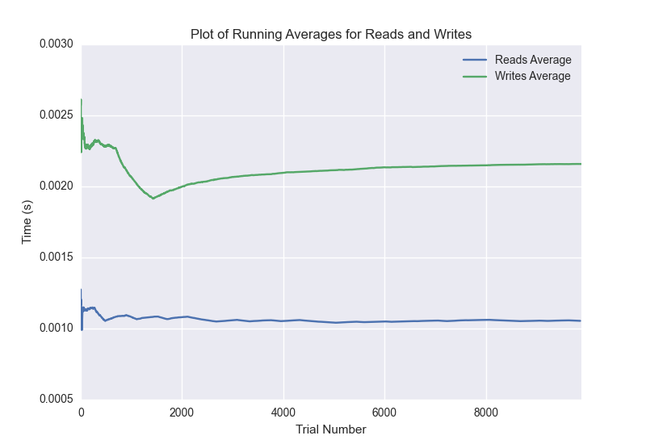

DATABASE BENCHMARKING REPORT - MONGO - 10000 Trials
=========================================

This report has been automatically generated from a Benchmarking application
built by [Kurtis Jungersen](http://kmjungersen.com).  The source behind the application can be found on the [project's GitHub.](https://github.com/kmjungersen/DB-Benchmarking)

TIME AND DATE
=============

Thu, 13 Nov, 2014 16:37:59

RESULTS
=======

After using these parameters:

| Parameter                  | Value   |
|:---------------------------|:--------|
| Database Tested            | MONGO   |
| Number of Trials           | 10000   |
| Length of Each Entry Field | 10      |
| Number of Nodes in Cluster | 3       |
| Split Reads and Writes     | True    |
| Debug Mode                 | False   |
| Chaos Mode (Random Reads)  | True    |

These results were obtained:

| Operation   |   Average |   St. Dev. |   Max Time |   Min Time |   Range |
|:------------|----------:|-----------:|-----------:|-----------:|--------:|
| Writes      |   0.00219 |    0.00068 |    0.01787 |    0.00087 | 0.01700 |
| Reads       |   0.00107 |    0.00024 |    0.00788 |    0.00071 | 0.00717 |

This plot shows the normalized speeds of reads and writes over the course of the benchmark.  The data was normalized (i.e. any data points beyond 3 standard deviations of the mean were excluded).

This plot shows a histogram which describes the general distribution of the data.

This plot shows the running averages for read and write speeds over the course of the benchmark.

Note: If any outliers were obtained in this benchmark, they will displayed here:

| Operation   |   Trial Number |      Value |
|:------------|---------------:|-----------:|
| Write       |             31 | 0.004421   |
| Write       |             35 | 0.00494194 |
| Write       |             63 | 0.00430393 |
| Write       |             78 | 0.00507307 |
| Write       |            167 | 0.00433087 |
| Write       |            259 | 0.00434899 |
| Write       |            262 | 0.00716496 |
| Write       |            263 | 0.00869393 |
| Write       |            264 | 0.0178699  |
| Write       |            265 | 0.00795722 |
| Write       |            266 | 0.00696206 |
| Write       |            267 | 0.0059278  |
| Write       |            268 | 0.00665402 |
| Write       |            271 | 0.00531292 |
| Write       |            382 | 0.00468111 |
| Write       |            404 | 0.0047648  |
| Write       |            448 | 0.00494504 |
| Write       |            472 | 0.00426698 |
| Write       |            492 | 0.00428104 |
| Write       |            602 | 0.00436997 |
| Write       |            692 | 0.011574   |
| Write       |           1546 | 0.00422597 |
| Write       |           2019 | 0.00492287 |
| Write       |           2037 | 0.00503993 |
| Write       |           2146 | 0.00423098 |
| Write       |           2168 | 0.00457311 |
| Write       |           2252 | 0.00423694 |
| Write       |           2533 | 0.00429082 |
| Write       |           2619 | 0.00545621 |
| Write       |           2655 | 0.0055871  |
| Write       |           2669 | 0.00456595 |
| Write       |           2707 | 0.00434613 |
| Write       |           2728 | 0.00439596 |
| Write       |           2794 | 0.00524688 |
| Write       |           3141 | 0.0045352  |
| Write       |           3368 | 0.00459194 |
| Write       |           3478 | 0.00434089 |
| Write       |           3504 | 0.00426006 |
| Write       |           3566 | 0.00422502 |
| Write       |           3641 | 0.00523305 |
| Write       |           3658 | 0.00463891 |
| Write       |           3740 | 0.004668   |
| Write       |           3838 | 0.00531006 |
| Write       |           4150 | 0.004637   |
| Write       |           4179 | 0.00482607 |
| Write       |           4314 | 0.00438786 |
| Write       |           4332 | 0.00467086 |
| Write       |           4378 | 0.00487089 |
| Write       |           4402 | 0.00427008 |
| Write       |           4494 | 0.00423789 |
| Write       |           4785 | 0.004246   |
| Write       |           4903 | 0.00432587 |
| Write       |           5010 | 0.00437903 |
| Write       |           5036 | 0.00428605 |
| Write       |           5100 | 0.00435305 |
| Write       |           5128 | 0.00433493 |
| Write       |           5170 | 0.00465822 |
| Write       |           5206 | 0.00427794 |
| Write       |           5220 | 0.00439596 |
| Write       |           5234 | 0.00475907 |
| Write       |           5340 | 0.00543785 |
| Write       |           5351 | 0.004318   |
| Write       |           5369 | 0.0046339  |
| Write       |           5371 | 0.00439501 |
| Write       |           5384 | 0.00425005 |
| Write       |           5392 | 0.00650001 |
| Write       |           5412 | 0.00446391 |
| Write       |           5456 | 0.00426793 |
| Write       |           5478 | 0.00439501 |
| Write       |           5484 | 0.00431108 |
| Write       |           5576 | 0.00651097 |
| Write       |           5577 | 0.00940394 |
| Write       |           5580 | 0.00460792 |
| Write       |           5581 | 0.00754094 |
| Write       |           5583 | 0.0068891  |
| Write       |           5597 | 0.00436807 |
| Write       |           5772 | 0.0046041  |
| Write       |           5790 | 0.00488091 |
| Write       |           5832 | 0.00454807 |
| Write       |           5859 | 0.00584102 |
| Write       |           6099 | 0.0048821  |
| Write       |           6145 | 0.00444698 |
| Write       |           6214 | 0.00823498 |
| Write       |           6215 | 0.00679803 |
| Write       |           6216 | 0.00637293 |
| Write       |           6217 | 0.0104241  |
| Write       |           6218 | 0.00522709 |
| Write       |           6389 | 0.00439405 |
| Write       |           6478 | 0.00486612 |
| Write       |           6541 | 0.00426722 |
| Write       |           6561 | 0.008255   |
| Write       |           6610 | 0.00443411 |
| Write       |           6767 | 0.00486684 |
| Write       |           6818 | 0.00442219 |
| Write       |           6881 | 0.00476098 |
| Write       |           7081 | 0.00436711 |
| Write       |           7126 | 0.00581408 |
| Write       |           7347 | 0.00492787 |
| Write       |           7599 | 0.00443316 |
| Write       |           7798 | 0.00461507 |
| Write       |           8007 | 0.00436592 |
| Write       |           8061 | 0.00597286 |
| Write       |           8122 | 0.00432205 |
| Write       |           8168 | 0.00496984 |
| Write       |           8213 | 0.00451994 |
| Write       |           8559 | 0.00423694 |
| Write       |           8676 | 0.00504994 |
| Write       |           8879 | 0.00437498 |
| Write       |           9203 | 0.004673   |
| Write       |           9284 | 0.00571895 |
| Write       |           9420 | 0.00468087 |
| Write       |           9514 | 0.00428319 |
| Write       |           9922 | 0.00503182 |
| Write       |           9931 | 0.00423694 |
| Write       |           9992 | 0.00485802 |
| Read        |              0 | 0.00237393 |
| Read        |             31 | 0.00209808 |
| Read        |             32 | 0.0022881  |
| Read        |             33 | 0.00267506 |
| Read        |             34 | 0.00217414 |
| Read        |             59 | 0.001858   |
| Read        |             88 | 0.00183702 |
| Read        |             97 | 0.00184107 |
| Read        |            115 | 0.00191116 |
| Read        |            146 | 0.00209093 |
| Read        |            170 | 0.00184083 |
| Read        |            221 | 0.00195503 |
| Read        |            329 | 0.00241494 |
| Read        |            801 | 0.00204301 |
| Read        |            830 | 0.0018301  |
| Read        |            868 | 0.00180507 |
| Read        |            897 | 0.00220013 |
| Read        |            922 | 0.00323009 |
| Read        |            987 | 0.00208712 |
| Read        |           1159 | 0.00190592 |
| Read        |           1167 | 0.00207114 |
| Read        |           1201 | 0.00187397 |
| Read        |           1233 | 0.001966   |
| Read        |           1306 | 0.00208306 |
| Read        |           1334 | 0.00188994 |
| Read        |           1364 | 0.00209999 |
| Read        |           1504 | 0.00201821 |
| Read        |           1533 | 0.00184417 |
| Read        |           1589 | 0.00193501 |
| Read        |           1725 | 0.00248694 |
| Read        |           1738 | 0.001863   |
| Read        |           1741 | 0.00303602 |
| Read        |           1762 | 0.00262785 |
| Read        |           1764 | 0.00238705 |
| Read        |           1773 | 0.00197697 |
| Read        |           1811 | 0.00214291 |
| Read        |           1844 | 0.00230503 |
| Read        |           1849 | 0.00195813 |
| Read        |           1872 | 0.00227404 |
| Read        |           1873 | 0.00203395 |
| Read        |           1876 | 0.00199103 |
| Read        |           1898 | 0.00184894 |
| Read        |           1912 | 0.00205898 |
| Read        |           1960 | 0.00193501 |
| Read        |           2151 | 0.00187612 |
| Read        |           2459 | 0.00279999 |
| Read        |           2726 | 0.00226092 |
| Read        |           2793 | 0.00204897 |
| Read        |           2854 | 0.00181293 |
| Read        |           2909 | 0.00208092 |
| Read        |           2936 | 0.00227404 |
| Read        |           2946 | 0.00184917 |
| Read        |           3047 | 0.002177   |
| Read        |           3233 | 0.00195479 |
| Read        |           3317 | 0.00186014 |
| Read        |           3450 | 0.00193    |
| Read        |           3477 | 0.00186515 |
| Read        |           3515 | 0.00202608 |
| Read        |           3609 | 0.00191712 |
| Read        |           3721 | 0.00234914 |
| Read        |           4056 | 0.00180292 |
| Read        |           4091 | 0.00239611 |
| Read        |           4120 | 0.00203395 |
| Read        |           4266 | 0.00188398 |
| Read        |           4352 | 0.00231194 |
| Read        |           4361 | 0.00455689 |
| Read        |           4362 | 0.00202799 |
| Read        |           4363 | 0.00182486 |
| Read        |           4364 | 0.00447106 |
| Read        |           4365 | 0.00459099 |
| Read        |           4366 | 0.00286913 |
| Read        |           4368 | 0.00230885 |
| Read        |           4369 | 0.0022521  |
| Read        |           4370 | 0.00225592 |
| Read        |           4371 | 0.00442505 |
| Read        |           4396 | 0.00190091 |
| Read        |           5045 | 0.00259686 |
| Read        |           5125 | 0.00185394 |
| Read        |           5181 | 0.00272107 |
| Read        |           5209 | 0.00227785 |
| Read        |           5335 | 0.00201678 |
| Read        |           5354 | 0.00187993 |
| Read        |           5362 | 0.00182915 |
| Read        |           5419 | 0.00190806 |
| Read        |           5503 | 0.00189304 |
| Read        |           5686 | 0.0020051  |
| Read        |           5930 | 0.00183606 |
| Read        |           5959 | 0.00208902 |
| Read        |           6023 | 0.00211215 |
| Read        |           6265 | 0.00182104 |
| Read        |           6269 | 0.00195312 |
| Read        |           6281 | 0.0018599  |
| Read        |           6297 | 0.00186896 |
| Read        |           6354 | 0.00204301 |
| Read        |           6481 | 0.00222492 |
| Read        |           6734 | 0.00180912 |
| Read        |           6759 | 0.00378799 |
| Read        |           6937 | 0.00192189 |
| Read        |           6990 | 0.0018189  |
| Read        |           7176 | 0.00183821 |
| Read        |           7336 | 0.00194407 |
| Read        |           7358 | 0.00210714 |
| Read        |           7368 | 0.00315714 |
| Read        |           7386 | 0.00199509 |
| Read        |           7395 | 0.00218081 |
| Read        |           7411 | 0.00231981 |
| Read        |           7412 | 0.00225902 |
| Read        |           7414 | 0.00188899 |
| Read        |           7440 | 0.00216103 |
| Read        |           7465 | 0.00182414 |
| Read        |           7467 | 0.00193191 |
| Read        |           7518 | 0.00788379 |
| Read        |           7519 | 0.00269508 |
| Read        |           7520 | 0.00255203 |
| Read        |           7541 | 0.00220394 |
| Read        |           7549 | 0.00253296 |
| Read        |           7564 | 0.00217915 |
| Read        |           7600 | 0.002033   |
| Read        |           7698 | 0.00217509 |
| Read        |           7874 | 0.00185204 |
| Read        |           7967 | 0.00182796 |
| Read        |           7969 | 0.0018661  |
| Read        |           8065 | 0.00180411 |
| Read        |           8088 | 0.00180697 |
| Read        |           8143 | 0.00198817 |
| Read        |           8215 | 0.00180101 |
| Read        |           8640 | 0.00195003 |
| Read        |           8701 | 0.00200915 |
| Read        |           8799 | 0.00238585 |
| Read        |           8827 | 0.00216389 |
| Read        |           8937 | 0.00199294 |
| Read        |           9014 | 0.00189805 |
| Read        |           9141 | 0.00194097 |
| Read        |           9210 | 0.00180793 |
| Read        |           9391 | 0.00222707 |
| Read        |           9411 | 0.00235796 |
| Read        |           9599 | 0.00180984 |
| Read        |           9726 | 0.00195813 |
| Read        |           9755 | 0.00195909 |