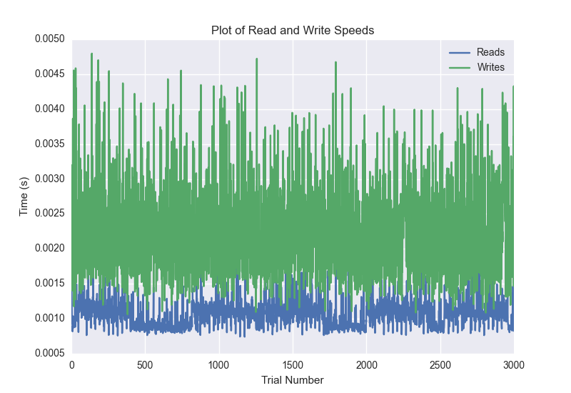
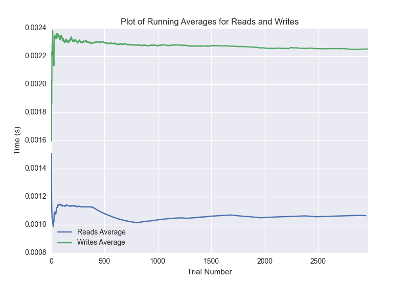

DATABASE BENCHMARKING REPORT - MONGO - 3000 Trials
=========================================

This report has been automatically generated from a Benchmarking application
built by [Kurtis Jungersen](http://kmjungersen.com).  The source behind the application can be found on the [project's GitHub.](https://github.com/kmjungersen/DB-Benchmarking)

TIME AND DATE
=============

Thu, 13 Nov, 2014 16:36:27

RESULTS
=======

After using these parameters:

| Parameter                  | Value   |
|:---------------------------|:--------|
| Database Tested            | MONGO   |
| Number of Trials           | 3000    |
| Length of Each Entry Field | 10      |
| Number of Nodes in Cluster | 3       |
| Split Reads and Writes     | True    |
| Debug Mode                 | False   |
| Chaos Mode (Random Reads)  | True    |

These results were obtained:

| Operation   |   Average |   St. Dev. |   Max Time |   Min Time |   Range |
|:------------|----------:|-----------:|-----------:|-----------:|--------:|
| Writes      |   0.00230 |    0.00085 |    0.02680 |    0.00106 | 0.02574 |
| Reads       |   0.00108 |    0.00022 |    0.00358 |    0.00074 | 0.00284 |

This plot shows the normalized speeds of reads and writes over the course of the benchmark.  The data was normalized (i.e. any data points beyond 3 standard deviations of the mean were excluded).

This plot shows a histogram which describes the general distribution of the data.

This plot shows the running averages for read and write speeds over the course of the benchmark.

Note: If any outliers were obtained in this benchmark, they will displayed here:

| Operation   |   Trial Number |      Value |
|:------------|---------------:|-----------:|
| Write       |              0 | 0.0154841  |
| Write       |              7 | 0.00503707 |
| Write       |             95 | 0.004879   |
| Write       |            236 | 0.026799   |
| Write       |            301 | 0.00848818 |
| Write       |            342 | 0.00530505 |
| Write       |            387 | 0.00538111 |
| Write       |            516 | 0.00487781 |
| Write       |            571 | 0.00484014 |
| Write       |            573 | 0.00502896 |
| Write       |            923 | 0.00559592 |
| Write       |            969 | 0.00583982 |
| Write       |            998 | 0.00525594 |
| Write       |           1083 | 0.00521803 |
| Write       |           1113 | 0.00642109 |
| Write       |           1121 | 0.00543904 |
| Write       |           1348 | 0.00492883 |
| Write       |           1882 | 0.00515795 |
| Write       |           2026 | 0.00588298 |
| Write       |           2027 | 0.00513196 |
| Write       |           2110 | 0.00500011 |
| Write       |           2242 | 0.00514603 |
| Write       |           2460 | 0.00496292 |
| Write       |           2867 | 0.00488687 |
| Write       |           2927 | 0.00604892 |
| Write       |           2928 | 0.00593805 |
| Write       |           2929 | 0.00752401 |
| Write       |           2930 | 0.00622606 |
| Write       |           2931 | 0.00855803 |
| Write       |           2932 | 0.00514603 |
| Read        |              1 | 0.002074   |
| Read        |             30 | 0.00208497 |
| Read        |             31 | 0.00196409 |
| Read        |             32 | 0.00209284 |
| Read        |             33 | 0.00189304 |
| Read        |             34 | 0.00188494 |
| Read        |             52 | 0.00198698 |
| Read        |             56 | 0.00187588 |
| Read        |             86 | 0.00225806 |
| Read        |            143 | 0.00208282 |
| Read        |            170 | 0.00228    |
| Read        |            388 | 0.0019269  |
| Read        |            438 | 0.00190997 |
| Read        |            820 | 0.00206208 |
| Read        |            833 | 0.0019381  |
| Read        |            859 | 0.00177193 |
| Read        |            907 | 0.00215507 |
| Read        |            949 | 0.00209498 |
| Read        |            992 | 0.00207186 |
| Read        |           1005 | 0.00178218 |
| Read        |           1061 | 0.00201297 |
| Read        |           1090 | 0.00206399 |
| Read        |           1221 | 0.00186896 |
| Read        |           1265 | 0.00179696 |
| Read        |           1313 | 0.00197291 |
| Read        |           1371 | 0.00183892 |
| Read        |           1423 | 0.00358081 |
| Read        |           1466 | 0.0019021  |
| Read        |           1488 | 0.00255799 |
| Read        |           1519 | 0.00189209 |
| Read        |           1544 | 0.00188708 |
| Read        |           1603 | 0.00212502 |
| Read        |           1610 | 0.00196791 |
| Read        |           1633 | 0.00258613 |
| Read        |           1658 | 0.00192904 |
| Read        |           1684 | 0.00183487 |
| Read        |           1716 | 0.00257492 |
| Read        |           1785 | 0.00217605 |
| Read        |           2071 | 0.00203013 |
| Read        |           2098 | 0.00180387 |
| Read        |           2190 | 0.00178099 |
| Read        |           2214 | 0.00174284 |
| Read        |           2241 | 0.00174212 |
| Read        |           2250 | 0.00186205 |
| Read        |           2398 | 0.00206685 |
| Read        |           2592 | 0.00207114 |
| Read        |           2594 | 0.002038   |
| Read        |           2620 | 0.0020299  |
| Read        |           2744 | 0.00203991 |
| Read        |           2799 | 0.00190496 |
| Read        |           2892 | 0.00183296 |
| Read        |           2928 | 0.00183702 |