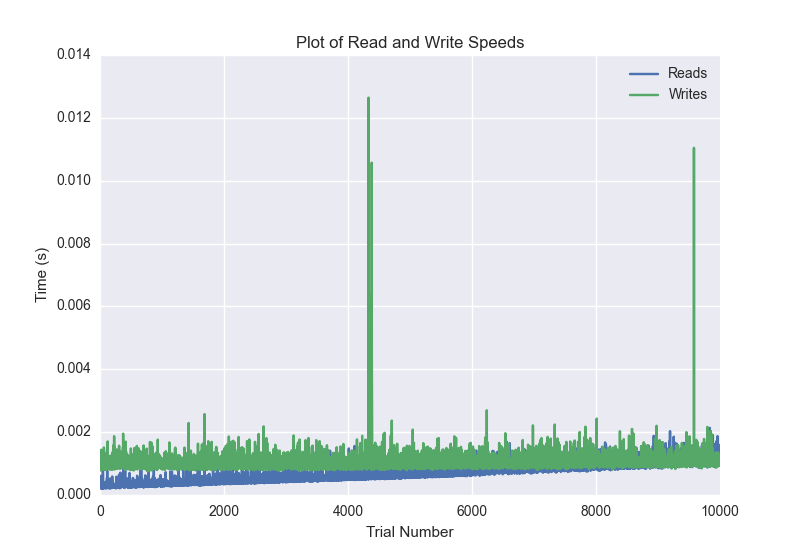
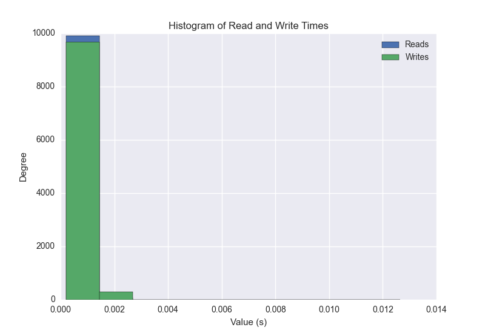

DATABASE BENCHMARKING REPORT - POSTGRESQL - 10000 Trials
=========================================

This report has been automatically generated from a Benchmarking application
built by [Kurtis Jungersen](http://kmjungersen.com).  The source behind the application can be found on the [project's GitHub.](https://github.com/kmjungersen/DB-Benchmarking)

TIME AND DATE
=============

Tue, 16 Dec, 2014 12:02:26

RESULTS
=======

After using these parameters:

| Parameter                  | Value      |
|:---------------------------|:-----------|
| Database Tested            | POSTGRESQL |
| Number of Trials           | 10000      |
| Length of Each Entry Field | 10         |
| Number of Nodes in Cluster | 3          |
| Split Reads and Writes     | False      |
| Debug Mode                 | False      |
| Chaos Mode (Random Reads)  | True       |

These results were obtained:

| Operation   |   Average |   St. Dev. |   Max Time |   Min Time |   Range |
|:------------|----------:|-----------:|-----------:|-----------:|--------:|
| Writes      |   0.00190 |    0.01722 |    0.40494 |    0.00077 | 0.40417 |
| Reads       |   0.00107 |    0.01169 |    0.39766 |    0.00020 | 0.39745 |

This plot shows the normalized speeds of reads and writes over the course of the benchmark.  The data was normalized (i.e. any data points beyond 3 standard deviations of the mean were excluded).

This plot shows a histogram which describes the general distribution of the data.

This plot shows the running averages for read and write speeds over the course of the benchmark.

Note: If any outliers were obtained in this benchmark, they will displayed here:

| Operation   |   Trial Number |     Value |
|:------------|---------------:|----------:|
| Write       |            267 | 0.400113  |
| Write       |            297 | 0.363215  |
| Write       |            472 | 0.356202  |
| Write       |           1205 | 0.326966  |
| Write       |           1868 | 0.351852  |
| Write       |           1933 | 0.104509  |
| Write       |           2024 | 0.364273  |
| Write       |           2143 | 0.321986  |
| Write       |           2146 | 0.394785  |
| Write       |           2239 | 0.0665851 |
| Write       |           2426 | 0.318802  |
| Write       |           2854 | 0.348272  |
| Write       |           3570 | 0.387857  |
| Write       |           3987 | 0.335593  |
| Write       |           4016 | 0.356188  |
| Write       |           4229 | 0.215636  |
| Write       |           4244 | 0.311002  |
| Write       |           4274 | 0.129005  |
| Write       |           4545 | 0.404935  |
| Write       |           4622 | 0.368502  |
| Write       |           4788 | 0.281627  |
| Write       |           4889 | 0.363834  |
| Write       |           5039 | 0.335974  |
| Write       |           5199 | 0.323798  |
| Write       |           5285 | 0.107685  |
| Write       |           5302 | 0.311188  |
| Write       |           5783 | 0.333515  |
| Write       |           5849 | 0.330934  |
| Write       |           5919 | 0.319701  |
| Read        |            827 | 0.319685  |
| Read        |           1079 | 0.350581  |
| Read        |           2149 | 0.394848  |
| Read        |           2824 | 0.397655  |
| Read        |           6224 | 0.330835  |
| Read        |           6328 | 0.394964  |
| Read        |           7148 | 0.322625  |
| Read        |           7411 | 0.380156  |
| Read        |           7715 | 0.3885    |
| Read        |           8312 | 0.368266  |
| Read        |           8559 | 0.107025  |
| Read        |           9420 | 0.148146  |