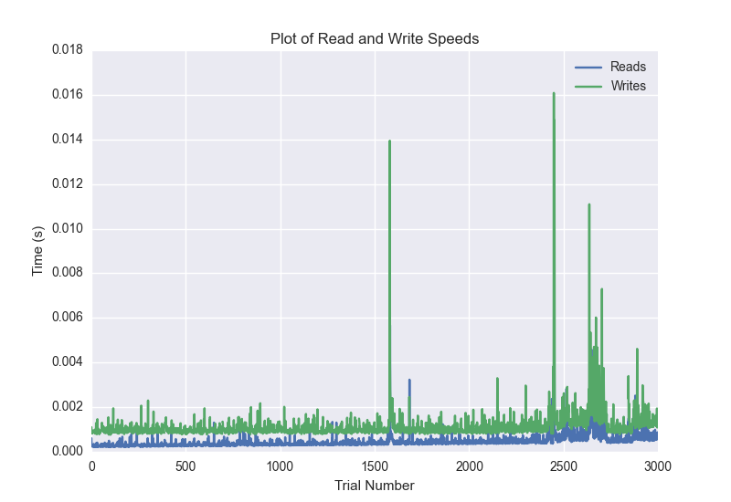
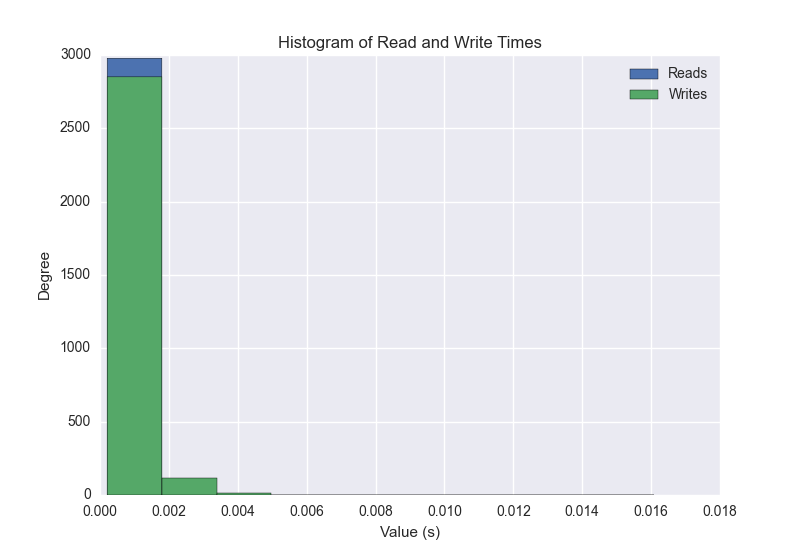
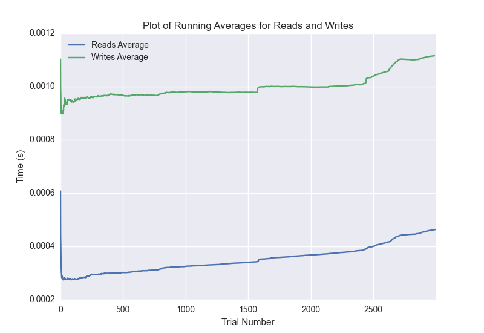

DATABASE BENCHMARKING REPORT - POSTGRESQL - 3000 Trials
=========================================

This report has been automatically generated from a Benchmarking application
built by [Kurtis Jungersen](http://kmjungersen.com).  The source behind the application can be found on the [project's GitHub.](https://github.com/kmjungersen/DB-Benchmarking)

TIME AND DATE
=============

Tue, 16 Dec, 2014 12:02:01

RESULTS
=======

After using these parameters:

| Parameter                  | Value      |
|:---------------------------|:-----------|
| Database Tested            | POSTGRESQL |
| Number of Trials           | 3000       |
| Length of Each Entry Field | 10         |
| Number of Nodes in Cluster | 3          |
| Split Reads and Writes     | False      |
| Debug Mode                 | False      |
| Chaos Mode (Random Reads)  | True       |

These results were obtained:

| Operation   |   Average |   St. Dev. |   Max Time |   Min Time |   Range |
|:------------|----------:|-----------:|-----------:|-----------:|--------:|
| Writes      |   0.00253 |    0.02203 |    0.40002 |    0.00076 | 0.39926 |
| Reads       |   0.00073 |    0.01021 |    0.40206 |    0.00021 | 0.40185 |

This plot shows the normalized speeds of reads and writes over the course of the benchmark.  The data was normalized (i.e. any data points beyond 3 standard deviations of the mean were excluded).

This plot shows a histogram which describes the general distribution of the data.

This plot shows the running averages for read and write speeds over the course of the benchmark.

Note: If any outliers were obtained in this benchmark, they will displayed here:

| Operation   |   Trial Number |     Value |
|:------------|---------------:|----------:|
| Write       |            388 | 0.348839  |
| Write       |            594 | 0.323354  |
| Write       |            693 | 0.108404  |
| Write       |            843 | 0.339048  |
| Write       |            947 | 0.358147  |
| Write       |           1416 | 0.266203  |
| Write       |           1471 | 0.394064  |
| Write       |           1645 | 0.400024  |
| Write       |           2336 | 0.347018  |
| Write       |           2486 | 0.269751  |
| Write       |           2529 | 0.374003  |
| Write       |           2803 | 0.39146   |
| Write       |           2841 | 0.341031  |
| Read        |           1645 | 0.402063  |
| Read        |           1652 | 0.389374  |
| Read        |           2636 | 0.0111411 |